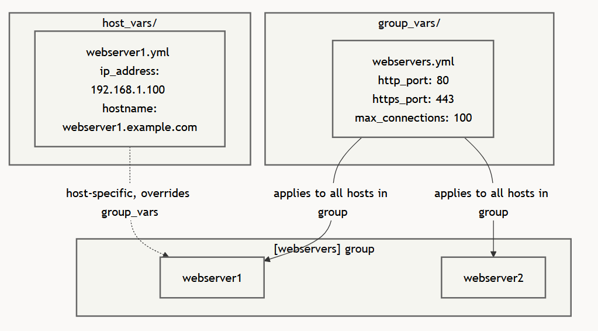

Automation 1
============

# Table of Contents

- [1. Playbooks](#1-playbooks)
  - [1.1 From ad-hoc to playbooks](#11-from-ad-hoc-to-playbooks)
  - [1.2 YAML fundamentals](#12-yaml-fundamentals)
    - [1.2.1 Common YAML pitfalls](#121-common-yaml-pitfalls)
  - [1.3 Playbook structure](#13-playbook-structure)
  - [1.4 Running playbooks](#14-running-playbooks)
  - [1.5 Privilege escalation](#15-privilege-escalation)
  - [1.6 Check mode and diff](#16-check-mode-and-diff)
  - [1.7 Tags](#17-tags)
  - [1.8 Multiple plays](#18-multiple-plays)
  - [1.9 Gathering facts](#19-gathering-facts)

- [2. Inventory](#2-inventory)
  - [2.1 Ansible inventory file structure](#21-ansible-inventory-file-structure)
  - [2.2 Core inventory concepts](#22-core-inventory-concepts)
  - [2.3 INI format](#23-ini-format)
  - [2.4 YAML format](#24-yaml-format)
  - [2.5 Targeting hosts (patterns)](#25-targeting-hosts-patterns)
  - [2.6 Advanced organization](#26-advanced-organization)
    - [2.6.1 Splitting inventory](#261-splitting-inventory)
    - [2.6.2 Dynamic inventory](#262-dynamic-inventory)
  - [2.7 Practical examples & configuration](#27-practical-examples--configuration)
    - [2.7.1 Ansible.cfg](#271-ansiblecfg)
    - [2.7.2 Connection test playbook (site_ping.yml)](#272-connection-test-playbook-site_pingyml)
    - [2.7.3 Running with limits](#273-running-with-limits)
    - [2.7.4 Setting group variables in inventory.ini](#274-setting-group-variables-in-inventoryini)

- [3. Variables](#3-variables)
  - [3.1 Debug output and verbosity](#31-debug-output-and-verbosity)
  - [3.2 Defining variables in Ansible: inline with register](#32-defining-variables-in-ansible-inline-with-register)
  - [3.3 Defining variables in Ansible: playbook with vars](#33-defining-variables-in-ansible-playbook-with-vars)
  - [3.4 Defining variables in Ansible: variable files with vars_files](#34-defining-variables-in-ansible-variable-files-with-vars_files)
  - [3.5 Variable precedence in Ansible](#35-variable-precedence-in-ansible)
  - [3.6 Ansible variable types](#36-ansible-variable-types)
  - [3.7 Ansible multi-line string variables](#37-ansible-multi-line-string-variables)
  - [3.8 Ansible variable interpolation](#38-ansible-variable-interpolation)
  - [3.9 Variable naming and quoting rules](#39-variable-naming-and-quoting-rules)
  - [3.10 Defining variables in Ansible: inventory variables](#310-defining-variables-in-ansible-inventory-variables)
    - [3.10.1 How to use inventory variables in Ansible](#3101-how-to-use-inventory-variables-in-ansible)
    - [3.10.2 The 'all' inventory group](#3102-the-all-inventory-group)
    - [3.10.3 Inventory variables with group_vars](#3103-inventory-variables-with-group_vars)
    - [3.10.4 Inventory variables with host_vars](#3104-inventory-variables-with-host_vars)
  - [3.11 Ansible extra variables through CLI](#311-ansible-extra-variables-through-cli)
  - [3.12 Common connection variables and facts](#312-common-connection-variables-and-facts)
  - [3.13 Complex variables](#313-complex-variables)
  - [3.14 Access operating system environment variables](#314-access-operating-system-environment-variables)
  - [3.15 Lists](#315-lists)
  - [3.16 Magic variables for hosts and groups](#316-magic-variables-for-hosts-and-groups)
  - [3.17 Variables best practice](#317-variables-best-practice)

- [4. Practical templating & lookups](#4-practical-templating--lookups)
  - [4.1 Rendering files with the template module](#41-rendering-files-with-the-template-module)
    - [4.1.1 When to use template instead of copy](#411-when-to-use-template-instead-of-copy)
    - [4.1.2 When to use lineinfile for small edits](#412-when-to-use-lineinfile-for-small-edits)
  - [4.2 Common filter patterns](#42-common-filter-patterns)
    - [4.2.1 Fallback values with default](#421-fallback-values-with-default)
    - [4.2.2 Simple text cleanup](#422-simple-text-cleanup)
    - [4.2.3 Type conversion](#423-type-conversion)
    - [4.2.4 Joining lists](#424-joining-lists)
  - [4.3 Common lookup patterns](#43-common-lookup-patterns)
    - [4.3.1 Read a local file](#431-read-a-local-file)
    - [4.3.2 Read an environment variable](#432-read-an-environment-variable)
    - [4.3.3 Generate or reuse a password](#433-generate-or-reuse-a-password)
    - [4.3.4 Get hosts from inventory](#434-get-hosts-from-inventory)
  - [4.4 The difference between lookup() and query()](#44-the-difference-between-lookup-and-query)
  - [4.5 Control node versus managed node](#45-control-node-versus-managed-node)

- [5. Ansible vault](#5-ansible-vault)
  - [5.1 Why vault exists](#51-why-vault-exists)
  - [5.2 What vault protects and what it doesn't protect](#52-what-vault-protects-and-what-it-doesnt-protect)
  - [5.3 Working with encrypted files](#53-working-with-encrypted-files)
  - [5.4 Supplying the vault password](#54-supplying-the-vault-password)

- [6. Conditionals and loops](#6-conditionals-and-loops)
  - [6.1 Common conditional patterns](#61-common-conditional-patterns)
  - [6.2 Understanding Ansible conditionals](#62-understanding-ansible-conditionals)
    - [6.2.1 Ansible conditional operators](#621-ansible-conditional-operators)
    - [6.2.2 Implicit logical operator and](#622-implicit-logical-operator-and)
    - [6.2.3 Testing group membership](#623-testing-group-membership)
  - [6.3 Jinja2 filters in conditions](#63-jinja2-filters-in-conditions)
    - [6.3.1 Providing default values](#631-providing-default-values)
    - [6.3.2 Type conversion in conditions](#632-type-conversion-in-conditions)
    - [6.3.3 Selecting variable files based on ansible_facts](#633-selecting-variable-files-based-on-ansible_facts)
  - [6.4 Using registered values](#64-using-registered-values)
    - [6.4.1 Common fields in registered variables](#641-common-fields-in-registered-variables)
    - [6.4.2 Using the status of registered variables](#642-using-the-status-of-registered-variables)
  - [6.5 failed_when and changed_when](#65-failed_when-and-changed_when)
  - [6.6 Grouping tasks with block](#66-grouping-tasks-with-block)
  - [6.7 Ignoring failure with ignore_errors](#67-ignoring-failure-with-ignore_errors)
  - [6.8 Handling unreachable hosts with ignore_unreachable](#68-handling-unreachable-hosts-with-ignore_unreachable)
  - [6.9 Loops](#69-loops)
    - [6.9.1 Looping over dictionaries](#691-looping-over-dictionaries)
    - [6.9.2 Combining loops and conditionals](#692-combining-loops-and-conditionals)
    - [6.9.3 Customize loops with loop_control](#693-customize-loops-with-loop_control)
    - [6.9.4 Retry logic with until, retries and delay](#694-retry-logic-with-until-retries-and-delay)

- [7. Handlers](#7-handlers)
  - [7.1 Definition of handlers](#71-definition-of-handlers)
  - [7.2 A simple handler flow](#72-a-simple-handler-flow)
  - [7.3 Limitations of handlers](#73-limitations-of-handlers)
  - [7.4 Basic syntax](#74-basic-syntax)
  - [7.5 Notifying handlers from tasks](#75-notifying-handlers-from-tasks)
  - [7.6 Force handlers to execute with flush_handlers](#76-force-handlers-to-execute-with-flush_handlers)
  - [7.7 Notifying multiple handlers from a single task](#77-notifying-multiple-handlers-from-a-single-task)
  - [7.8 Grouping handlers with listen](#78-grouping-handlers-with-listen)
  - [7.9 Using variables with handlers](#79-using-variables-with-handlers)
  - [7.10 Advanced handler patterns](#710-advanced-handler-patterns)
    - [7.10.1 Conditionally executing handlers](#7101-conditionally-executing-handlers)
    - [7.10.2 Managing handler notifications based on task outcomes or host-specific variables](#7102-managing-handler-notifications-based-on-task-outcomes-or-host-specific-variables)
    - [7.10.3 Combining multiple steps in one handler with block](#7103-combining-multiple-steps-in-one-handler-with-block)
  - [7.11 Force handlers to execute with force_handlers](#711-force-handlers-to-execute-with-force_handlers)
  - [7.12 Configuration example](#712-configuration-example)

---

## 1. Playbooks
### 1.1 From ad-hoc to playbooks

Ad-hoc commands cause drift, do not work for complex deployments, are terrible for version control, ...
Playbooks solve these problems:

| Ad-Hoc Commands            | Playbooks                        |
| -------------------------- | -------------------------------- |
| One-liners in the terminal | YAML files stored on disk        |
| Hard to repeat exactly     | Run identically every time       |
| No version control         | Full git history                 |
| Limited to single tasks    | Orchestrate complex workflows    |
| No documentation           | Self-documenting with task names |

Make use of FQCN (fully qualified collection names) for modules, this is best practice. This will make playbooks longer but wil increase readability, ensure versionability and shareability.

### 1.2 YAML fundamentals

- Use 2 spaces for indentation, do not use "tab"!
- Key-value pairs use a colon followed by a space
- Playbooks start with "---"
- Dictionaries can be defined in block style (preferred) or inline style (for some simple cases):

```yaml
# Block style (preferred for readability)
user:
  name: deploy
  uid: 1001
  shell: /bin/bash

# Inline style (for simple cases)
user: { name: deploy, uid: 1001, shell: /bin/bash }

# In Ansible tasks, access with dot or bracket notation:
- name: Show username
  ansible.builtin.debug:
    msg: "{{ user.name }}"        # Outputs: deploy

- name: Show uid
  ansible.builtin.debug:
    msg: "{{ user['uid'] }}"      # Outputs: 1001
```

- Lists use a hyphen followed by a space:

```yaml
# Block style
fruits:
  - apple      # Index 0
  - banana     # Index 1
  - orange     # Index 2

# Inline style
fruits: [apple, banana, orange]
```

Example for accesssing and using a list of dictionaries:

```yaml
# Task 1: Access values from the first server entry
- name: Show first server details
  ansible.builtin.debug:
    msg: "Server {{ servers[0].name }} has IP {{ servers[0].ip }}"

# Task 2: Access list items by index
- name: Show second server IP
  ansible.builtin.debug:
    msg: "Server IP: {{ servers[1].ip }}"
```

#### 1.2.1 Common YAML pitfalls

String with special characters:

```yaml
# These need quotes
message: "Hello: World"      # Contains colon
path: "/tmp/my file.txt"     # Contains space
regex: "^[a-z]+$"            # Special characters

# These are fine without quotes
message: Hello World
path: /tmp/myfile.txt
```

Booleans:

```yaml
# All of these are boolean true
enabled: true
enabled: yes
enabled: on

# All of these are boolean false
enabled: false
enabled: no
enabled: off
```

Numbers:

```yaml
version: 1.10      # Parsed as float 1.1, not string "1.10"
version: "1.10"    # String - use quotes to preserve
port: 80           # Integer
port: "80"         # String
```

### 1.3 Playbook structure

A **playbook** is a list of plays, each play maps a group of hosts to a number of tasks.
A **play** is the basic unit of work in a playbook, it defines: 
- hosts: Which machines to target (from your inventory)
- tasks: What actions to perform
- become: Whether to use privilege escalation
- vars: Variables for this play
**Tasks** are the individual actions within a play, each task calls a module with specific parameters. Always give tasks desscriptive names, they appear in the output and make debugging easier.

### 1.4 Running playbooks

Basic execution:

```bash
# Run a playbook with the ansible-playbook command:
ansible-playbook playbook.yml

# If your inventory is not in ansible.cfg, specify it:
ansible-playbook -i inventory.ini playbook.yml

# Check syntax without running tasks:
ansible-playbook playbook.yml --syntax-check

# See which hosts would be targeted:
ansible-playbook playbook.yml --list-hosts
```

for verbose output: add the "-v" flag (up to -vvvvvv for maximum verbosity)

Limiting execution:

```bash
# Only run on one host
ansible-playbook playbook.yml --limit web01.example.com

# Only run on the db group
ansible-playbook playbook.yml --limit db

# Run on multiple specific hosts
ansible-playbook playbook.yml --limit "web01,web02"
```

Extra:

```bash
# Start from a specific task name
ansible-playbook playbook.yml --start-at-task="Deploy configuration"

# List all tasks without running them:
ansible-playbook playbook.yml --list-tasks

# List tags without running the playbook:
ansible-playbook playbook.yml --list-tags
```

### 1.5 Privilege escalation

Most system administration tasks require root privileges. Ansible handles this with ``become``.

This can be done at:
- Play level (applied to all tasks)
- Task level (applied to that specific task)

Use ``become_user`` to choose which user Ansible should switch to when using privilege escalation, this works the same as ``become`` on both levels (play and task)

### 1.6 Check mode and diff

Before applying changes, verify what would happen:
Check mode (``--check``) runs the playbook without making changes when the modules involved support check mode, Tasks often report what they would do (caveats: simulation, so may differ from actual implementation. Less reliable with dependencies on earlier tasks)

Diff mode (``--diff``) shows file changes for modules that support diff output, especially file-oriented modules such as template and copy

> Be careful with ``--diff`` on files that may contain secrets. It can print sensitive content to the terminal. If needed, you can disable diff output for a task: ``diff: false``

### 1.7 Tags

Tags let you run specific parts of a playbook selectively.

```yaml
tasks:
  - name: Install nginx
    ansible.builtin.dnf:
      name: nginx
      state: present
    tags:
      - packages
      - nginx
```

Run only tasks with specific tags:

```bash
# Only run tasks tagged 'configuration'
ansible-playbook playbook.yml --tags configuration

# Run multiple tags
ansible-playbook playbook.yml --tags "packages,services"

# Skip specific tags
ansible-playbook playbook.yml --skip-tags configuration
```

Ansible provides built-in special tags and tag names:

```bash
# Run the normal set of tasks
ansible-playbook playbook.yml --tags all

# Run only tagged tasks
ansible-playbook playbook.yml --tags tagged

# Run only untagged tasks
ansible-playbook playbook.yml --tags untagged
```

Two special tag names are especially useful when writing playbooks:

- ``always``: the task runs unless you explicitly skip it
- ``never``: the task does not run unless you explicitly request it

### 1.8 Multiple plays

A playbook can contain multiple plays targeting different host groups. This is essential for multi-tier deployments. Plays execute in the order you defined them!

### 1.9 Gathering facts

By default, Ansible collects system information (facts) at the start of each play, this includes things like: OS details, IP addresses, hardware info, ... and can be used in tasks as variables. Disabling this can speed up playbooks that do not need system info. Alternatively you can gather specific fact subsets to reduce overhead:

```yaml
- name: Network configuration
  hosts: all
  gather_facts: true
  gather_subset:
    - network

  tasks:
    - name: Show IP address
      ansible.builtin.debug:
        var: ansible_facts['default_ipv4']['address']
```

---

## 2. Inventory
### 2.1 Ansible inventory file structure

Inventory tells Ansible which hosts exist, how to reach them and how they are grouped. An inventory file consists of:

- **Hosts** are the machines Ansible manages
- **Groups** let you target several hosts at once
- **Variables** can be attached to hosts or groups (dont put these in the inventory.ini file because Tom's autograding script will not like you)
- **Patterns** let you select which hosts a play or ad-hoc command should target

These will usually be stored in one of these forms:

- a single INI file
- a single YAML file
- an inventory directory with multiple sources
- a dynamic inventory plugin for cloud environments

### 2.2 Core inventory concepts

Ansible always creates two special groups:

- ``all``: every host in the inventory
- ``ungrouped``: hosts that are not members of any group other than ``all``

Example:

```ini
[webservers]
web1

db1
```

- ``web1`` belongs to ``webservers`` and ``all``
- ``db1`` belongs to ``ungrouped`` and ``all``

Groups can also contain other groups:

```ini
[webservers]
web1
web2

[dbservers]
db1

[production:children]
webservers
dbservers
```

Now a play with ``hosts: production`` will target both the web and database servers.

### 2.3 INI format

The ini format is simple:
- List of sections enclosed in []
- Key-value pairs under each section

```ini
[webservers]
web1 ansible_host=10.10.0.10 ansible_user=ansible
web2 ansible_host=10.10.0.11 ansible_user=ansible
web3 ansible_host=10.10.0.12 ansible_user=ansible

[dbservers]
db1 ansible_host=10.10.0.20 ansible_user=ansible
db2 ansible_host=10.10.0.21 ansible_user=ansible
```

> SECURITY NOTE: Always connect as a non-root user and use ``become-true`` to gain elevated privileges when needed.

### 2.4 YAML format

This is a more flexible format that allows for more complex data structures (we never used this in class so im skipping this)

### 2.5 Targeting hosts (patterns)

You can target specific hosts or groups using **patterns**. This is what you put in the ``hosts:`` field of a play or pass as an argument to Ansible:

- All hosts: ``all`` or ``*``
- Specific group: ``webservers``
- Specific host: ``web1``
- Intersection (AND): ``webservers:&production`` (in both groups)
- Exclusion (NOT): ``webservers:!phoenix`` (in webservers but NOT in phoenix)
- Union (OR): ``webservers:dbservers`` (in either group)
- Wildcards: ``*.example.com`` or ``192.168.1.*``
- Ranges: ``web[01:50]`` (matches web01, web02... web50)

### 2.6 Advanced organization
#### 2.6.1 Splitting inventory

Instead of a single file, it is possible to point Ansible to an **inventory directory**

#### 2.6.2 Dynamic inventory

In modern cloud environments, IPs change constantly. Dynamic Inventory plugins query cloud providers (AWS, Azure, GCP) to get the current list of hosts automatically.

### 2.7 Practicle examples & configuration
#### 2.7.1 Ansible.cfg

This configuration file sets defaults for the inventory location and connection strings:

```ini
[defaults]
# Path to the inventory file (or directory)
inventory = ./inventory.ini

# Default remote user to connect as
remote_user = ansible

# Disable host key checking (useful for labs/testing)
host_key_checking = false

# Use the default callback, but format task results as YAML
stdout_callback = default
callback_result_format = yaml

[privilege_escalation]
become = true
become_method = sudo
become_user = root
become_ask_pass = false
```

#### 2.7.2 Connection test playbook (site_ping.yml)

This is a simple playbook that tests the connectivity to all hosts:

```yaml
---
- name: Test connectivity to all hosts
  hosts: all
  gather_facts: false

  tasks:
    - name: Ping the hosts
      ansible.builtin.ping:
```

#### 2.7.3 Running with limits

To run a playbook only against a certain group without modifying the file, use ``--limit``:

```bash
ansible-playbook site_ping.yml --limit dbservers
```

#### 2.7.4 Setting group variables in inventory.ini
(Tom is watching, do not do this)

An example of setting a custom SSH port for the ``dbservers`` group:

```ini
[dbservers:vars]
ansible_port=2222
```

---

## 3. Variables

- Variables can be used in tasks, playbooks, roles and inventories
- Variables can be included inline
- You can also pass additional variables using quoted YAML or JSON, or even by passing YAML/JSON files
- Variables can be passed through the CLI

### 3.1 Debug output and verbosity

Use the ``ansible.builtin.debug`` module to display variable values during a playbook run. It is also possible to increase command-line verbosity with ``-v`` to get more execution details.

```yaml
- hosts: localhost
  tasks:
    - name: Display variable value
      vars:
        my_var: This is my variable
      ansible.builtin.debug:
        var: my_var
```

output:

```bash
TASK [Display variable value] *******************************************************************************
ok: [localhost] => {
    "my_var": "This is my variable"
}
```

### 3.2 Defining variables in Ansible: inline with register

The ``register`` keyword stores a task's result in a variable that later tasks can use for the same host during the current playbook run:

```yaml
- name: My playbook
  hosts: localhost
  tasks:
    - name: Run command and store output in variable
      ansible.builtin.shell: echo "This is my output variable"
      register: my_output_var

    - name: Display output variable value
      ansible.builtin.debug:
        msg: "{{ my_output_var.stdout }}"
```

### 3.3 Defining variables in Ansible: playbook with vars

Playbook-level variables are defined at the top of the playbook file using the ``vars`` keyword:

```yaml
---
- name: My playbook
  hosts: localhost
  vars:
    my_playbook_var: This is my playbook variable
  tasks:
    - name: Display playbook variable value
      ansible.builtin.debug:
        var: my_playbook_var
```

### 3.4 Defining variables in Ansible: variable files with ``vars_files``

Variables can be defined in seperate files and included in playbooks using the ``vars_files`` keyword:

```yaml
---
- name: My playbook
  hosts: localhost
  vars_files:
    - my_vars.yml
  tasks:
    - name: Display variable value
      ansible.builtin.debug:
        var: my_file_var
```
my_vars.yml:
```yaml
my_file_var: This is my file variable.
```

### 3.5 Variable precedence in Ansible

As a baseline remember these rules:

- ``--extra-vars`` passed on the command line have the highest precedence
- More specific variables usually override less specific ones
- Task and block variables typically override play-level, inventory, and role default variables
- Host variables typically override group variables
- Role defaults are meant to be the lowest-precedence fallback values

> Check the official Ansible documentation for the complete list of 22 precedence rules!

### 3.6 Ansible variable types

| Type | Description |
|------|-------------|
| Strings | Text values, enclosed in quotes (single or double). |
| Numbers | Integers or floats. |
| Lists | Collection of ordered items, enclosed in `[ ]` and separated by `,`. |
| Dictionaries | Collection of key-value pairs, using `{ }` separated by `,`. |
| Booleans | `True` or `False` values. |
| Null | An empty value such as `null` or `~`. |

### 3.7 Ansible multi-line string variables

There are 2 types of muliti-line string variables:

```yaml

# Literal, Keeps line breaks exactly as written

my_pattern: |
  O you who turn the wheel and look to windward,
  Consider Phlebas, who was once handsome and tall as you.

# Folded, Converts line breaks into spaces

my_pattern: >
  O you who turn the wheel and look to windward,
  Consider Phlebas, who was once handsome and tall as you.
```

### 3.8 Ansible variable interpolation

Ansible uses variable interpolation to replace variable references with their values at runtime.
Variables are replaced with their values at runtime. Variables can be referenced using the double curly braces notation: ``{{ variable_name }}``

### 3.9 Variable naming and quoting rules

- Variable names should use letters, numbers, and underscores
- Start variable names with a letter or an underscore
- Avoid dashes, dots, and names that conflict with Jinja2 or Python keywords
- If a YAML value starts with ``{{ ... }}``, quote the whole value so YAML parses it correctly

For example:
```yaml
app_port: 8080
app_user: deploy
app_home: "{{ base_dir }}/myapp"
```

### 3.10 Defining variables in Ansible: inventory variables

Inventory variables can be defined in both INI and YAML inventories, but the syntax is not the same.

- In INI inventory, use inline host variables or sections such as ``[webservers:vars]``.
- In YAML inventory, use the ``vars:`` key.

#### 3.10.1 How to use inventory variables in Ansible

Inventory variables, referenced as ``{{ variable_name }}``, provide host-specific configurations in playbooks, templates, and tasks.`

#### 3.10.2 The 'all' inventory group

The special group all represents every host in the inventory and can be used to define variables for all managed nodes. It id defined by using: ``[all:vars]``

#### 3.10.3 Inventory variables with ``group_vars``

Group variables apply to all hosts in a group and are commonly defined in ``group_vars/<group_name>.yml``.
They inherit to child groups but can be overridden at the host level.

Ansible supports two layouts for a group's variables. Both are equivalent; use whichever fits the project.

Single file - all variables for the group in one file:
```bash
group_vars/
  webservers.yml
```

Directory - a directory named after the group; every ``.yml`` file inside is loaded automatically:`
```bash
group_vars/
  webservers/
    vars.yml
    vault.yml
```

The directory layout is the preferred approach.

#### 3.10.4 Inventory variables with ``host_vars``

Host variables apply to a specific host and override group variables. They are commonly defined in ``host_vars/<host_name>.yml``, storing values like IP or hostname.

Diagram:



### 3.11 Ansible extra variables through CLI

Extra variables, passed via CLI with --extra-vars, override other variables or add information.
Some examples:

- ``ansible-playbook playbook.yml --extra-vars "var1=value1" --extra-vars "var2=value2"``
- ``ansible-playbook playbook.yml --extra-vars "@variables.yml"``
- ``"@variables.yml"``: read the variable values from the file ``variables.yml``

### 3.12 Common connection variables and facts

Connection variables:

| Variable | Description |
|----------|-------------|
| `ansible_host` | Hostname or IP address of the target machine. |
| `ansible_port` | SSH port used to connect to the target machine. |
| `ansible_user` | Username used to connect to the target machine. |
| `ansible_connection` | Connection type used to connect to the target machine (e.g. SSH or local). |
| `ansible_python_interpreter` | Path to the Python interpreter Ansible should use on the target machine. |

Facts:

| Fact Access | Description |
|-------------|-------------|
| `ansible_facts['distribution']` | Name of the Linux distribution on the target machine. |
| `ansible_facts['distribution_version']` | Version of the distribution on the target machine. |
| `ansible_facts['os_family']` | Operating system family, such as Debian or RedHat. |
| `ansible_facts['architecture']` | CPU architecture, such as `x86_64`. |
| `ansible_facts['hostname']` | Short hostname of the target machine. |
| `ansible_facts` | Full dictionary of gathered facts, including network, hardware, and system details. |

### 3.13 Complex variables

- For larger and more structured variables, you can access nested values
- either using bracket syntax ['key'] or dot . syntax
- ``{{ ansible_facts['default_ipv4']['address'] }}``
- Bracket syntax is usually the safest choice with fact data

### 3.14 Access operating system environment variables

Environment variables from the target host are available through ``ansible_facts['env']`` when facts are gathered.

Example:

```yaml
- name: Deploy web application
  hosts: webserver
  vars:
    api_key: "{{ ansible_facts['env']['MY_API_KEY'] }}"
  tasks:
    - name: Configure application
      ansible.builtin.template:
        src: my_config.j2
        dest: /var/www/myapp/config.ini
```

### 3.15 Lists

Many variables you will use are structured as arrays (or 'lists').

For example:

```yaml
foo_list:
  - one
  - two
  - three
```

Access to list elements:

- ``{{ foo_list[0] }}``

- ``{{ foo_list | first }}``

### 3.16 Magic variables for hosts and groups

If you need to get the variables of a specific host from another host, Ansible provides a magic ``hostvars`` variable that contains variables for each host in the inventory.

If you use ``hostvars`` to read facts from another host, those facts must already be gathered or cached for that host.

| Variable | Description |
|----------|-------------|
| `hostvars` | A dictionary that contains variables for each host in the inventory. Example: `{{ hostvars['host1']['admin_user'] }}` retrieves the `admin_user` variable from `host1`. |
| `groups` | A dictionary that maps each group name to the hosts in that group. |
| `group_names` | A list of all groups to which the current host belongs. |
| `inventory_hostname` | The hostname of the current host, according to the inventory. |
| `inventory_hostname_short` | The first part of `inventory_hostname`, up to the first dot. |
| `play_hosts` | All hosts on which the current play is running. |

> See the official Ansible documentation for more info on hostvars

### 3.17 Variables best practice

- Keep host- and group-specific data in inventory, host_vars, or group_vars
- Keep playbook-specific values close to the playbook, for example with vars or vars_files
- Inventory sources should have minimal variables, as they are often less visible
- Avoid command-line variables (-e) except for local testing, automation pipelines, or one-off runs

---

## 4. Practical templating & lookups
### 4.1 Rendering files with the ``template`` module

Use ``ansible.builtin.template`` when a file should contain variable values.
If the file is static, use ``ansible.builtin.copy`` instead.

Example playbook:
```yaml
---
- name: Configure an application
  hosts: webservers
  vars:
    app_name: inventory-demo
    app_port: 8080

  tasks:
    - name: Render application config
      ansible.builtin.template:
        src: templates/app.conf.j2
        dest: /etc/myapp/app.conf
        owner: root
        group: root
        mode: '0644'
```
Template file ``templates/app.conf.j2``:
```jinja
app_name = {{ app_name }}
listen_port = {{ app_port }}
```
Rendered file:
```txt
app_name = inventory-demo
listen_port = 8080
```

#### 4.1.1 When to use ``template`` instead of ``copy``

Use ``ansible.builtin.template`` when:

- the file contains variables
- the file differs per host or group
- you want one source file with placeholders

Use ``ansible.builtin.copy`` when:

- the file is the same everywhere
- no variable substitution is needed

#### 4.1.2 When to use ``lineinfile`` for small edits

Use ``ansible.builtin.lineinfile`` when you need to manage one line inside an existing file.

### 4.2 Common filter patterns

Filters transform values inside ``{{ ... }}``.

#### 4.2.1 Fallback values with ``default``

```yaml
vars:
  effective_port: "{{ app_port | default(8080) }}"
```
You can also treat empty values as missing by passing ``true`` as a second argument:
```yaml
vars:
  effective_owner: "{{ app_owner | default('root', true) }}"
```
The second argument ``true`` tells the filter to use the default when ``app_owner`` is defined but empty ("", null, or false). Without it, ``default`` only applies when the variable is completely undefined.

#### 4.2.2 Simple text cleanup

```yaml
vars:
  raw_name: "  My App  "

tasks:
  - name: Show cleaned values
    ansible.builtin.debug:
      msg:
        trimmed: "{{ raw_name | trim }}"
        lower: "{{ raw_name | trim | lower }}"
        upper: "{{ raw_name | trim | upper }}"
```

#### 4.2.3 Type conversion

```yaml
vars:
  timeout_seconds: "{{ app_timeout | int }}"
  feature_enabled: "{{ feature_flag | bool }}"
```
If the value cannot be converted, ``int`` falls back to 0 and ``bool`` falls back to false.

#### 4.2.4 Joining lists

```yaml
vars:
  backend_hosts:
    - web1
    - web2
    - web3

tasks:
  - name: Show host list
    ansible.builtin.debug:
      msg: "{{ backend_hosts | join(', ') }}"
```

### 4.3 Common lookup patterns
#### 4.3.1 Read a local file

```yaml
vars:
  ssh_key: "{{ lookup('file', 'files/deploy_key.pub') }}"
```
In a playbook, the path is resolved relative to the playbook

#### 4.3.2 Read an environment variable

```yaml
vars:
  github_user: "{{ lookup('env', 'USER') }}"
  home_dir: "{{ lookup('env', 'HOME') }}"
```

#### 4.3.3 Generate or reuse a password

```yaml
vars:
  db_password: "{{ lookup('password', 'credentials/db_password length=20') }}"
```

#### 4.3.4 Get hosts from inventory

```yaml
vars:
  web_hosts: "{{ query('inventory_hostnames', 'webservers') }}"
```
``inventory_hostnames`` returns the names of all hosts that match the given pattern, exactly as they appear in the inventory

### 4.4 The difference between ``lookup()`` and ``query()``

- ``lookup()`` usually gives you one string
- ``query()`` gives you a list

### 4.5 Control node versus managed node

Easy to mix up:

- templates are rendered on the control node
- lookups run on the control node
- modules like ``copy``, ``template``, ``package``, and ``service`` act on the managed host

---

## 5. Ansible vault
### 5.1 Why vault exists

You cannot leave that data in plain text inside a repository, a shared folder, or a class project.
Ansible Vault solves that problem by encrypting sensitive content at rest. The file stays unreadable on disk, but Ansible can decrypt it during a run when you provide the correct password.

### 5.2 What vault protects and what it doesn't protect

Vault protects data at rest, this means:

- a vaulted variable file on disk is encrypted
- someone opening the file without the password sees encrypted text

Vault does **not** protect secrets after encryption, this means:

- if you print a secret with debug, it is exposed
- if a task logs a password, it is exposed
- if you copy a decrypted secret to a remote machine, that remote file must still be protected with correct permissions

### 5.3 Working with encrypted files

Common Ansible-vault operations:
| Command | What it does |
|----------|-------------|
| `ansible-vault create secrets.yml` | Create a new encrypted file. |
| `ansible-vault view secrets.yml` | Read an encrypted file. |
| `ansible-vault edit secrets.yml` | Change an encrypted file safely. |
| `ansible-vault encrypt vars.yml` | Encrypt an existing plain text file. |
| `ansible-vault decrypt vars.yml` | Remove encryption from a file. |
| `ansible-vault rekey vars.yml` | Change the password used for a file. |
| `ansible-vault encrypt_string --name db_password 'secret'` | Encrypt one variable instead of a whole file. |

### 5.4 Supplying the vault password

Ansible cannot decrypt anything unless it knows the vault password, there are several ways to provide it:

- Interactive prompt (default)
- Password file ``.vault_pass``, given to Ansible-vault with: ``--vault-password-file=.vault_pass``
- Automatic password configuration by exporting ``.vault_pass`` to an environment variable
- Password client cripts: Ansible can run a script and use its output as the Vault password. That script can read from an environment variable, a keyring, or a secret manager
- Vault IDs: let you use more than one Vault password in the same project
For example:

```bash
echo "my_secret: 'supersecretpassword'" > secret_vars.yaml
ansible-vault encrypt secret_vars.yaml --vault-id dev@prompt

ansible-playbook vault_id_test.yml -e @secret_vars.yaml --vault-id dev@prompt
```

It is also possible to store these settings in ``ansible.cfg``:

```ini
[defaults]
vault_password_file = .vault_pass
vault_identity_list = dev@.vault_pass, prod@prompt
```

---

## 6. Conditionals and loops
### 6.1 Common conditional patterns

- ``when``: run a task only if a condition is true.
- Status tests: check whether a registered task result is ``failed``, ``succeeded``, ``skipped``, or ``changed``.
- ``failed_when``: define what should count as task failure.
- ``changed_when``: define what should count as task change.

For example:
```yaml
- name: Do something if myvar is set
  ansible.builtin.command: /path/to/some/command
  when: myvar == "somevalue"
```

### 6.2 Understanding Ansible conditionals

Conditionals answer a simple question: should this task run on this host right now?

```yaml
- name: Install Apache on Debian-family hosts
  ansible.builtin.package:
    name: apache2
    state: present
  when: ansible_facts['os_family'] == "Debian"
```

> [!WARNING]
> `when`, `failed_when`, `changed_when`, and `until` use raw Jinja expressions. Do not wrap them in `{{ }}`.

#### 6.2.1 Ansible conditional operators

- Comparison operators (``==``, ``>``, ``<``, ``!=``)
- Logical operators (``and``, ``or``, ``not``)
- Regular expression tests such as ``is match(...)`` or ``is search(...)``

#### 6.2.2 Implicit logical operator ``and``

Specify multiple conditions that all need to be true as a list. A YAML list under ``when`` behaves like a logical ``and``:

```yaml
tasks:
  - name: Shut down CentOS 6 systems
    ansible.builtin.command: /sbin/shutdown now
    when:
      - ansible_facts['distribution'] == "CentOS"
      - ansible_facts['distribution_major_version'] == "6"
```

#### 6.2.3 Testing group membership

```yaml
---
- name: Install vsftpd only on hosts in a specific group
  hosts: all
  become: true

  vars:
    target_group: ftpservers

  tasks:
    - name: Show group membership
      ansible.builtin.debug:
        msg: "This host is in {{ target_group }}"
      when: target_group in group_names

    - name: Install vsftpd on matching hosts
      ansible.builtin.dnf:
        name: vsftpd
        state: present
      when: target_group in group_names
```

### 6.3 Jinja2 filters in conditions

Filters help you transform values before evaluating them in a condition. For example, you can provide defaults, cast strings to booleans or integers, or reshape structured data.

#### 6.3.1 Providing default values

```jinja
{{ some_variable | default(5) }}
{{ lookup('env', 'MY_USER') | default('admin', true) }}
```

#### 6.3.2 Providing default values

```yaml
when: some_string_value | bool
when: ansible_facts['distribution_major_version'] | int >= 8
```

#### 6.3.3 Selecting variable files based on ``ansible_facts``

This is a practical use of conditionals outside ``when:``. You can select different variable files depending on facts from the target host.

Playbook:
```yaml
---
- hosts: webservers
  remote_user: root
  vars_files:
    - "vars/common.yml"
    - ["vars/{{ ansible_facts['os_family'] }}.yml", "vars/os_defaults.yml"]
  tasks:
    - name: Make sure apache is started
      ansible.builtin.service:
        name: "{{ apache }}"
        state: started
```
vars/Redhat.yml:
```yaml
---
apache: httpd
somethingelse: 42
```
vars/Debian.yml:
```yaml
---
apache: apache2
somethingelse: 13
```

### 6.4 Using registered values

A registered variable is created with the ``register`` keyword and stores the result of a task for that host during the current playbook run.
Use registered variables when a later task depends on what an earlier task discovered.

For example:
```yaml
tasks:
  - name: Check whether /etc/motd exists
    ansible.builtin.stat:
      path: /etc/motd
    register: motd_file

  - name: Report when /etc/motd exists
    ansible.builtin.debug:
      msg: /etc/motd exists on this host
    when: motd_file.stat.exists
```

#### 6.4.1 Common fields in registered variables

Registered results are usually dictionaries. These are the fields you will use most often for ``shell`` and ``command`` modules:

- ``stdout``: standard output from the command
- ``stderr``: error output from the command
- ``rc``: return code
- ``changed``: whether Ansible marked the task as changed
- ``failed``: whether the task failed

> Do not memorize these, use the official documentation!

#### 6.4.2 Using the status of registered variables

Status tests let you branch based on what happened in a previous task.
Example of failed, succeeded:

```yaml
---
- hosts: all
  vars:
    user: angie
  tasks:
    - name: Check if file already exists
      ansible.builtin.stat:
        path: /home/{{ user }}/myfile
      register: file_info

    - name: Create file for user
      ansible.builtin.file:
        path: /home/{{ user }}/myfile
        state: touch
      when: not file_info.stat.exists

    - name: Show message if file exists
      ansible.builtin.debug:
        msg: The user file already exists.
      when: file_info.stat.exists
```

### 6.5 ``failed_when`` and ``changed_when``

These are similar to when, but control task status instead of execution.

- ``failed_when`` marks the task as failed if the condition is met
- ``changed_when`` marks the task as changed if the condition is met

Use them when the default behavior of a module does not match what you mean by success, failure, or change.

Multiple conditions in a list use implicit ``and``. The task fails only if all are true:
```yaml
- name: Fail only when the command succeeds and prints a critical warning
  ansible.builtin.command: /usr/bin/example-command --status
  register: result
  failed_when:
    - result.rc == 0
    - "'CRITICAL' in result.stdout"
```

If you have too many conditions to fit on one line, split them into a multi-line YAML value with ``>``.
```yaml
- name: Example of many failed_when conditions with or
  ansible.builtin.shell: ./mySuperProgram
  register: my_return
  failed_when: >
    ("No such file or directory" in my_return.stdout) or
    (my_return.stderr != '') or
    (my_return.rc == 10)
```

### 6.6 Grouping tasks with ``block``

``block:`` groups multiple tasks so you can apply a single ``when``, a single ``become``, a single ``tags``, or structured error handling (``rescue``, ``always``) to all of them at once.
In real playbooks, ``block`` with ``rescue`` is usually a better default than ``ignore_errors: true``.

Use ``block:`` in these situations:
- Applying a shared condition without repeating ``when:``
- Structured error handling (``block:``, ``rescue:``, ``always:``), rescue does **not** work with unreachable hosts!
- Applying shared privilege escalation cleanly

### 6.7 Ignoring failure with ``ignore_errors``

By default Ansible stops running tasks on a host if one fails.
``ignore_errors: true`` lets the play continue, but it should not be your default error handling strategy.
Use with caution!

### 6.8 Handling unreachable hosts with ``ignore_unreachable``

When Ansible cannot connect to a host, it marks it as UNREACHABLE and skips remaining tasks for that host.
``ignore_unreachable:`` true tells Ansible not to drop that host immediately.

### 6.9 Loops

For collections, use ``loop``, it expects a list. If you are converting from an older ``with_items`` example, you may sometimes need ``flatten(1)`` to get the same behavior

Access each element of the looped-over list with {{ item }}:

```yaml
---
- name: Loop example with users
  hosts: all
  become: true

  tasks:
    - name: Create multiple users
      ansible.builtin.user:
        name: "{{ item }}"
        state: present
      loop:
        - alice
        - bob
        - charlie
```

#### 6.9.1 Looping over dictionaries

If your data is a dictionary, convert it with ``dict2items`` so each loop item has a key and a value:

```yaml
---
- name: Ensure users from a dictionary
  hosts: all
  become: true
  vars:
    users:
      dev_user: ftp
      qa_user: ftp
      prod_user: apache

  tasks:
    - name: Ensure users are present
      ansible.builtin.user:
        name: "{{ item.key }}"
        state: present
        groups: "{{ item.value }}"
      loop: "{{ users | dict2items }}"
```

#### 6.9.2 Combining loops and conditionals

If you combine a ``when`` statement with a ``loop``, Ansible processes the condition separately for each item:

```yaml
tasks:
  - name: Run with items greater than 5
    ansible.builtin.command: "echo {{ item }}"
    loop: [0, 2, 4, 6, 8, 10]
    when: item > 5
```

#### 6.9.3 Customize loops with ``loop_control``

``loop_control ``gives you fine-grained control over how loops behave. It is a dictionary with options like:

- ``label``: custom label for the current item in output and logs
- ``index_var``: stores the current iteration index
- ``loop_var``: custom variable name for the current item
- ``extended``: when set to ``true``, enables additional loop metadata variables such as ``ansible_loop.revindex``, ``ansible_loop.first``, ``ansible_loop.last``, and ``ansible_loop.length``
- ``pause``: adds a delay in seconds between each iteration of the loop

For example:
```yaml
- name: Loop example
  hosts: localhost
  tasks:
    - name: Print numbers with custom label
      ansible.builtin.debug:
        msg: "The number is {{ item }}"
      loop:
        - 1
        - 2
        - 3
      loop_control:
        label: "Number {{ item }}"
```

Output:
```text
TASK [Print numbers with custom label] ***********************
ok: [localhost] => (label=Number 1) => {
    "msg": "The number is 1"
}
ok: [localhost] => (label=Number 2) => {
    "msg": "The number is 2"
}
ok: [localhost] => (label=Number 3) => {
    "msg": "The number is 3"
}
```

#### 6.9.4 Retry logic with until, retries and delay

- ``until``: defines a condition that must be true for the task to succeed
- ``retries``: maximum number of times to retry a task if the ``until`` condition is not yet true
- ``delay``: time in seconds to wait between retries

For example:
```yaml
---
- name: Retry until a file is available
  hosts: localhost
  tasks:
    - name: Check whether the PID file exists
      ansible.builtin.stat:
        path: /tmp/myprocess.pid
      register: pid_file
      changed_when: false
      until: pid_file.stat.exists
      retries: 10
      delay: 10
```

---

## 7. Handlers
### 7.1 Definition of handlers

Handlers are special tasks triggered only when notified by other tasks, they only run if a task reports a change. They are defined like regular tasks but referenced by name using ``notify``.

### 7.2 A simple handler flow

- a normal task makes a change
- that task notifies a handler
- Ansible queues the handler
- the handler runs later, after the current section of the play finishes
- if several tasks notify the same handler, it still runs only once

For example:
```yaml
- name: Configure nginx
  hosts: webservers
  tasks:
    - name: Deploy nginx configuration
      ansible.builtin.template:
        src: nginx.conf.j2
        dest: /etc/nginx/nginx.conf
      notify: Restart nginx

  handlers:
    - name: Restart nginx
      ansible.builtin.service:
        name: nginx
        state: restarted
```

### 7.3 Limitations of handlers

- **Execution timing**: By default, handlers do not run immediately when notified. They are flushed later, usually after the current major section of the play, though you can force earlier execution with ``meta: flush_handlers``
- **Notification-based**: A handler only runs if a task notifies it and that task reports ``changed``
- **Single execution**: A handler runs only once per play, even if notified multiple times
- **Best for delayed follow-up actions**: Handlers are not a replacement for normal task ordering, ``block``/``rescue``, or rollback logic

### 7.4 Basic syntax

```yaml
handlers:
  - name: Handler Name
    module_name:
      parameter1: value1
      parameter2: value2
```

### 7.5 Notifying handlers from tasks

Generic task:
```yaml
tasks:
  - name: Task Name
    module_name:
      parameter1: value1
      parameter2: value2
    notify: Handler Name # or [Handler Name 1, Handler Name 2]
```

Task with loop:
```yaml
tasks:
  - name: Deploy multiple application config files
    ansible.builtin.template:
      src: "{{ item }}.j2"
      dest: "/etc/myapp/{{ item }}"
    loop:
      - app.conf
      - logging.conf
      - cache.conf
    notify: Restart myapp
```
If only one of those files changes, ``Restart myapp`` is still queued. Once queued, the handler still runs only once!

### 7.6 Force handlers to execute with ``flush_handlers``

For example:
```yaml
- name: Update nginx and validate it immediately
  hosts: webservers
  tasks:
    - name: Deploy Nginx configuration file
      ansible.builtin.template:
        src: nginx.conf.j2
        dest: /etc/nginx/nginx.conf
      notify: Restart nginx

    - name: Flush handlers
      ansible.builtin.meta: flush_handlers

    - name: Check that Nginx is now active with the new configuration
      ansible.builtin.command: systemctl is-active nginx
      register: nginx_status
      changed_when: false

    - name: Fail if Nginx is not active
      ansible.builtin.fail:
        msg: Nginx is not running after the configuration change
      when: nginx_status.stdout != "active"

  handlers:
    - name: Restart nginx
      ansible.builtin.service:
        name: nginx
        state: restarted
```

### 7.7 Notifying multiple handlers from a single task

In the example below, the task notifies both the ``Restart nginx`` and ``Log configuration change`` handlers when the nginx configuration file is updated.
When that happens, Ansible runs handlers in the order they are defined in ``handlers:``, not the order listed under ``notify:``.

```yaml
tasks:
  - name: Install Nginx configuration file
    ansible.builtin.template:
      src: nginx.conf.j2
      dest: /etc/nginx/nginx.conf
    notify:
      - Restart nginx
      - Log configuration change

handlers:
  - name: Restart nginx
    ansible.builtin.service:
      name: nginx
      state: restarted

  - name: Log configuration change
    ansible.builtin.lineinfile:
      path: /var/log/nginx_config.log
      line: "Nginx configuration updated"
      create: true
```

### 7.8 Grouping handlers with listen

Use the ``listen:`` keyword to group multiple handlers under a common notification topic:
```yaml
tasks:
  - name: Update the shared web services marker
    ansible.builtin.copy:
      content: "restart requested\n"
      dest: /tmp/restart-web-services
    notify: restart web services

handlers:
  - name: Restart memcached
    ansible.builtin.service:
      name: memcached
      state: restarted
    listen: restart web services

  - name: Restart apache2
    ansible.builtin.service:
      name: apache2
      state: restarted
    listen: restart web services
```

### 7.9 Using variables with handlers

Keep handler names stable so ``notify:`` remains predictable and easy to read. Use variables inside the handler task itself, for example in module arguments.

Debian.yml:
```yaml
web_service_name: apache2
```
RedHat.yml:
```yaml
web_service_name: httpd
```

Playbook:
```yaml
tasks:
  - name: Set host variables based on os family
    ansible.builtin.include_vars: "{{ ansible_facts['os_family'] }}.yml"

  - name: Deploy web server configuration
    ansible.builtin.copy:
      content: "managed by ansible\n"
      dest: /tmp/web.conf
    notify: Restart web service

handlers:
  - name: Restart web service
    ansible.builtin.service:
      name: "{{ web_service_name | default('httpd') }}"
      state: restarted
```

### 7.10 Advanced handler patterns
#### 7.10.1 Conditionally executing handlers

Example: The handler only runs if it was notified and ``restart_nginx_handler`` is true:
```yaml
handlers:
  - name: Restart nginx
    ansible.builtin.service:
      name: nginx
      state: restarted
    when: restart_nginx_handler is defined and restart_nginx_handler
```

#### 7.10.2 Managing handler notifications based on task outcomes or host-specific variables

In practice, handler notification is usually controlled on the task side.
For example:
```yaml
tasks:
  - name: Test the current nginx configuration
    ansible.builtin.command: /usr/sbin/nginx -t
    register: nginx_config_test
    changed_when: false

  - name: Deploy nginx configuration
    ansible.builtin.template:
      src: nginx.conf.j2
      dest: /etc/nginx/nginx.conf
    when: nginx_config_test.rc == 0
    notify: Restart nginx

handlers:
  - name: Restart nginx
    ansible.builtin.service:
      name: nginx
      state: restarted
```

#### 7.10.3 Combining multiple steps in one handler with ``block``

You can use ``block:`` inside a handler when one notification should trigger several related steps:

```yaml
handlers:
  - name: Restart nginx and log the action
    block:
      - name: Restart nginx
        ansible.builtin.service:
          name: nginx
          state: restarted
      - name: Log Nginx Restart
        ansible.builtin.lineinfile:
          path: /var/log/nginx_restart.log
          line: "Nginx restarted"
          create: true
```

### 7.11 Force handlers to execute with ``force_handlers``

Use ``force_handlers: true`` when you still want already-notified handlers to run even if a later task fails. This can matter when a service must be restarted or reloaded to make sure the system stays in a consistent state.
For example:
```yaml
- name: Deploy config and still restart nginx on failure
  hosts: webservers
  force_handlers: true
  tasks:
    - name: Deploy Nginx configuration
      ansible.builtin.template:
        src: nginx.conf.j2
        dest: /etc/nginx/nginx.conf
      notify: Restart nginx

    - name: Simulate a failure after the config change
      ansible.builtin.command: /bin/false

  handlers:
    - name: Restart nginx
      ansible.builtin.service:
        name: nginx
        state: restarted
```

### 7.12 Configuration example

This follows the same basic pattern as the earlier configuration examples, but here the better handler is a reload instead of a restart. Sometimes a full restart is unnecessary, and a reload is less disruptive.
```yaml
- name: Deploy Apache config and reload only when needed
  hosts: webservers
  tasks:
    - name: Install the latest version of Apache
      ansible.builtin.dnf:
        name: httpd
        state: latest
    - name: Deploy Apache vhost configuration
      ansible.builtin.template:
        src: httpd.conf.j2
        dest: /etc/httpd/conf/httpd.conf
        owner: root
        group: root
        mode: '0644'
      notify: Reload Apache

  handlers:
    - name: Reload Apache
      ansible.builtin.service:
        name: httpd
        state: reloaded
```