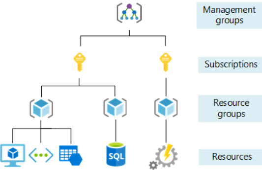
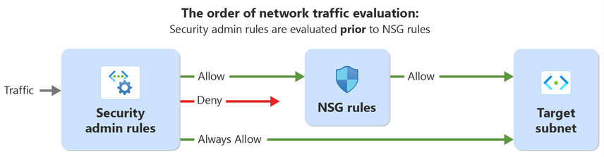
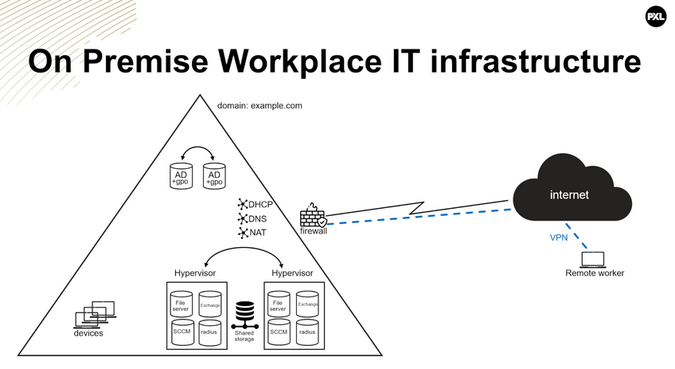

Cloud Advanced
==============

# Table of Contents

* [1. Azure fundamentals](#1-azure-fundamentals)

  * [1.1 General](#11-general)

    * [1.1.1 Core components](#111-core-components)
    * [1.1.2 Region selection](#112-region-selection)
    * [1.1.3 Paired regions](#113-paired-regions)
    * [1.1.4 Point of presence](#114-point-of-presence)
    * [1.1.5 Management levels and hierarchy](#115-management-levels-and-hierarchy)
  * [1.2 Resources](#12-resources)

    * [1.2.1 Virtual machine](#121-virtual-machine)
    * [1.2.2 Storage](#122-storage)

      * [1.2.2.1 Storage blobs](#1221-storage-blobs)
      * [1.2.2.2 Managed disks](#1222-managed-disks)
    * [1.2.3 Networking](#123-networking)

      * [1.2.3.1 Network security groups (NSGs)](#1231-network-security-groups-nsgs)
      * [1.2.3.2 Virtual networks (VNets)](#1232-virtual-networks-vnets)
      * [1.2.3.3 Public IP addresses](#1233-public-ip-addresses)
  * [1.3 Azure resource manager](#13-azure-resource-manager)

    * [1.3.1 Azure CLI vs Cloud Shell](#131-azure-cli-vs-cloud-shell)
  * [1.4 Cost management](#14-cost-management)

* [2. Azure networking](#2-azure-networking)

  * [2.1 Connectivity](#21-connectivity)

    * [2.1.1 Outbound connectivity (egress)](#211-outbound-connectivity-egress)

      * [2.1.1.1 NAT gateway](#2111-nat-gateway)
    * [2.1.2 Inbound connectivity (ingress)](#212-inbound-connectivity-ingress)
  * [2.2 Bastion](#22-bastion)

    * [2.2.1 Traditional jump server](#221-traditional-jump-server)
    * [2.2.2 Azure Bastion: jump host as a service](#222-azure-bastion-jump-host-as-a-service)

      * [2.2.2.1 Native client connections](#2221-native-client-connections)
  * [2.3 Network security groups](#23-network-security-groups)

    * [2.3.1 General](#231-general)
    * [2.3.2 Default rules](#232-default-rules)
    * [2.3.3 Service tags](#233-service-tags)
    * [2.3.4 Application security groups](#234-application-security-groups)
    * [2.3.5 Security admin rules](#235-security-admin-rules)

* [3. Azure automation](#3-azure-automation)

  * [3.1 Overview](#31-overview)

    * [3.1.1 Azure CLI scripts](#311-azure-cli-scripts)
    * [3.1.2 Azure Automation Account](#312-azure-automation-account)
    * [3.1.3 Infrastructure as Code](#313-infrastructure-as-code)
  * [3.2 Infrastructure as Code (IaC)](#32-infrastructure-as-code-iac)

    * [3.2.1 ARM](#321-arm)
    * [3.2.2 Bicep](#322-bicep)
    * [3.2.3 Terraform](#323-terraform)
  * [3.3 Terraform](#33-terraform)

* [4. M365 fundamentals](#4-m365-fundamentals)

  * [4.1 Modern workplace](#41-modern-workplace)

    * [4.1.1 Traditional on-premises workplace](#411-traditional-on-premises-workplace)

      * [4.1.1.1 Active Directory](#4111-active-directory)
      * [4.1.1.2 End-user devices](#4112-end-user-devices)
      * [4.1.1.3 Server roles](#4113-server-roles)
      * [4.1.1.4 Virtualization and storage](#4114-virtualization-and-storage)
      * [4.1.1.5 Network services](#4115-network-services)
      * [4.1.1.6 Firewall rules](#4116-firewall-rules)
    * [4.1.2 Modern workplace](#412-modern-workplace)

      * [4.1.2.1 New requirements](#4121-new-requirements)
      * [4.1.2.2 Microsoft 365 core services](#4122-microsoft-365-core-services)
  * [4.2 Microsoft 365](#42-microsoft-365)
  * [4.3 Licensing](#43-licensing)

    * [4.3.1 Subscription tiers](#431-subscription-tiers)
    * [4.3.2 Other licensing topics](#432-other-licensing-topics)

* [5. Entra](#5-entra)

  * [5.1 Entra ID overview](#51-entra-id-overview)

    * [5.1.1 Terminology](#511-terminology)
    * [5.1.2 Identity types](#512-identity-types)

* [6. Intune](#6-intune)

  * [6.1 General](#61-general)

    * [6.1.1 Personal vs company-owned devices](#611-personal-vs-company-owned-devices)
    * [6.1.2 Autopilot](#612-autopilot)
    * [6.1.3 Configuration policy](#613-configuration-policy)
    * [6.1.4 Apps](#614-apps)
    * [6.1.5 Synchronization](#615-synchronization)
    * [6.1.6 Deployment profile](#616-deployment-profile)
    * [6.1.7 Local admin](#617-local-admin)
  * [6.2 Device Enrollment](#62-device-enrollment)

* [7. Collaboration](#7-collaboration)

  * [7.1 General](#71-general)

    * [7.1.1 SharePoint](#711-sharepoint)
    * [7.1.2 OneDrive](#712-onedrive)
    * [7.1.3 Exchange Online](#713-exchange-online)
    * [7.1.4 Power Automate](#714-power-automate)
    * [7.1.5 Other collaboration tools](#715-other-collaboration-tools)
  * [7.2 OneDrive](#72-onedrive)
  * [7.3 SharePoint](#73-sharepoint)
  * [7.4 Exchange](#74-exchange)

    * [7.4.1 Mailbox types](#741-mailbox-types)
    * [7.4.2 Mailbox delegation](#742-mailbox-delegation)
    * [7.4.3 Mailbox settings](#743-mailbox-settings)
    * [7.4.4 Mail flow](#744-mail-flow)


---

## 1. Azure fundamentals
### 1.1 General 
#### 1.1.1 Core components

- **Datacenter**: Physical facilities equipped with servers, storage devices and network equipment. These are the physical foundation for the Azure services
- **Region**: Geographical area that consists of one or more **availability zones**. It serves as a broader location where users can deploy their applications and data
- **Availability zone**: Physically seperate grouping of one or more datacenters within a region. Each zone has independent power, cooling and networking to ensure fault isolation and high availability.

#### 1.1.2 Region selection

When selecting a region these things need to be taking into account:

- **Compliance & data residency**: Ensuring that the region meets legal and regulatory requirements for data storage (for example GDPR in Europe)
- **Latency & performance**: Choosing a region that provides the lowest latency and best network performance for users
- **Availability of services**: Not all Azure services are available in every region, so make sure to select a region that supports the required services
- **Resiliency & disaster recovery**: Using regions with multiple availability zones or paired regions for high availability and disaster recovery
- **Cost**: Pricing for Azure services varies by region, so cost considerations may influence selection

#### 1.1.3 Paired regions

Most Azure regions have a paired region, this is a geographically seperated secondary region associated with a primary region to provide enhanced reliability and continuity. Some of its benefits are:

- **Geo-redundancy**: Data and workloads can be replicated between the paired regions to improve resiliency
- **Disaster recovery**: In the event of a regional outage, Microsoft prioritizes recovery of one region over its pair to minimize downtime
- **Controlled updates**: Planned maintenance and updates are rolled out sequentially to paired regions, reducing the risk of simultanious failures
- **physical seperation**: Paired regions are located far enough apart to mitigate the impact of regional disasters such as earthquakes or floods

#### 1.1.4 Point of presence

A point of presence is a network edge location that connects users to Microsoft's global cloud infrastructure. These act as entry points to Microsoft's global backbone network and help improve network performance, reliability and latency.
Some key features include:

- **Edge location**: serves as an access point to Microsoft's global network, enabling fast and more reliable connections
- **Supports services**: PoPs support services like Front Door, Content Delivery Network and ExpressRoute to optimize content delivery and network traffic
- **Strategic placement**: Located worldwide in strategic locations to ensure low-latency access and high availabiity for users
- **Network optimization**: PoPs primarily handle network traffic and caching, they don't host customer workloads directly

#### 1.1.5 Managment levels and hierarchy

Azure provides four level of management:

- **Management groups**: container for **one or more** subscriptions that enables unified management across an organization
- **Subscriptions**: unit of managment, biling and resource allocation
- **Resource groups**: logical container for resources that share a lifecycle
- **Resources**: any service or component you create, provision or deploy in azure (VMs, virtual networks, public ips, ...)



### 1.2 Resources
#### 1.2.1 Virtual machine

Provide compute resources in a self-managed environment. They represent the core of Azure's infrastructure as a Service offering.
You have full control, VMs are self-managed (IaaS). All other compute resources are managed environments built on VMs where Microsoft handles the underlying infrastructure.

#### 1.2.2 Storage

| Storage Option | Description | Use Case |
|----------------|-------------|----------|
| Azure Blobs | Scalable cloud storage for storing unstructured data such as documents, images, backups, and media files. | Hosting static websites (serving web assets like HTML, CSS, and JavaScript). Storing and streaming images, videos, and audio. Backup and recovery storage. Archiving logs and telemetry data. |
| Azure Files | Fully managed cloud file shares accessible via standard SMB and NFS protocols. | Mounting Azure file shares from the cloud or on-premises on Windows, Linux, and macOS systems for shared storage. |
| Azure Managed Disks | Block-level storage volumes designed specifically for Azure Virtual Machines. | Persistent storage for virtual machines, including OS and data disks. Supports high availability and managed snapshots. |
| Azure Tables | NoSQL key-value store for schemaless storage of structured data. | Flexible datasets such as user profiles, address books, device information, or other application metadata. Ideal for web apps and IoT scenarios. |

##### 1.2.2.1 Storage blobs

Each blob in Azure has a unique URI (for example: "https://myaccount.blob.core.windows.net/mycontainer/blob")

- **Storage account**: a unique namespace for storing data in Azure. The name must be globally unique!
- **Container**: a logical grouping of blobs (similar to a directory in a file system)
- **Blob**: the actual file or object stored inside a container (document, image, video, ...)

##### 1.2.2.2 Managed disks

Fully managed, high performance disk storage designed for Azure VMs. By using these the need for manually managing underlying storage accounts is removed.
When you create a VM, typically 2 disks are provisioned (OS disk, a **managed** disk and a temporary disk which is **unmanaged**)

#### 1.2.3 Networking
##### 1.2.3.1 Network security groups (NSGs)

A **Network security group** controls inbound and outbound network traffic to Azure resources by defining rules based on IP addresses and ports.

- **Stateful**: automatically allow response traffic
- Can be associated with: virtual network subnets or network interfaces (NICs)

##### 1.2.3.2 Virtual networks (VNets)

A **virtual network** is a fundamental networking component in Azure that enables secure communication between resources. It consits of one or more subnets.

##### 1.2.3.3 Public IP addresses

A **public IP** allows Azure resources to communicate with the internet. Public IPs can be assigned to:

- Network interface cards (NIC)
- NAT gateways
- VPN gateways
- Azure bastion
- Load balancers
- Azure firewall

### 1.3 Azure resource manager

Azure resource manager (ARM) is the deployment and management service for Azure. It does not matter what you used (Portal, CLI, REST) to create, update or delete a resource, ARM will handle the request.

- Azure portal: GUI
- Azure CLI:
```bash
# structure of azure cli commands:
az <group> <command> --options
# example:
az group create --name ca-FirstGroup --location westeurope
```
- Azure CLI Cloudshell: uses a cloud container in Azure to execute CLI commands instead of running them locally can be opened in two ways:
    - When opening a new Terminal tab on your machine
    - From the Azure portal

#### 1.3.1 Azure CLI vs Cloudshell

| Feature | Azure CLI (Local) | Azure Cloud Shell |
|----------|------------------|-------------------|
| Execution environment | Runs on your local computer | Runs in a cloud-based container |
| Installation | You need to install Azure CLI manually | No installation required (pre-configured) |
| Access to local resources | Full access to local files, scripts, and tools | Limited access (Cloud Shell has persistent storage in `$HOME`) |
| Authentication | Requires manual login (`az login`) | Automatically authenticated with your Azure account |
| Persistent data | All files and settings are stored locally | Only the `$HOME` directory is persistent (uses Azure File Storage) |
| How to access | Run `az` commands in Windows Terminal or PowerShell | Access via Azure Portal or Windows Terminal (`Ctrl+Shift+P` → **Cloud Shell**) |

### 1.4 Cost management

There are several tools available:

- **Cost calculator**: Before deploying cloud resources, use this to estimate the cost
- **Cost analysis**: Once the resources are running, you can monitor their actual spending, you can filter cost analysis based on resource groups, subscription or on a specific time (for example daily)
- **Budget alerts**: Set up budget alerts to automatically receive an email when you reach a certain level of Azure credit usage. You can configure budgets in several ways:
    - **total budget**: sends an alert when a specified portion of the total budget has been spent
    - **monthly budget**: sends an alert when a certain amount is spent within a month

---

## 2. Azure networking
### 2.1 Connectivity
#### 2.1.1 Outbound connectivity (egress)

There are multiple ways to provide outbound connectivity from Azure VMs to the internet:

- **public subnets**: This is not the default after 31/05 2026! Now when you create a subnet it is by default private.
- **private subnets**: common options to grant outbound connectivity:
    - **public IP**: OK for test environments, not for production
    - **NAT gateway**: recommended

##### 2.1.1.1 NAT gateway

A NAT gateway is associated with one or more subnets in a virtual network.

- A NAT gateway is attached to subnets! (not the virtual network itself)
- One NAT gateway can be associated with multiple subnets in the same virtual network
- The same NAT gateway cannot be used accross different virtual networks
- Each subnet can have at most one NAT gateway
- Each public IP address provides up to 64k SNAT ports (add more public IPs to increase)

#### 2.1.2 Inbound connectivity (ingress)

Inbound connectivity is typically handled seperately from outbound connectivity. Common options are:

- Azure load balancer
- Application gateway

### 2.2 Bastion
#### 2.2.1 Traditional jump server

In traditional on-premises and early cloud setups, admins often used a **jump server** to access machines in a private network. This is a **hardened intermediary host** that sits between an untrusted network (such as the internet) and a secure internal network. It serves as a **controlled** entypoint for admin access so that direct connections from the internet to every individual server are not allowed.

The typical setup consists of:
- A VM deployed with a public IP
- Admins connect to the jump server using SSH or RDP
- From the jump server, admins connect to other private VMs using their **private** IPs
- The jump server acts as a secure "hop" between public acces and the internet environment

Challenges of using a jump server:
- Jump server must be **secured, patched and monitored**
- It must expose at least SSH or RDP ports to the internet which increases attack surface
- If used widely, requires **ongoing management and maintenance**
- Each new target VM may require additional configuration or mangament rules

#### 2.2.2 Azure Bastion: jump host as a service

Azure bastion is a fully managed Platform as a service (Paas) that provides secure RDP and SSH access to virtual machines without exposing them to the public internet.

- RDP and SSH are routed securly over TLS
- Connection is established through the Azure portal (or CLI) without needing special client software or agents
- Basion sits inside your virtual network and acts as a managed jump host for all VMs in that VNet (and peered VNets)
- Microsoft handles scaling, patching and security of the Bastion service
- available in 4 SKUs: Developer, basic, standard and premium

#### 2.2.2.1 Native client connections

Accessing a virtual machine through a web browser sucks ass, instead use the Azure CLI to set up a native client connection to the Bastion service and the target virtual machine.

### 2.3 Network security groups
#### 2.3.1 general

Network security groups (NSGs) are used to filter network traffic between Azure resources within Azure networks. An NSG contains security rules that allow or deny inbound and outbound traffic to various types of Azure resources. It can be configured to a virtual subnet or a NIC.

The same NSG can be reused in other virtual subnets and/or NICs. It is recommended to associate NSGs with subnets instead NICs.
Every NSG consists of 7 properties:

| Property | Description |
|----------|-------------|
| Priority | Determines the order in which rules are processed. Lower numbers have higher priority and are processed first; higher numbers are processed later. |
| Name | A human-readable name for the rule to identify its purpose. |
| Port | The port number or range that the rule applies to. |
| Protocol | The network protocol the rule applies to (TCP or UDP). |
| Source | The origin of the traffic. Can be an IP address, a Service Tag, or an Application Security Group (ASG). |
| Destination | The target of the traffic. Can be an IP address, a Service Tag, or an Application Security Group (ASG). |
| Action | Specifies whether to **Allow** or **Deny** the traffic. |

**NSG rules are stateful** this means that when traffic is allowed in one direction, the return traffic is automatically also allowed!

#### 2.3.2 Default rules

Default inbound security rules:
| Priority | Name | Port | Protocol | Source | Destination | Action |
|----------|------|------|----------|--------|-------------|--------|
| 65000 | AllowVnetInBound | Any | Any | VirtualNetwork | VirtualNetwork | Allow |
| 65001 | AllowAzureLoadBalancerInBound | Any | Any | AzureLoadBalancer | Any | Allow |
| 65500 | DenyAllInBound | Any | Any | Any | Any | Deny |

Default outbound security rules:
| Priority | Name | Port | Protocol | Source | Destination | Action |
|----------|------|------|----------|--------|-------------|--------|
| 65000 | AllowVnetOutBound | Any | Any | VirtualNetwork | VirtualNetwork | Allow |
| 65001 | AllowInternetOutBound | Any | Any | Any | Internet | Allow |
| 65500 | DenyAllOutBound | Any | Any | Any | Any | Deny |

> [!WARNING]
> When using the default rules in an NSG, the following is allowed by default:
>
> - **All network traffic between subnets in the same VNet is allowed**, both inbound and outbound. ⚠ This is **not Zero Trust**.
>   - **Best practice:** Block VNet traffic by default and create explicit inbound and outbound rules to allow only the required traffic between subnets.
>
> - **All outbound traffic is allowed.**
>   - This permits resources to access the Internet. ⚠ This is **not Zero Trust**.
>   - **Best practice:**
>     - Allow outbound HTTP/HTTPS traffic only to the Service Tag: `Internet`.
>     - Allow DNS traffic only to `168.63.129.16` (Azure DNS). The IP address `168.63.129.16` is used by several Azure services. Therefore, DNS resolution is only allowed through Azure itself and not through external DNS resolvers.
>     - Avoid using `Any` for outbound destinations, as it could also allow access to unintended VNets or resources.

#### 2.3.3 Service tags

A service tag represents a set of IP address prefixes for a specific Azure service. Microsoft manages and updates these prefixes automatically, reducing the need to frequently modify NSGs, by specifying a service tag in the source or destination of a security rule, you allow or deny any traffic for that service. The tag always includes all current and future IP ranges used by that service.

#### 2.3.4 Application security groups

An application security group is a logical grouping of Azure VMs or NICs that share similar security requirements. Using ASGs in network security rules allows you to allow or deny traffic to an entire group of resources without specifying individual IP addresses. 
Example use cases: 
- ASG-FrontendApp: all NICs hosting the public facing frontend web application
- ASG-Backend: all NICs hosting the private backend application
- ASG-Database: All NICs hosting the private database tier or application

> These only work within the same virtual network! If you need to allow traffic between resources in seperate virtual networks, use CIDR ranges or individual IP addresses in your NSG rules instead.

#### 2.3.5 Security admin rules

Security admin rules are global network security rules that enfore security policies defined in the rule collection on virtual networks. These network groups can only consist of virtual networks within the scope of your virtual network manager instance.

| Scenario | Description |
|----------|-------------|
| Restricting access to high-risk network ports | Use security admin rules to block traffic on specific ports commonly targeted by attackers, such as port **3389** for Remote Desktop Protocol (RDP) or port **22** for Secure Shell (SSH). |
| Enforcing compliance requirements | Use security admin rules to enforce compliance requirements. For example, block traffic to or from specific IP addresses or network blocks. |
| Protecting sensitive data | Use security admin rules to restrict access to sensitive data by blocking traffic to or from specific IP addresses or subnets. |
| Enforcing network segmentation | Use security admin rules to enforce network segmentation by blocking traffic between virtual networks or subnets. |
| Enforcing application-level security | Use security admin rules to enforce application-level security by blocking traffic to or from specific applications or services. |

Security admin rules vs network security groups:
| Rule Type | Target Audience | Applied On | Evaluation Order | Action Types | Parameters |
|-----------|----------------|------------|------------------|--------------|------------|
| Security admin rules | Network admins, central governance team | Virtual networks | Higher priority | Allow, Deny, Always Allow | Priority, protocol, action, source, destination |
| Network security group rules | Individual teams | Subnets, NICs | Lower priority, evaluated after security admin rules | Allow, Deny | Priority, protocol, action, source, destination |

Order of network evaluation:


Security admin rules support 3 actions:

- **Deny**: Stops traffic immediately. NSG rules are NOT evaluated afterward
- **Always allow**: Bypasses NSGs completely. Traffic is allowed even if an NSG denies it.
- **Allow**:  Allows traffic at the admin layer, BUT traffic must still pass NSG evaluation.

---

## 3. Azure automation
### 3.1 overview

Creating Azure resources through the Portal manually has several shortcomings:

- Time consuming
- Inconsistency
- No version control

#### 3.1.1 Azure CLI scripts

Instead of running commands manually for each resource, you can place all required commands in a single script and execute them in sequence. 

This comes with several benefits:
- Efficiency and speed
- Version control
- Consistency

But has several limitations:
- Imperative approach (scripts can become very long and hard to maintain as environments grow)
- Order-sensitive execution
- Limited dependency handling
- More complex lifecycle management (since there is no state management, handling repeated changes safely and consistently often requires extra logic, validation and testing)

> Use this for quick, manual or one-time limited operation or when automation across environments are not needed.

#### 3.1.2 Azure automation account

Another way to automate Azure operations is by using Azure Automation runbooks, instead of running scripts locally, runbooks are stored and executed in an Azure Automation account. Runbooks can be triggered by schedules, webhooks or events. They are usually written in PowerShell or PowerShell-based Azure CLI

Benefits:
- Centralized execution
- Scheduling and triggers
- Operational efficiency (well suited for repeatable tasks)
- Secure authentication options (can use managed identities)

Limitations/drawbacks:
- Script maintenance is still required
- Not ideal for full infrastructure provisioning
- Manual workflow logic (complex dependency handling, retries and rollbacks often require custom code)
- Runtime and module contraints (you must manage supported runtime version, modules and permissions)

> Use this when you need time-based or event-driven operational automation rather than full environment provisioning.

#### 3.1.3 Infrastructure as code

Another way of automating Azure resources is by defining them through IaC. This uses a **declaritive** model: you describe the desired state of your environment and the tool determines what to create, update or remove. This is the key difference from Azure CLi scripts which are **imperative** and require you to define each step explicitly.

Benefits:
- Version control
- Consistency
- Single definition for create and update
- State management(Terraform does this, ARM and bicep do not!)
- Dependency orchestration

Limitations:
- Learning curve
- State handling complexity(terraform): state files must be stored securely and managed carefully
- Less convenient for quick ad-hoc tasks

> Use IaC when you need to deploy and maintain a complete Azure environment repeatedly and consistently.

### 3.2 Infrastructure as code (IaC)

Infrastructure as Code aalows you to define and manage Azure resources through code instead of manual Portal actions. In Azure the most common IaC options are ARM templates, Bicep and Terraform.

| Properties | ARM | Bicep | Terraform |
|------------|-----|--------|-----------|
| Developed by | Microsoft | Microsoft | HashiCorp |
| Language | JSON | Bicep (DSL) | HCL (DSL) |
| Multi cloud / environments | Azure only | Azure only | Yes (AWS, Azure, GCP, VMware, Proxmox, etc.) |
| Engine | Native Azure Resource Manager | Compiles to ARM templates, then deployed via Azure Resource Manager | Terraform engine + Azure Provider |
| State Management | Handled by Azure Resource Manager | Handled by Azure Resource Manager | Separate state file managed by Terraform |
| Drift detection | No | No | Yes |

#### 3.2.1 ARM

Azure Resource Manager templates is Microsoft's original IaC tool for deploying and managing Azure resources. ARM templates are written in JSON which can become verbose, so even single infrastructure definitions can grow into large templates.

#### 3.2.2 Bicep

Bicep was developed by Microsoft to address ARM template complexity. It is an evolution of ARM that uses domain-specific language that is easier to read and write than JSON. When you deploy a Bicep file, it is compiled to an ARM template and then executed by Azure Resource Manager. The main advantage of ARM and Bicep is that both are native Azure approaches and integrate directly with Azure Resource Manager.

#### 3.2.3 Terraform

Terraform is an IaC tool developed by HashiCorp that supports Azure and many other platforms. In Azure, Terraform uses the Azure Provider to translate your configuration into API calls that create, update or remove resources.
Terraform configurations are written in HCL, a domain-specific language designed to be more readable and modular.

When you run Terraform, it compares your configuration with the current environment and its state file, then creates an execution plan before applying changes.

The main advantage of Terraform is its multi-cloud support and strong state-driven workflow including planning and drift detection. A key consideration is that the Terraform state file must be managed carefully, because it is critical for safe and consistent deployments.

### 3.3 Terraform

This was handled in class and is fully practical, I am not including it here.

---

## 4. M365 fundamentals
### 4.1 Modern workplace
### 4.1.1 Traditional on-premises workplace

A traditional workplace is designed around in-person office work:

- All infrastructure is hosted on-premises
- Each employee is assigned a single, dedicated device
- Devices are primarily used within the on-premises network
- External user access is limited and handled through VPN
- Remote employees connect back to the on-premises environment via VPN



##### 4.1.1.1 Active directory

Active directory is the directory service that manages users, computers and resources within a Windows network domain. It provides:
- **Centralized identity management**: user accounts, groups and computer objects
- **Access control**: role-based access to file shares, printers and applications
- **Group policy objects**: enforce security settings and configuration accross all domain-joined devices

##### 4.1.1.2 End-user devices

Desktops, laptops and workstations are joined to the Active directory domain, enabling:
- Centralized configuration through GPOs
- Software deployment and patch management via SCCM
- OS provisioning through imaging

##### 4.1.1.3 Server roles

| Service | Purpose |
|----------|---------|
| File Server | Centralized file storage and shared network drives |
| Exchange Server | On-premises email, calendar, and contacts |
| SCCM | System Center Configuration Manager — software deployment, updates, and device inventory |
| RADIUS | Remote Authentication Dial-In User Service — network access authentication for Wi-Fi and VPN |

##### 4.1.1.4 Virtualization and storage

Server roles run as virtual machines on Type 1 hypervisors (VMware, Hyper-V, Proxmox, ...). Multiple hypervisors are deployed for redudancy. A SAN (Storage Area Network) provides shared storage, enabling:
- Live migration of VMs between hypervisors without downtime
- Centralized backup and snapshot management
- High availability

##### 4.1.1.5 network services

| Service | Full Name | Purpose |
|----------|-----------|---------|
| DHCP | Dynamic Host Configuration Protocol | Automatically assigns IP addresses to network devices |
| DNS | Domain Name System | Resolves hostnames (e.g., `fileserver.example.com`) to IP addresses |
| NAT | Network Address Translation | Maps internal private IPs to a public IP for internet access |

##### 4.1.1.6 Firewall rules

The security gateway between the internal network and the interent:
- Filters inbound and outbound traffix based on rules
- Protects internal systems from external threats
- Terminates VPN tunnels for remote workers

#### 4.1.2 Modern workplace
##### 4.1.2.1 New requirements

The modern workplace demands flexibility and hybrid support:

- **Hybrid work**: employees split time between locations and the office
- **Multi-device**: each employee uses multiple devices across different operating systems
- **BYOD**: employees access company resources from personal devices
- **External collaboration**: partners and contractors need scoped, time-limited access to company resources.

A traditional on-premises infrastructure is not designed to meet these challenges. Identity, device management and collaboration must move to the cloud to support a workforce that operates from anywhere, on any device.

##### 4.1.2.2 Microsoft 365 core services

| Microsoft 365 Service | Replaces / Extends | Description |
|----------------------|--------------------|-------------|
| Entra ID | Active Directory | Cloud-based identity and access management — user authentication, single sign-on (SSO), multi-factor authentication (MFA), and conditional access policies |
| Intune | SCCM / GPOs | Cloud-based device management (MDM) and application management (MAM) — enroll, configure, and secure devices across Windows, macOS, iOS, and Android |
| Exchange Online | Exchange Server | Cloud-hosted email, calendar, and contacts with built-in spam filtering and data loss prevention |
| SharePoint / OneDrive | File Server | SharePoint provides team sites for shared document management; OneDrive provides personal cloud storage with sync and sharing capabilities |
| Teams | — | Unified collaboration platform for chat, video meetings, file sharing, and integration with other Microsoft 365 services |

### 4.2 Microsoft 365

The initial setup of a Microsoft 365 tenant is done in the Microsoft 365 admin center. This admin center is used for tenant-wide administration, including:

- User management
- License assignment
- Basic tenant settings

In addition to the global admin center, Microsoft 365 has service-specific admin centers for deeper configuration and operations:

| Service | Description | Admin center URL |
|----------|-------------|------------------|
| Entra | Manages identities, authentication, access policies, and conditional access for users and applications. | `entra.microsoft.com` |
| Intune | Manages devices and applications through cloud-based MDM and MAM policies. | `intune.microsoft.com` |
| SharePoint | Manages SharePoint sites, sharing settings, storage limits, and content services. | `tenantname-admin.sharepoint.com` |
| Exchange | Manages mail flow, mailboxes, protection policies, and organization-wide email settings. | `admin.exchange.microsoft.com` |
| Teams | Manages Teams policies, meetings, calling, apps, and collaboration settings. | `admin.teams.microsoft.com` |
| Security (Defender) | Centralizes threat protection, security incidents, alerts, and investigation workflows. | `security.microsoft.com` |
| Purview (Compliance) | Manages data lifecycle, retention, eDiscovery, information protection, and compliance policies. | `compliance.microsoft.com` |

### 4.3 Licensing

Microsoft 365 is a SaaS platform and is licensed per user, it offers several plans for different target groups:

- **Business**: Small and medium-sized organizations (up to 300 users)
- **Enterprise**: Large organizations or organizations with advanced security, compliance, and management requirements
- **Frontline**: Lower-cost plans with essential services for operational workers
- **Nonprofit**: Discounted licensing for eligible nonprofit organizations
- **Government**: Plans designed for public sector organizations
- **Education**: Plans designed for educational institutions

#### 4.3.1 Subscription tiers

Each subscription plan contains one or more tiers. Higher tiers include more services and more advanced security/compliance capabilities.

#### 4.3.2 Other licensing topics

The total Microsoft 365 cost depends on:

- Chosen subscription plan
- Chosen tier
- Number of licensed users
- Contract type and purchasing channel
- Optional add-ons

In the EEA Microsoft introduced offers with and without teams due to competition commitments.

Organizations can purchase Microsoft 365 directly from Microsoft or through a partner using the Cloud Solution Provider program (CSP)

---

## 5. Entra
### 5.1 EntraID overview

Microsoft Entra ID is Microsoft's cloud based identity and access management (IAM) service. It helps users securely access apps, devices and data. It was previously called Azure Active Directory (Azure AD). It provies core identity capabilities such as:
- Authentication
- Authorization
- Single sign-on (SSO)
- Conditional access

Organizations use Microsoft Entra ID to give employees, guests and partners secure access to internal and external resources.

#### 5.1.1 Terminology

- **UPN**: each user is identified by a unique User Principal Name (UPN)
- **Tenant**: an instance of Entra ID for a single organization, each tenant has a unique ID and domain name
- **Directory service**: a logical container within a tenant holding and organizing identity related resources
- **Multi-tenant**: an organization with multiple Entra ID instances often due to reasons like subsidiaries, mergers, ...

#### 5.1.2 Identity types

In Microsoft Entra ID, there are different types of identities that are supported:

- **User identities**: identities assigned to people (can be internal or external users)
- **Device identities**: identities assigned to physical devices (mobile phones, desktops, IoT devices, ...)
- **Workload identities**: identities assigned to software-based objects (applications, VMs, services, containers, ...)
    - **Service principal**: Security identity of an application in a tenant, used to grant app-level permissions to resources
    - **Managed identity**: Microsoft Entra identity that Azure creates and manages automatically for supported resources so applications can authenticate without storing or rotating credentials in code

---

## 6. Intune
### 6.1 General

Microsoft Intune is Microsoft's cloud-based endpoint management service (SaaS) for securing and managing organizational and persoal devices. It supports both **device management (MDM)** and **application management (MAM)**

#### 6.1.1 Personal vs company owned devices

In Intune's Mobile Device Management (MDM) it is possible to enroll two types of devices:

- Personal devices (less commonly enrolled in Intune through MDM)
- Company-owned devices

#### 6.1.2 Autopilot

To register company-owned devices with intune MDM, they must first be added to Windows autopilot, this links each device to your organization's Microsoft 365 tenant. When the device is reset or reinstalled, it automatically reconnects to the tenant and continues to be managed by Intune

Autopilot is used to:

- Associate devices with a Microsoft 365 tenant
- Automate provisioning and configuration during the out-of-box experience (OOBE)

#### 6.1.3 Configuration policy

Configuration policies are rules that define how devices should be set up and behave in an organization. (modern cloud-based equivalent of GPO)

They are used to:

- Enforce security settings
- Configure device behaviour
- Restrict or allow features
- Ensure compliance with company standards

#### 6.1.4 Apps

Applications in Microsoft Intune are software packages that you centrally manage, deploy and control across your organization's devices. Apps can be deployed in 2 ways:

- **Enforced**: automatically installed on the selected group of devices (end user cannot override this)
- **Company portal**: the app is published to the company portal, where end users can download and install it themselves

#### 6.1.5 Synchronization

Device synchronization is needed to synchronize configuration policies, application/device information to intune. This is not predictable but is dependable on the synchronization scheme, for windows this is: every 3 minutes for the first 15 minutes, then every 15 minutes for the next 2 hours, and after that, approximately every 8 hours. It is also possible to do this manually:

- From windows settings on the device itself
- From the Intune device menu
- Restarting the Microsoft Intune Management Extension on the device

#### 6.1.6 Deployment profile

A deployment profile is a collection of rules that define how a device is enrolled and configured during intitial setup. A deployment profile automates the Windows OOBE.
Typical settings included in a deployment profile are:

- Type of local user account
- Hostname naming template
- System language
- Keyboard layout/configuration

#### 6.1.7 Local admin

The best practive is the end users do not have local administrator privileges on their devices. Granting users local admin rights introduces significant security risks:

- Malware proliferation
- Unauthorized software installation
- Configuration drift
- Privilege escalation

This alligns with the **zero trust principle**, a core security principle stating that users should only have the minimum permissions necessary to perform their job

When elevated privileges are required admins have 2 options to grant temporary or controlled local administrator access:

- Local admin security policy (an Intune configuration policy that adds a specific Entra ID user account to the local admin group on a device. Discouraged because it exposes the admin's Entra credentials on the device)
- Windows LAPS: Windows Local Administrator Password Solution (LAPS) automatically generates, rotates and securly stores a unique local admn password per device in Entra ID

### 6.2 Device Enrollment

To register company-owned devices with Intune MDM, they must first be added to Windows Autopilot. Adding a device to Autopilot can be done in 2 ways:

- Through the device manufacturer: request the device hardware hash when purchasing them
- Manually extract a device's hardaware hash using a PowerShell script and then import it into Autopilot

---

## 7. Collaboration
### 7.1 General
#### 7.1.1 Sharepoint

Sharepoint is a web-based platform for structured team collaboration and content management. Key capabilities include:

- **Document libraries**: centralized storage for team files with built-in version history and access control
- **Intranet sites**: Team or department sites for organizing news, announcements and resources
- **External sharing**: Both internal (Entra ID) users and external guests can collaborate on content

Sharepoint integrates directly with Microsoft Teams, each team automatically gets a backing Sharepoint site for file storage

#### 7.1.2 Onedrive

The personal cloud storage solution for each Microsoft 365 user. Onedrive is scoped to the individual while Sharepoint is intended for team-owned content. Users can still share files and folders with internal colleagues or external users.

#### 7.1.3 Exchange online

SaaS email and calendaring service. It is the cloud equivalent of on-premises Exchange server and provides enterprise email, shared calendars, contacts and distribution groups. It also integrates with Teams for meeting scheduling and is managed through the Microsoft 365 admin center or Exchange admin center.

#### 7.1.4 Power automate

A low-code workflow automation platform. It enables users and administrators to automate repetitive tasks and business processes across Microsoft 365 services and third-party applications. Common use cases include approval flows, automated notifications, and data synchronization between services.

#### 7.1.5 Other collaboration tools

| Tool | Description |
|------|-------------|
| Microsoft Project | Project and portfolio management tool for planning, scheduling, and tracking work. |
| Planner | Lightweight task management with kanban-style boards for team task tracking. |
| Viva Engage (Yammer) | Enterprise social networking platform for organization-wide communication. |
| Whiteboard | Digital canvas for real-time collaborative brainstorming and diagramming. |
| Power BI | Business intelligence platform for creating and sharing interactive data reports and dashboards. |

### 7.2 Onedrive

Nothing useful, just practical explanations

### 7.3 Sharepoint

Nothing useful, just practical explanations

### 7.4 Exchange
#### 7.4.1 Mailbox types

| Type | Description | Example |
|------|-------------|---------|
| User mailbox | A mailbox assigned to an individual user. It is created when a new Entra user is assigned a Microsoft 365 license. | `jan.peeters@company.com` |
| Shared mailbox | A mailbox used by multiple users (for example, support or HR). Users access it through delegated permissions. Shared mailboxes do not have separate sign-in credentials. | `info@company.com`, `hr@company.com` |
| Group | Creating a group in the Exchange admin center creates a Microsoft 365 group. This is the same as creating a Microsoft 365 group in Entra. | `hr@company.com` |
| Resource mailbox | A mailbox for scheduling resources such as meeting rooms or equipment. | `room1@company.com`, `projector@company.com` |
| Mail contact | A mail-enabled contact for an external email address. It appears in the organization address list but does not include a mailbox. | `support@proximus.be` |

Besides creating different mailbox types, you can also manage mailbox-specific settings in the Exchange admin center.

#### 7.4.2 Mailbox delegation

There are several mailbox delegation permissions to be assigned:

- **Full Access**: Allows a user to open a mailbox and manage its content (read, create, edit, and delete emails)
- **Send As**: Allows a user to send email as the mailbox. Recipients see the message as sent directly by that mailbox
- **Send on Behalf**: Allows a user to send email on behalf of the mailbox owner. Recipients see both the sender and the mailbox owner (for example, "Alex on behalf of HR")

#### 7.4.3 Mailbox setting

For each mailbox, you can configure additional settings. Common examples include:

- **Message size restrictions**: Define the maximum size for incoming and outgoing messages
- **Email forwarding**: Forward incoming mail to another mailbox or external address. This is often used during employee transitions, temporary role coverage, or centralized processing (for example, legal or support workflows)
- **Message delivery restrictions**: Allow or block messages from specific senders or groups to control who can email the mailbox
- **Automatic replies (Out of Office)**: Configure automatic responses for a mailbox. Central configuration is useful for shared mailboxes, long-term absences, or department-level communication mailboxes
- **Primary email address and aliases**: Configure the primary SMTP address and add aliases for alternative email addresses
- **Mailbox usage**: Review mailbox size and usage metrics for monitoring and capacity management

#### 7.4.4 Mail flow

Mail flow management in Exchange controls how messages are routed, filtered, and delivered:

- **Message tracing and troubleshooting**: Track a specific message through Exchange Online 
- **Mail flow (transport) rules**: Apply organization-wide policies
- **Connector management**: Configure secure mail routing between Microsoft 365 and external systems
- **High Volume Email scenarios**: Use Exchange features for operational high-volume messages (for example, notifications and system-generated emails)