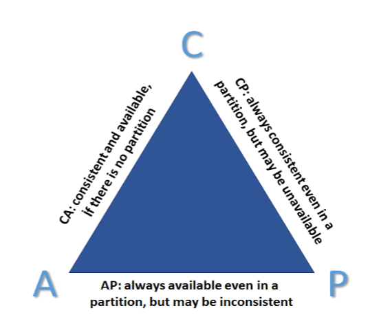
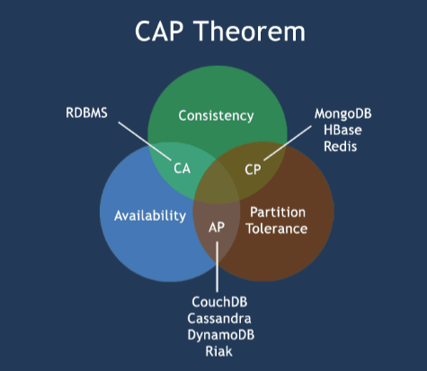
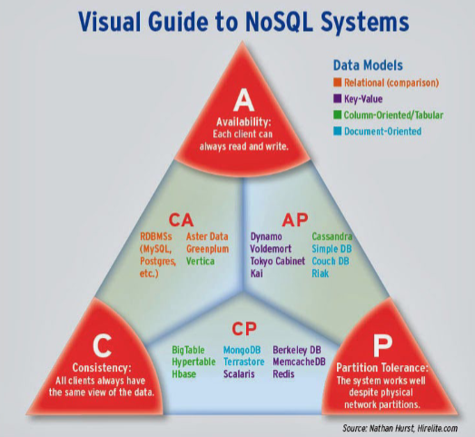
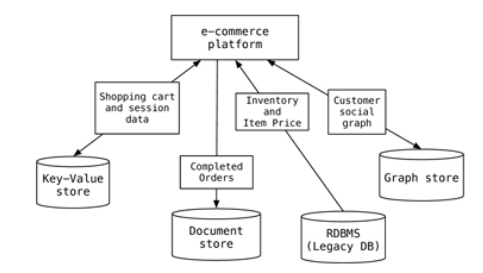

Data Advanced
=============

# Table of Contents

- [1. Basisprincipes](#1-basisprincipes)
   - [1.1 Terminology](#11-terminology)
   - [1.2 Data organisation](#12-data-organisation)
      - [1.2.1 Distributed systems](#121-distributed-systems)
      - [1.2.2 CAP-theorem](#122-cap-theorem)
   - [1.3 Database principles](#13-database-principles)
      - [1.3.1 Transaction](#131-transaction)
      - [1.3.2 ACID](#132-acid)
      - [1.3.3 BASE](#133-base)
   - [1.4 NoSQL](#14-nosql)
      - [1.4.1 NoSQL database systems](#141-nosql-database-systems)
      - [1.4.2 Key-value stores](#142-key-value-stores)
      - [1.4.3 Column oriented stores](#143-column-oriented-stores)
      - [1.4.4 Document oriented stores](#144-document-oriented-stores)
   - [1.5 NoSQL, Relational or Both?](#15-nosql-relational-or-both)

---

## 1. Basisprincipes

Because of changes in how data is stored nowadays we speak of the 3 V's:

- Volume: large amounts of data stored
- Velocity: data needs to be accesible at high speeds (think Facebook, instagram, ...)
- Variety: differences in structure of stored data

### 1.1 Terminology

- Database: the stored data, the way the data is stored (see datamodel), the software with which databases can be made or accessed (see DBMS)
- Datamining: searching for (statistical) connections in data to create profiles to be used in scientific, commercial or journalistic cases
- Datawarehouse: a collection of data that can be queried in a relatively short time, without impacting the source, users cannot add/change/delete data and this is mostly used for BI-purposes
- Datalake: can be compared to a normal file system on a consumer PC
- Datalakehouse: combination of datalake and datawarehouse, on top of the datalake an extra layer of metadata and governance is built (single source of truth)

### 1.2 Data organisation
#### 1.2.1 Distributed systems

With large amounts of data and little to no structure the time to process that data goes up the more data there is. How can we decrease that processing time?

- Faster server: RDBMS 
- More servers: Distributed system: mainframe, workstations, communication via network => NoSQL
- Optimization of software

In practice a combination of **more servers** and **optimiaztion of software** is used most often. This has big advantages:

- Reliability (one node crashes, others can keep working)
- Scalability (expanding is always possible)
- Sharing resources (multiple applications use the same data and systems)
- Flexibility (easy to install, implement and debug new services)
- Speed (more power)
- Open system (every client can use every service if they have access (rights) to that service)
- Performance (higher performance because workloads are distributed)

But they also come with a couple of drawbacks:

- Less software support
- Highly vulnerable to network issues
- Possible security issues

#### 1.2.2 CAP-theorem

Describes the consequences of using distributed systems for databases. The letters stand for:

- Consistency: the way the database system shows the most recent data to all servers/nodes (optimal if after a transaction/operation all clients see the most recent data on all connected servers/nodes)
- Availability: optimal if the system is always available
- Partition tolerance: system stays operational when 1 or more servers or nodes goes down

The CAP-theorem says that when a **distributed system** is being used with multiple servers/nodes a choice must be made between **consistency** and **availability**, only one of these can be fulfilled.

With RDBMS, consistency and availability (CA) are the most important because they work with constantly operational data that must be consistent and available.
With NoSQL databases there are two possible combinations: 
- CP: some data is not directly available but consistency is guaranteed and can be spread over multiple servers
- AP: the system is available but not always consistent, particularly useful for analysis of Big Data

### 1.3 Database principles
#### 1.3.1 Transaction

In a database system a transaction might consist of one or more data-manipulation statements and queries, each reading and/or writing information in the database. Users of database systems consider consistency and integrity of data as highly important. A simple transaction is usually issued to the database system in a language like SQL wrapped in a transaction, using a pattern similar to the following:
 
- Begin the transaction
- Execute a set of data manipulations and/or queries
- If no errors occur then commit the transaction and end it
- If errors occur then roll back the transaction and end it

#### 1.3.2 ACID

A classic relational database uses the ACID principle:

- Atomic: a transaction either succeeds completely or does not succeed at all (if 1 statement throws an error, the entire transaction is rolled back)
- Consistent (ACID consistency): ensures that any transaction takes the database from one valid state to another, strictly adhering to predefined rules, constraints, and triggers. If a transaction violates any data integrity rule, the database aborts it and rolls back the changes
- Isolated: every transaction is done seperate (isolated) from every other transaction. Transactions that are done simultaneously can not see each others results
- Durable: when a transaction is comitted, it is permanent and cannot be reverted

#### 1.3.3 BASE

The ACID principle is not always the best choice for modern applications, for example for NoSQL databases the BASE principle is used, in this principle the consistency of the database is less important.

- Basic availability: the system guarantess availability proposed by the CAP theorem, but temporary inconsistencies are allowed
- Soft state: the system can change over time even without input of data, it is the responsibility of the developer to catch that inconsistency
- Eventual consistency: with passage of time, eventually the consistent state of the database will be realised (for example: a change will not be visible for everyone instantly but it will be after a couple of days like in webapplications)

### 1.4 NoSQL

A non-relational databasemanagement system specially developed for distributed data stores that contain Big Data, it does not have to have a strict structure en avoids join-operations

| RDBMS | NoSQL |
|--------|--------|
| Structured data | Not Only SQL – also supports unstructured data |
| SQL (Structured Query Language); ANSI standard | No standard query language |
| Data and relationships are stored in separate tables | No predefined structure |
| DML (Data Manipulation Language) | Sometimes unpredictable data |
| DDL (Data Definition Language) | |
| Data consistency | Eventual consistency, but high performance |
| ACID transactions | BASE transactions |

| Advantages of NoSQL | Disadvantages of NoSQL |
|---------------------|------------------------|
| High scalability | No standard |
| Distributed computing | Limited query capabilities |
| Lower cost | Eventual consistency can be difficult to program |
| Flexibility in data structure | |
| No complicated relationships/joins | |

#### 1.4.1 NoSQL database systems

#### 1.4.2 Key-value stores

- This is the most used type
- Can hold many TB of data
- Unstructured data is ok
- Easily expandable
- Data saved as a hash table, key is unique and value can be a string, JSON-object, BLOB-object, ...
- Key-value pair can be a name combined with a value
- Examples: Dynamo, Redis, Oracle NoSQL
- Drawback: searching can only be done using the unique key!

#### 1.4.3 Column oriented stores

In a row oriented database, if we were to add some new data, it would be added to the back of the row. It is also common for data to be seperated over multiple disks, so when a certain query is executed the database needs to do a FTS (full-table scan) and will have to load the entire database into memory (loss of performance).

Instead of using row oriented stores, we can use column oriented stores: this means that when new data is added, it is added in between the old data (in the columns) and when data is seperated over multiple disks, it is common that entire columns are on the same disk so when executing queries only that disk has to be loaded into memory thereby increasing performance!

- Work with columns, where each column is handled separately and can be part of a Column Family (CF)
- Store the values of a column contiguously
- Store column data in specific files
- Use keys, but these keys refer to different columns
- Also support queries
- All data within a column file is of the same type, making it easy to compress
- As a result, they provide high performance for both simple and aggregate queries, making them well suited for Business Intelligence (BI) and Customer Relationship Management (CRM) applications
- Examples: HBase, Cassandra, SAP HANA

#### 1.4.4 Document oriented stores

- Contain a collection of documents
- Store data in documents, where the key provides access to the values (key–value pairs)
- Do not necessarily have a fixed structure, making them flexible and easy to modify
- Store documents in collections to group related data, and these documents can contain different key–value pairs and even nested documents
- The documents are JSON objects
- Essentially a specialized key–value store with additional features, without the limitations of traditional key–value databases, since you can also search using other indexes
- Provide an API or query language that allows searching based on the contents of the document
- Examples: MongoDB, CouchDB, Couchbase

| Relational Model | Document Model |
|------------------|---------------|
| Tables | Collections |
| Rows that always contain the same fields in the same order | Documents where the number of fields and their order can vary |
| Columns | Key–value pairs |

### 1.5 NoSQL, Relational or Both?

In a business it is common to use different types of data stores depending on what kind of data is being used.

Recommendations:

- Large, public, content-centric applications: **NoSQL**
- Internal, line-of-business (LOB) applications that support business operations: **Relational databases**
- Existing investment in RDBMS licenses, infrastructure, and skills:
  - Relational databases
  - Use both (depending on the application)
  - Use hybrid approaches

- Productivity
  - Perform a cost-benefit analysis
    - How much extra development time and cost ($$) will be required?
    - What is the cost of using a less scalable system?

- It may be tempting to use one technology for the other's purpose
  - It may work in some cases, but that does not necessarily mean it is the right solution.