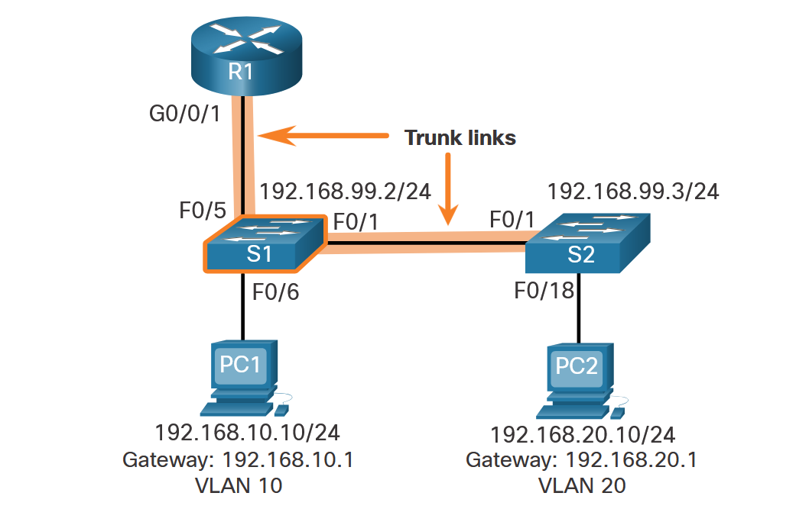
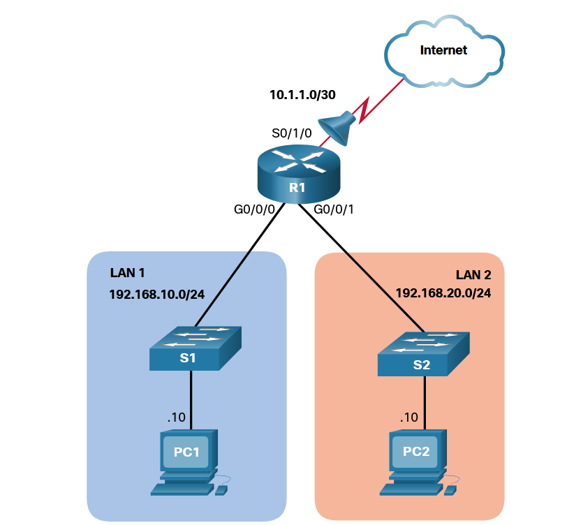
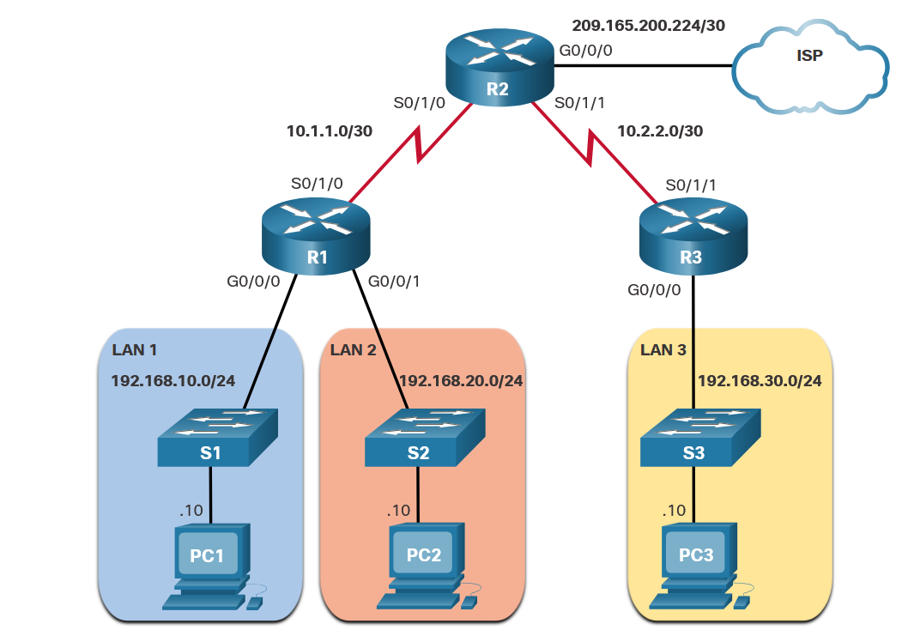
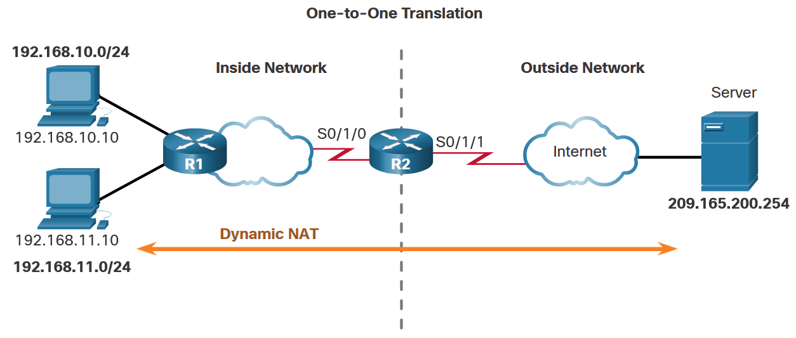

Networks Advanced
=================

# Table of Contents

- [1. Switching, Routing and Wireless Essentials (SRWE)](#1-switching-routing-and-wireless-essentials-srwe)
  - [1.1 Basic Device Configuration](#11-basic-device-configuration)
    - [1.1.1 Initial Switch Settings](#111-initial-switch-settings)
    - [1.1.2 Configure Switch Ports](#112-configure-switch-ports)
    - [1.1.3 Switch Verification Commands](#113-switch-verification-commands)
  - [1.2 Secure Remote Access](#12-secure-remote-access)
    - [1.2.1 Configure SSH](#121-configure-ssh)
  - [1.3 Basic Router Configuration](#13-basic-router-configuration)
    - [1.3.1 Configure Router Interfaces](#131-configure-router-interfaces)
  - [1.4 Verify Directly Connected Networks](#14-verify-directly-connected-networks)
  - [1.5 VLANs](#15-vlans)
    - [1.5.1 VLAN Configuration](#151-vlan-configuration)
    - [1.5.2 VLAN Port Assignment](#152-vlan-port-assignment)
  - [1.6 VLAN Trunks](#16-vlan-trunks)
  - [1.7 Inter-VLAN Routing](#17-inter-vlan-routing)
    - [1.7.1 Router-on-a-Stick Inter-VLAN Routing](#171-router-on-a-stick-inter-vlan-routing)
  - [1.8 EtherChannel](#18-etherchannel)
  - [1.9 IP Static Routing](#19-ip-static-routing)

- [2. Enterprise Networking, Security and Automation](#2-enterprise-networking-security-and-automation)
  - [2.1 Single-Area OSPFv2 Configuration](#21-single-area-ospfv2-configuration)
  - [2.2 ACLs for IPv4 Configuration](#22-acls-for-ipv4-configuration)
    - [2.2.1 Numbered Standard IPv4 ACL](#221-numbered-standard-ipv4-acl)
    - [2.2.2 Named Standard IPv4 ACL](#222-named-standard-ipv4-acl)
    - [2.2.3 Apply a Standard IPv4 ACL](#223-apply-a-standard-ipv4-acl)
    - [2.2.4 Numbered Standard IPv4 ACL Example](#224-numbered-standard-ipv4-acl-example)
    - [2.2.5 Named Standard IPv4 ACL Example](#225-named-standard-ipv4-acl-example)
    - [2.2.6 Secure VTY Ports with a Standard IPv4 ACL](#226-secure-vty-ports-with-a-standard-ipv4-acl)
  - [2.3 Extended IPv4 ACL Configuration](#23-extended-ipv4-acl-configuration)
    - [2.3.1 Numbered Extended IPv4 ACLs](#231-numbered-extended-ipv4-acls)
    - [2.3.2 Examples](#232-examples)
    - [2.3.3 Named Extended IPv4 ACLs](#233-named-extended-ipv4-acls)
  - [2.4 NAT for IPv4](#24-nat-for-ipv4)
    - [2.4.1 Static NAT](#241-static-nat)
    - [2.4.2 Dynamic NAT](#242-dynamic-nat)
    - [2.4.3 PAT](#243-pat)
  - [2.5 Network Management](#25-network-management)
    - [2.5.1 SNMPv2 Configuration](#251-snmpv2-configuration)
    - [2.5.2 Secure SNMP with ACLs](#252-secure-snmp-with-acls)
    - [2.5.3 SYSLOG Configuration](#253-syslog-configuration)
    - [2.5.4 SNMPv3 Configuration](#254-snmpv3-configuration)
    - [2.5.5 SPAN and Wireshark Verification](#255-span-and-wireshark-verification)
---

## Switching, routing and wireless essentials (SRWE)
### 1. Basic device configuration
#### 1.1 Initial switch settings

|       |  |
| :----------- | :----------- |
| Task     | Command |
| Enter global configuration mode      | ```S1# configure terminal ```     |
| Enter interface configuration mode (for SVI in this example)   | ```S1(config)# interface vlan 99```       |
| Configure ipv4 address for the interface      | ```S1(config-if)# ip address [ipv4 address] [subnet-mask]```   |
| Configure ipv6 address for the interface     | ```S1(config-if)# ipv6 address [ipv6 address]```     |
| Enable the interface    | ```S1(config-if)# no shutdown```    |
| Return to privileged EXEC mode     | ```S1(config-if)# end```      |
| Copy running config to startup config     | ```S1# copy running-config startup-config```      |
| Configure default gateway for the switch    | ```S1(config)# ip default-gateway [ipv4 address of default gateway]```    |
| Verify ipv4   | ```S1# show ip interface brief```    |
| Verify ipv6   | ```S1# show ipv6 interface brief```    |

#### 1.2 Configure switch ports

|       |  |
| :----------- | :----------- |
| Task     | Command |
| Enter global configuration mode      | ```S1# configure terminal ```     |
| Enter interface configuration mode   | ```S1(config)# interface FastEthernet 0/1```       |
| Configure interface duplex (default: auto)    | ```S1(config-if)# duplex full```   |
| Configure interface speed (default: auto)    | ```S1(config-if)# speed 100```   |

##### 1.2.1 Switch verification commands

|       |  |
| :----------- | :----------- |
| Task     | Command |
| Display interface status and config     | ```S1# show interfaces [interface-id] ```     |
| Display current startup config   | ```S1# show startup-config```       |
| Display current running config   | ```S1# show running-config```   |
| Display information about the flash file system    | ```S1# show flash```   |
| Display system hardware and software status      | ```S1# show version ```     |
| Display command history      | ```S1# show history ```     |
| Display ipv4 information of interface      | ```S1# show ip interface [interface-id] ```     |
| Display ipv6 information of interface     | ```S1# show ipv6 interface [interface-id] ```     |
| Display the MAC address table      | ```S1# show mac-address-table ``` OR ```S1# show mac address-table ```    |

#### 1.3 Secure remote access
##### 1.3.1 Configure ssh

|       |  |
| :----------- | :----------- |
| Task     | Command |
| Verify ssh support and show current ssh config (if applicable)     | ```S1(config)# show ip ssh ```     |
| Configure ip domain      | ```S1(config)# ip domain-name [domain-name] ```     |
| Generate rsa key pairs      | ```S1(config)# crypto key generate rsa ``` <br> for modulus use 1024 or just press "enter"    |
| Configure user authentication      | ```S1(config)# username [username] secret [password] ```     |
| Configure vty lines      | ```S1(config-line)# line vty 0 15 ``` <br> ```S1(config-line)# transport input ssh ``` <br> ```S1(config-line)# login local ``` <br> ```S1(config-line)# exit ```    |
| Enable SSH version 2      | ```S1(config)# ip ssh version 2 ```     |

#### 1.4 Basic router configuration

|       |  |
| :----------- | :----------- |
| Task     | Command |
| Enter global configuration mode      | ```Router# configure terminal ```     |
| Configure router hostname      | ```Router(config)# hostname R1 ```     |
| Configure privileged exec mode password     | ```R1(config)# enable secret [password] ```     |
| Configure console password (can also be used for vty lines)     | ```R1(config)# line console 0 ``` <br> ```R1(config-line)# password [password] ``` <br> ```R1(config-line)# login ``` <br> ```R1(config-line)# exit ```    |
| Enable password encryption      | ```R1(config)# service password-encryption ```     |
| Configure motd      | ```R1(config)# banner motd [message] ```     |

##### 1.4.1 Configure router interfaces

|       |  |
| :----------- | :----------- |
| Task     | Command |
| Enter interface configuration mode     | ```R1(config)# interface g0/0/0 ```     |
| Configure ipv4 address     | ```R1(config-if)# ip address [ipv4-address] [subnet-mask] ```     |
| Configure ipv6 address     | ```R1(config-if)# ipv6 address [ipv6 address] ```     |
| Configure a description for the interface     | ```R1(config-if)# description [Description] ```     |
| Activate the interface     | ```R1(config-if)# no shutdown ```     |
| Configure loopback address     | ```R1(config)# interface loopback [number] ``` <br> ```R1(config-if)# ip address [ipv4 address] [subnet-mask] ```     |

#### 1.5 Verify Directly connected networks

|       |  |
| :----------- | :----------- |
| Task     | Command |
| Verify interface ipv4 status     | ```R1# show ip interface brief ``` <br> instead of "brief" enter a specific interface id to show that config    |
| Verify interface ipv6 status     | ```R1# show ipv6 interface brief ``` <br> instead of "brief" enter a specific interface id to show that config     |
| verify ipv4 routes    | ```R1# show ip route ```     |
| verify ipv6 routes    | ```R1# show ipv6 route ```     |
| ping     | ```R1# ping [ip address] ```     |

> It is also possible to filter "show" commands, do this by piping ("|") the output of the "show" command you used, you can use "section", "include", "exclude" and "begin" to filter the output.

### 2. VLANs
#### 2.1 VLAN configuration

|       |  |
| :----------- | :----------- |
| Task     | Command |
| Create a VLAN with a valid id number     | ```Switch(config)# vlan [vlan-id] ```     |
| Specify name for the created VLAN     | ```Switch(config-vlan)# name [vlan-name] ```     |

##### 2.1.1 VLAN port assignment

|       |  |
| :----------- | :----------- |
| Task     | Command |
| Enter interface configuration mode    | ```Switch(config)# interface [interface id] ```     |
| Enter interface configuration mode for a range of ports     | ```Switch(config)# interface range [interface ids] ```     |
| Set the port to access mode     | ```Switch(config-if)# switchport mode access ```     |
| Assign the port to a vlan   | ```Switch(config-if)# switchport access vlan [vlan-id] ```     |

#### 2.2 VLAN trunks

|       |  |
| :----------- | :----------- |
| Task     | Command |
| Enter interface configuration mode    | ```Switch(config)# interface [interface id] ```     |
| Set the port to trunking mode   | ```Switch(config-if)# switchport mode trunk] ```     |
| Set the native vlan    | ```Switch(config-if)# switchport trunk native vlan [vlan-id] ```     |
| Specify the list of allowed VLANs    | ```Switch(config-if)# switchport trunk allowed vlan [vlan-id-list] ```     |
| Verify    | ```Switch# show interface trunk ```     |
| Reset trunk to default state   | ```Switch(config-if)# no switchport allowed vlan ```     |
| Disable generation of DTP frames    | ```Switch(config-if)# switchport nonegotiate ```     |
| re-enable generation of DTP frames    | ```Switch(config-if)# switchport mode dynamic auto ```     |

### 3. Inter-VLAN routing
#### 3.1 Router on a stick inter-VLAN routing


S1 configuration:
Create and name the VLANs
```lua
S1(config)# vlan 10
S1(config-vlan)# name LAN10
S1(config-vlan)# exit
S1(config)# vlan 20
S1(config-vlan)# name LAN20
S1(config-vlan)# exit
S1(config)# vlan 99
S1(config-vlan)# name Management
S1(config-vlan)# exit
S1(config)#
```
Create the management interface
```lua
S1(config)# interface vlan 99
S1(config-if)# ip add 192.168.99.2 255.255.255.0
S1(config-if)# no shut
S1(config-if)# exit
S1(config)# ip default-gateway 192.168.99.1
S1(config)#
```
Configure access ports
```lua
S1(config)# interface fa0/6
S1(config-if)# switchport mode access
S1(config-if)# switchport access vlan 10
S1(config-if)# no shut
S1(config-if)# exit
S1(config)#
```
Configure trunking ports
```lua
S1(config)# interface fa0/1
S1(config-if)# switchport mode trunk
S1(config-if)# no shut
S1(config-if)# exit
S1(config)# interface fa0/5
S1(config-if)# switchport mode trunk
S1(config-if)# no shut
S1(config-if)# end
```
The configuration for S2 is similar so it won't be shown
R1 configuration:

```lua
R1(config)# interface G0/0/1.10
R1(config-subif)# description Default Gateway for VLAN 10
R1(config-subif)# encapsulation dot1Q 10
R1(config-subif)# ip add 192.168.10.1 255.255.255.0
R1(config-subif)# exit
R1(config)#
R1(config)# interface G0/0/1.20
R1(config-subif)# description Default Gateway for VLAN 20
R1(config-subif)# encapsulation dot1Q 20
R1(config-subif)# ip add 192.168.20.1 255.255.255.0
R1(config-subif)# exit
R1(config)#
R1(config)# interface G0/0/1.99
R1(config-subif)# description Default Gateway for VLAN 99
R1(config-subif)# encapsulation dot1Q 99
R1(config-subif)# ip add 192.168.99.1 255.255.255.0
R1(config-subif)# exit
R1(config)#
R1(config)# interface G0/0/1
R1(config-if)# description Trunk link to S1
R1(config-if)# no shut
R1(config-if)# end
```

### 4. Etherchannel

|       |  |
| :----------- | :----------- |
| Task     | Command |
| Specify interfaces for the etherchannel group     | ```Switch(config)# interface range [interface-id-list] ```    |
| Create port channel interface     | ```Switch(config-if-range)# Channel-group 1 mode active OR on ```    |
| Enter port channel interface configuration mode     | ```Switch(config)# interface port-channel 1 ```     |
| Configure the port channel as a trunk interface     | ```Switch(config-if)# switchport mode trunk ```     |
| Specify the allowed vlans for the port channel     | ```Switch(config)# switchport trunk allowed vlan [vlan-id-list] ```     |
| Verify specific port channel    | ```Switch# show interface port-channel [port-channel-id] ```     |
| Verify all etherchannels    | ```Switch# show etherchannel summary ```     |
| Verify all port channels    | ```Switch# show etherchannel port-channel ```     |

### 5. IP static routing

|       |  |
| :----------- | :----------- |
| Task     | Command |
| Configure a next-hop static route     | ```R1(config)# ip route [target ip address] [target subnet-mask] [next-hop ip address] ```    |
| Configure a directly connected static route     | ```R1(config)# ip route [target ip address] [target subnet-mask] [exit interface-id] ```    |
| Configure a fully-specified static route     | ```R1(config)# ip route [target ip address] [target subnet-mask] [exit interface-id] [next-hop ip address] ```    |
| Configure a default static route     | ```R1(config)# ip route 0.0.0.0 0.0.0.0 [next-hop ip address] ```    |

---

## Enterprise networking, security and automation
### 1. Single-area OSPFv2 configuration

|       |  |
| :----------- | :----------- |
| Task     | Command |
| Enter router configuration mode     | ```Router(config)# router ospf [process-id] ```     |
| Specify name for the created VLAN     | ```Router(config-router)# router-id [router-id] ```     |
| Enable OSPF using network statements (network)     | ```Router(config-router)# network [network-ip-address] [network-wildcard-mask] area 0 ```     |
| Enable OSPF using network statements (interface)     | ```Router(config-router)# network [interface-ip-address] 0.0.0.0 area 0 ```     |
| Enable OSPF using ip ospf command on each interface   | ```Router(config)# interface [interface-id] ``` <br> ```Router(config-if)# ip ospf [process-id] area 0```     |
| Prevent transmission of routing messages     | ```Router(config)# router ospf [process-id]``` <br> ```Router(config-router)# passive-interface [interface-id]```     |
| Verify OSPF neighbours     | ```Router# show ip ospf neighbour ```     |
| Specify ospf priority     | ```Router(config)# interface [interface-id] ``` <br> ```Router(config-if)# ip ospf priority [priority(0-255)]     |
| Manually set OSPF cost value     | ```Router(config)# interface [interface-id] ``` <br> ```Router(config-if)# ip ospf cost [cost]     |
| Modify OSPFv2 intervals     | ```Router(config-if)# ip ospf hello-interval [seconds] ``` <br> ```Router(config-if)# ip ospf dead-interval [seconds]```    |
| Propagate a default static route in OSPF     | edge router already has: default static route:  ```Router(config-if)# ip route 0.0.0.0 0.0.0.0 [interface-id of internet facing interface] ``` <br> ```Router(config)# router ospf 10``` <br> ```Router(config-router)# default-information originate ```    |

### 2. ACLs for IPv4 configuration
#### 2.1 Numbered standard IPv4 ACL

```Router(config)# access-list access-list-number {deny | permit | remark text} source [source-wildcard] [log]```

|       |  |
| :----------- | :----------- |
| Parameter     | Description |
| ```acces-list-number```     | ACL number between 1-99 or 1300-1999    |
| ```deny```     | Denies access if condition is met    |
| ```permit```     | Permits access if condition is met    |
| ```remark text```     | (optional) adds text entry for documentation purposes    |
| ```source-wildcard```     | (optional) if omitted, defaults to 0.0.0.0    |
| ```log```     | (optional) sends informational message whenever ACE is matched    |

#### 2.2 Named standard IPv4 ACL

|       |  |
| :----------- | :----------- |
| Task     | Command |
| Enter named standard configuration mode | ```Router(config)# ip access-list standard [access-list-name]```    |
| Remove a named standard IPv4 ACL | ```Router(config)# no ip access-list standard [access-list-name]```    |

#### 2.3 Apply a standard IPv4 ACL

```Router(config-if) # ip access-group {access-list-number | access-list-name} {in | out}```

#### 2.4 Numbered standard IPv4 ACL example



Assume only PC1 is allowed out to the internet. To enable this policy, a standard ACL ACE could be applied outbound on S0/1/0, as shown in the figure.
```lua
R1(config)# access-list 10 remark ACE permits ONLY host 192.168.10.10 to the internet
R1(config)# access-list 10 permit host 192.168.10.10
R1(config)# do show access-lists
Standard IP access list 10
    10 permit 192.168.10.10
R1(config)#
```
Apply ACL 10 outbound on the Serial 0/1/0 interface.
```lua
R1(config)# interface Serial 0/1/0
R1(config-if)# ip access-group 10 out
R1(config-if)# end
R1#
```

#### 2.5 Named standard IPv4 ACL example


Assume only PC1 is allowed out to the internet. To enable this policy, a named standard ACL called PERMIT-ACCESS could be applied outbound on S0/1/0.
Remove the previously configured named ACL 10 and create a named standard ACL called PERMIT-ACCESS, as shown here.
```lua
R1(config)# no access-list 10
R1(config)# ip access-list standard PERMIT-ACCESS
R1(config-std-nacl)# remark ACE permits host 192.168.10.10
R1(config-std-nacl)# permit host 192.168.10.10
R1(config-std-nacl)#
```
Apply the new named ACL outbound to the Serial 0/1/0 interface.
```lua
R1(config)# interface Serial 0/1/0
R1(config-if)# ip access-group PERMIT-ACCESS out
R1(config-if)# end
R1#
```

#### 2.6 Secure VTY ports with a standard IPv4 ACL

```R1(config-line)# access-class {access-list-number | access-list-name} { in | out } ```


To increase secure access, a username and password will be created, and the login local authentication method will be used on the vty lines. The command in the example creates a local database entry for a user ADMIN and password class.

A named standard ACL called ADMIN-HOST is created and identifies PC1. Notice that the deny any has been configured to track the number of times access has been denied.

The vty lines are configured to use the local database for authentication, permit ssh traffic, and use the ADMIN-HOST ACL to restrict traffic.

```lua
R1(config)# username ADMIN secret class
R1(config)# ip access-list standard ADMIN-HOST
R1(config-std-nacl)# remark This ACL secures incoming vty lines
R1(config-std-nacl)# permit 192.168.10.10
R1(config-std-nacl)# deny any
R1(config-std-nacl)# exit
R1(config)# line vty 0 4
R1(config-line)# login local
R1(config-line)# transport input ssh
R1(config-line)# access-class ADMIN-HOST in
R1(config-line)# end
R1#
```

### 3. Extended IPv4 ACL configuration
#### 3.1 Numbered extended IPv4 ACLs 

```Router(config)# access-list access-list-number {deny | permit | remark text} protocol source source-wildcard [operator {port}] destination destination-wildcard [operator {port}] [established] [log]```

|       |  |
| :----------- | :----------- |
| Parameter     | Description |
| ```acces-list-number```     | ACL number between 1-99 or 1300-1999    |
| ```deny```     | Denies access if condition is met    |
| ```permit```     | Permits access if condition is met    |
| ```remark text```     | (optional) adds text entry for documentation purposes    |
| ```protocol```     | name or number of an internet protocol    |
| ```source```     | Identifies the source network or host address ("any" to specify all networks; "host [ip address]" or simply [ip address] to identify a specific ip address)    |
| ```source-wildcard```     | (optional) if omitted, defaults to 0.0.0.0    |
| ```destination```     | Identifies the destination network or host address ("any" to specify all networks; "host [ip address]" or simply [ip address] to identify a specific ip address)    |
| ```destination-wildcard```     | (optional) wildcard mask of the destination   |
| ```operator```     | (optional) compares source or destination ports ("lt", "gt", "eq", "neq")   |
| ```port```     | (optional) decimal number or name of a TCP or UDP port   |
| ```established```     | (optional) for TCP protocol only    |
| ```log```     | (optional) sends informational message whenever ACE is matched    |

The command to apply an extended IPv4 ACL to an interface is the same as the command used for standard IPv4 ACLs.

```Router(config-if)# ip access-group {access-list-number | access-list-name} {in | out}```

#### 3.2 Examples

Extended ACLs can filter on different port number and port name options. This example configures an extended ACL 100 to filter HTTP traffic. The first ACE uses the www port name. The second ACE uses the port number 80. Both ACEs achieve exactly the same result.

```lua
R1(config)# access-list 100 permit tcp any any eq www
R1(config)#  !or...
R1(config)# access-list 100 permit tcp any any eq 80 
```

Configuring the port number is required when there is not a specific protocol name listed such as SSH (port number 22) or an HTTPS (port number 443), as shown in the next example.

```lua
R1(config)# access-list 100 permit tcp any any eq 22
R1(config)# access-list 100 permit tcp any any eq 443
R1(config)#
```



In this example, the ACL permits both HTTP and HTTPS traffic from the 192.168.10.0 network to go to any destination.

Extended ACLs can be applied in various locations. However, they are commonly applied close to the source. Therefore, ACL 110 was applied inbound on the R1 G0/0/0 interface.

```lua
R1(config)# access-list 110 permit tcp 192.168.10.0 0.0.0.255 any eq www
R1(config)# access-list 110 permit tcp 192.168.10.0 0.0.0.255 any eq 443
R1(config)# interface g0/0/0
R1(config-if)# ip access-group 110 in
R1(config-if)# exit
R1(config)#
```

#### 3.3 Named extended IPv4 ACLs

To create a named extended ACL, use the following global configuration command. This command enters the named extended configuration mode. Recall that ACL names are alphanumeric, case sensitive, and must be unique.

```lua
Router(config)# ip access-list extended [access-list-name] 
Router(config-ext-nacl)# 
```

The example shows the configuration for the inbound SURFING ACL and the outbound BROWSING ACL.

The SURFING ACL permits HTTP and HTTPS traffic from inside users to exit the G0/0/1 interface connected to the internet. Web traffic returning from the internet is permitted back into the inside private network by the BROWSING ACL.

The SURFING ACL is applied inbound and the BROWSING ACL applied outbound on the R1 G0/0/0 interface, as shown in the output.

Inside hosts have been accessing the secure web resources from the internet. The show access-lists command is used to verify the ACL statistics. Notice that the permit secure HTTPS counters (i.e., eq 443) in the SURFING ACL and the return established counters in the BROWSING ACL have increased.

```lua
R1(config)# ip access-list extended SURFING
R1(config-ext-nacl)# Remark Permits inside HTTP and HTTPS traffic
R1(config-ext-nacl)# permit tcp 192.168.10.0 0.0.0.255 any eq 80
R1(config-ext-nacl)# permit tcp 192.168.10.0 0.0.0.255 any eq 443
R1(config-ext-nacl)# exit
R1(config)#
R1(config)# ip access-list extended BROWSING
R1(config-ext-nacl)# Remark Only permit returning HTTP and HTTPS traffic
R1(config-ext-nacl)# permit tcp any 192.168.10.0 0.0.0.255 established
R1(config-ext-nacl)# exit
R1(config)# interface g0/0/0
R1(config-if)# ip access-group SURFING in
R1(config-if)# ip access-group BROWSING out
R1(config-if)# end
R1# show access-lists
Extended IP access list SURFING
    10 permit tcp 192.168.10.0 0.0.0.255 any eq www
    20 permit tcp 192.168.10.0 0.0.0.255 any eq 443 (124 matches)
Extended IP access list BROWSING
    10 permit tcp any 192.168.10.0 0.0.0.255 established (369 matches)
R1#
```

> To correct an error using sequence numbers, the original statement is removed with the no [sequence_number] command and the corrected statement is added replacing the original statement. For example:

```lua
R1# configure terminal
R1(config)# ip access-list extended SURFING
R1(config-ext-nacl)# no 10
R1(config-ext-nacl)# 10 permit tcp 192.168.10.0 0.0.0.255 any eq www
R1(config-ext-nacl)# end
```

### 4. NAT for IPv4
#### 4.1 Static NAT

There are two basic tasks when configuring static NAT translations:

**Step 1.** The first task is to create a mapping between the inside local address and the inside global addresses. For example, the 192.168.10.254 inside local address and the 209.165.201.5 inside global address in the figure are configured as a static NAT translation.

```lua
R2(config)# ip nat inside source static 192.168.10.254 209.165.201.5
```

**Step 2.** After the mapping is configured, the interfaces participating in the translation are configured as inside or outside relative to NAT. In the example, the R2 Serial 0/1/0 interface is an inside interface and Serial 0/1/1 is an outside interface.

```lua
R2(config)# interface serial 0/1/0
R2(config-if)# ip address 192.168.1.2 255.255.255.252
R2(config-if)# ip nat inside
R2(config-if)# exit
R2(config)# interface serial 0/1/1
R2(config-if)# ip address 209.165.200.1 255.255.255.252
R2(config-if)# ip nat outside
```

With this configuration in place, packets arriving on the inside interface of R2 (Serial 0/1/0) from the configured inside local IPv4 address (192.168.10.254) are translated and then forwarded towards the outside network. Packets arriving on the outside interface of R2 (Serial 0/1/1), that are addressed to the configured inside global IPv4 address (209.165.201.5), are translated to the inside local address (192.168.10.254) and then forwarded to the inside network.

To verify NAT translations, use:

|       |  |
| :----------- | :----------- |
| Task     | Command |
| Show active NAT translations | ```R2# show ip nat translations```    |
| Show information about the total number of active NAT translations | ```R2# show ip nat statistics```    |

#### 4.2 Dyanmic NAT



**Step 1:** Define the pool of addresses (using the starting and ending IPv4 address of the pool) and netmask or prefix-length to indicate which address bits belong to the network and which bits belong to the host in that range.
**Step 2:** Configure a standard ACL to identify (permit) only those addresses that are to be translated (remember the implicit deny)
**Step 3:** Bind the ACL to the pool, using the following command syntax: ```Router(config)# ip nat inside source list {access-list-number | access-list-name} pool pool-name```
**Step 4:** Identify which interfaces are inside, in relation to NAT; this will be any interface that connects to the inside network.
**Step 5:** Identify which interfaces are outside, in relation to NAT; this will be any interface that connects to the outside network.

```lua
R2(config)# ip nat pool NAT-POOL1 209.165.200.226 209.165.200.240 netmask 255.255.255.224
R2(config)# access-list 1 permit 192.168.0.0 0.0.255.255
R2(config)# ip nat inside source list 1 pool NAT-POOL1
R2(config)# interface serial 0/1/0
R2(config-if)# ip nat inside
R2(config-if)# end
R2(config)# interface serial 0/1/1
R2(config-if)# ip nat outside
```

#### 4.3 PAT

To configure PAT to use a single IPv4 address, simply add the keyword overload to the ip nat inside source command. The rest of the configuration is the similar to static and dynamic NAT configuration except that with PAT, multiple hosts can use the same public IPv4 address to access the internet.

For example:
```lua
R2(config)# ip nat inside source list 1 interface serial 0/1/1 overload
R2(config)# access-list 1 permit 192.168.0.0 0.0.255.255
R2(config)# interface serial0/1/0
R2(config-if)# ip nat inside
R2(config-if)# exit
R2(config)# interface Serial0/1/1
R2(config-if)# ip nat outside
```
### 5. Network management
#### 5.1 SNMPv2 Configuration

| Task                                  | Command                                                                    |
| :------------------------------------ | :------------------------------------------------------------------------- |
| Configure read-only community string  | `Router(config)# snmp-server community SNMP-RO ro`                         |
| Configure read-write community string | `Router(config)# snmp-server community SNMP-RW rw`                         |
| Configure SNMP engineID (optional)    | `Router(config)# snmp-server engineID local 1234567890ABCDEF`              |
| Configure SNMP server                 | `Router(config)# snmp-server host 10.199.64.67 version 2c SNMP-RO`         |
| Configure SNMP informs                | `Router(config)# snmp-server host 10.199.64.67 informs version 2c SNMP-RO` |
| Enable authentication traps           | `Router(config)# snmp-server enable traps snmp authentication`             |
| Enable configuration traps            | `Router(config)# snmp-server enable traps config`                          |
| Enable syslog traps                   | `Router(config)# snmp-server enable traps syslog`                          |


| Task                       | Command                        |
| :------------------------- | :----------------------------- |
| Verify SNMP status         | `Router# show snmp`            |
| Verify community strings   | `Router# show snmp community`  |
| Verify configured hosts    | `Router# show snmp host`       |
| Verify engineID            | `Router# show snmp engineID`   |
| Verify SNMP running config | ```Router# show running-config section snmp``` |


#### 5.3 Secure SNMP with ACLs

Configure ACL for SNMP access:

```lua
Router(config)# ip access-list standard ACL-SNMP
Router(config-std-nacl)# permit host 10.199.64.67
Router(config-std-nacl)# deny any
```

Apply ACL to community strings

```lua
Router(config)# snmp-server community SNMP-RO ro ACL-SNMP
Router(config)# snmp-server community SNMP-RW rw ACL-SNMP
```
Configure SNMP notify community

```lua
Router(config)# snmp-server community SNMP-NOTIFY ro
Router(config)# snmp-server host 10.199.64.67 version 2c SNMP-NOTIFY
Router(config)# snmp-server host 10.199.64.67 informs version 2c SNMP-NOTIFY
```
To verify the secure SNMP configuration

| Task                     | Command                       |
| :----------------------- | :---------------------------- |
| Verify community strings | `Router# show snmp community` |
| Verify SNMP hosts        | `Router# show snmp host`      |


#### 5.4 SYSLOG Configuration

Configure SYSLOG server:

```lua
Router(config)# logging host 10.199.64.134
Router(config)# logging trap informational
```
Configure SYSLOG traps via SNMP

```lua
Router(config)# snmp-server enable traps syslog
```

To verify SYSLOG configuration

| Task                        | Command                |
| :-------------------------- | :--------------------- |
| Verify SYSLOG configuration | `Router# show logging` |

Expected output should include:

```text
trap logging: level informational
```

#### 5.5 SNMPv3 Configuration

Create the SNMP view, group and user:
```lua
Router(config)# snmp-server view SNMP-VIEW iso included
Router(config)# snmp-server group SNMP-GROUP v3 priv read SNMP-VIEW
Router(config)# snmp-server user SNMP-USER SNMP-GROUP v3 auth sha wachtwoord priv aes 128 wachtwoord
```
Verify SNMPv3 configuration

| Task               | Command                   |
| :----------------- | :------------------------ |
| Verify SNMP groups | `Router# show snmp group` |
| Verify SNMP users  | `Router# show snmp user`  |

#### 5.6 SPAN and Wireshark Verification

```lua
Switch(config)# monitor session 1 source vlan 40 both
```
Mirror interface traffic

```lua
Switch(config)# monitor session 1 source interface GigabitEthernet1/0/21
Switch(config)# monitor session 1 destination interface GigabitEthernet1/0/19
```
Verify SPAN session

| Task                   | Command                          |
| :--------------------- | :------------------------------- |
| Verify monitor session | `Switch# show monitor session 1` |