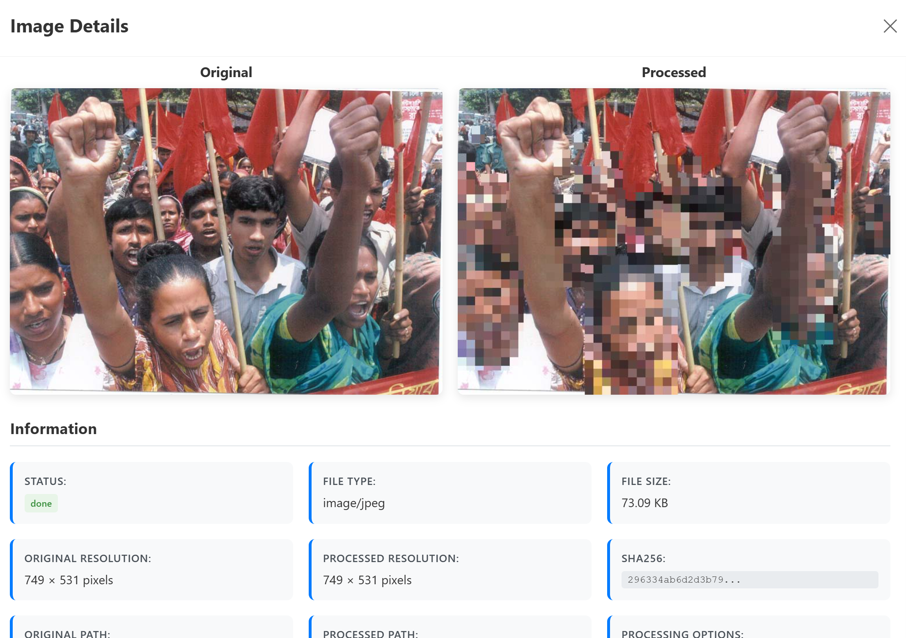
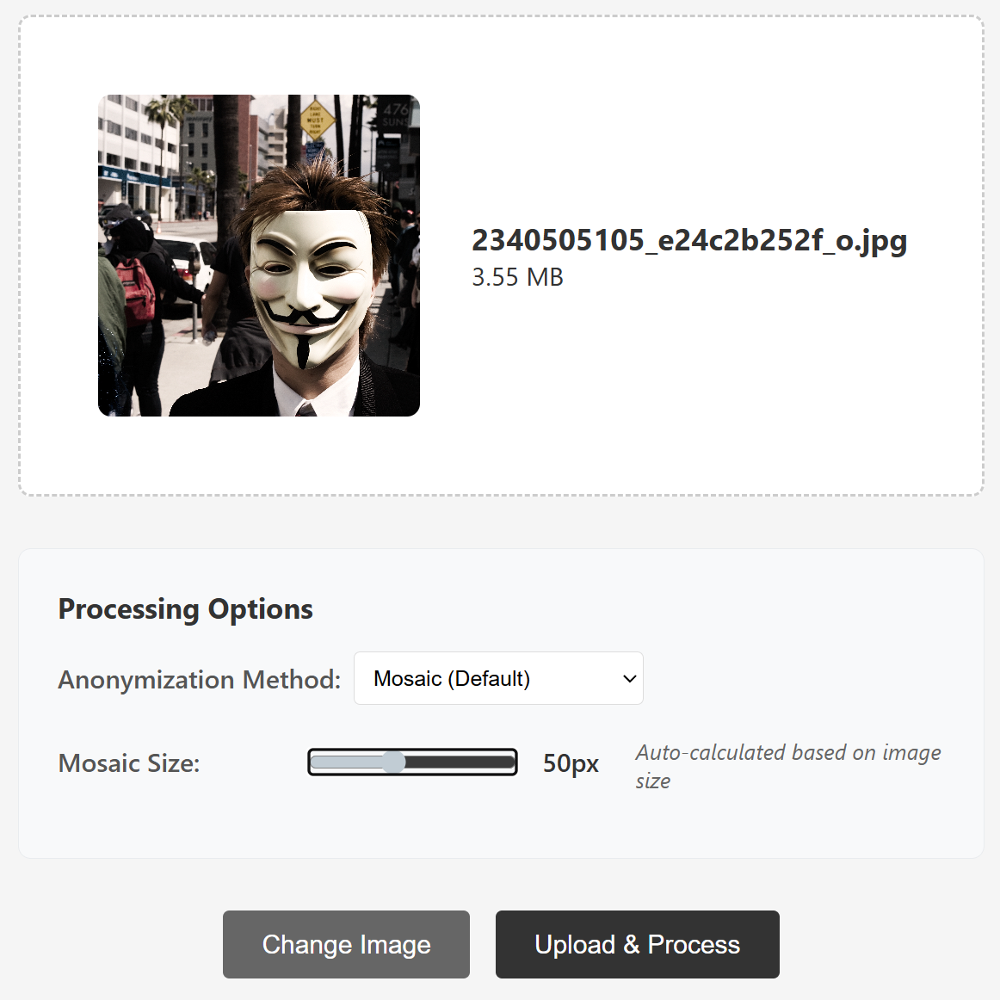
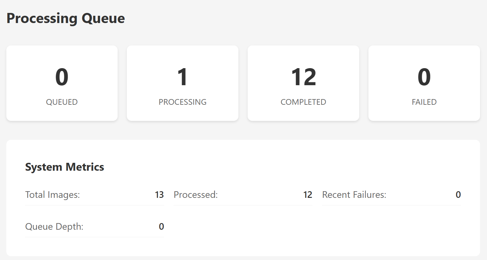

# Research Project 25-26: pxlcensor

A web-based face anonymization service that automatically detects and blurs, pixelates, or blocks faces in uploaded images.



---

- [Overview](#overview)
- [Features](#features)
- [How It Works](#how-it-works)
- [Architecture](#architecture)
- [Observability \& Monitoring](#observability--monitoring)
- [Requirements](#requirements)
- [Quick Start](#quick-start)
- [Testing](#testing)
  - [Unit Tests (Offline)](#unit-tests-offline)
  - [Integration Tests (Online)](#integration-tests-online)
  - [Code Coverage](#code-coverage)
- [Configuration](#configuration)
- [Technology Stack](#technology-stack)
- [Development](#development)
- [Limitations](#limitations)

---

## Overview

PXLCensor provides an easy-to-use interface for anonymizing faces in photos. Upload an image, select your preferred anonymization method, and download the processed result. The service runs entirely on your own infrastructure with no external dependencies.

## Features

- Multiple anonymization methods: mosaic pixelation, blur, solid blocks, or none (detection only)
- Configurable mosaic size (1-120 pixels)
- Automatic face detection using neural networks
- Batch upload mode (up to 50 images, sequential processing)
- Processing queue with real-time status updates
- Image gallery with processing history
- Complete file management including deletion
- **Cloud-Ready Observability**: Structured JSON logging and Prometheus metrics
- **Automated Test Suite**: Comprehensive unit and integration tests
- Docker-based deployment

## How It Works

1. Upload an image through the web interface
2. Select anonymization method and settings
3. The system queues the image for processing
4. A background worker uses the deface library to detect faces
5. Anonymization filters are applied to detected face regions
6. Download the processed image or view it in the gallery

For detailed technical information, see the [Technical Specification](TECH_SPEC.md).



## Architecture

The application consists of five services:

- **Frontend**: Vue.js web interface (Vite)
- **API**: Node.js/Fastify orchestrator
- **Processor**: Background worker for image processing (Python/Node)
- **Media**: Secure file storage service with signed URLs
- **Database**: PostgreSQL with job queue



## Observability & Monitoring

The application is built for cloud observability:

- **Structured Logs**: All backend services output logs in JSON format for easy ingestion by ELK, Datadog, or CloudWatch.
- **Metrics**: The API service exposes Prometheus metrics at `/metrics` (via `fastify-metrics`) plus a JSON summary for the UI at `/queue/metrics`.
- **Health Checks**: API and Media services include `/health` endpoints for readiness/liveness probes.

## Requirements

- Docker and Docker Compose
- 2GB+ RAM recommended for image processing
- Modern web browser with JavaScript enabled

## Quick Start

1. Clone the repository
2. Run `docker compose up -d`
3. Open <http://localhost:3000> in your browser
4. Upload an image and select processing options

## Testing

The project includes a multi-layered testing strategy:

### Unit Tests (Offline)
Test individual components and logic in isolation using mocks.
```bash
# Backend services
cd api && npm run test:unit
cd media && npm run test:unit
cd processor && npm run test:unit

# Frontend components
cd frontend && npm test
```

### Integration Tests (Online)
Test the interaction between services and the database.
```bash
# Requires Docker (Postgres) running
cd api && npm run test:integration
```

### Code Coverage
Generate coverage reports using `c8`.
```bash
cd api && npm run test:coverage
```

## Configuration

Environment variables can be set in `compose.yml` or a `.env` file:

- `DATABASE_URL`: PostgreSQL connection string
- `MEDIA_SIGNING_SECRET`: Secret key for HMAC file access signatures
- `MEDIA_EXTERNAL_URL`: Public URL of the media service (default: `http://localhost:8081`)
- `MAX_UPLOAD_MB`: Maximum upload file size in megabytes (default: `25`)
- `PROCESSOR_CONCURRENCY`: Number of concurrent processing jobs (default: `1`)
- `TEMP_DIR`: Temporary directory for processor working files (default: `/tmp/pxlcensor`)
- `CORS_ALLOWED_ORIGINS`: Comma-separated list of allowed origins (e.g., `http://localhost:3000,http://localhost:8080`)
- `VITE_API_BASE_URL`: Frontend API base URL for production builds (defaults to `/api` when unset)
- `AUTH_USER_HEADER`: Comma-separated request header names to read user identity from (default: `x-auth-request-email`)
- `AUTH_USER_FALLBACK`: User identifier to use when no auth header is present (default: `shared`)

**User scoping:** The API scopes images, jobs, and queue stats by user identity derived from `AUTH_USER_HEADER`.

## Technology Stack

- **Frontend**: Vue 3, Vue Router, Vite, Vitest, Axios
- **Backend**: Node.js, Fastify, PostgreSQL
- **Processing**: Python deface library with CenterFace ONNX models
- **Storage**: Local filesystem with HMAC-signed URLs
- **Testing**: Node --test, Vitest, c8, Vue Test Utils

## Development

Each service can be developed independently:

- **Frontend on port 3000** - Main entry point for the application
- API server on port 8080 (internal, no UI)
- Media service on port 8081 (internal, file storage)
- PostgreSQL on port 5432

Logs can be viewed with `docker compose logs -f`.

## Limitations

- Only image files are supported (JPEG, PNG, WebP)
- Processing time depends on image size and face count
- Face detection accuracy varies with image quality and lighting
- Very high resolution images may require additional memory (handled via auto-scaling)
