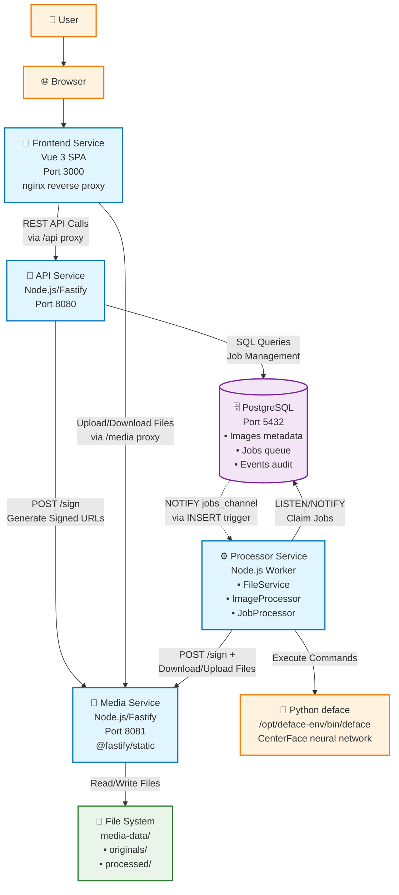
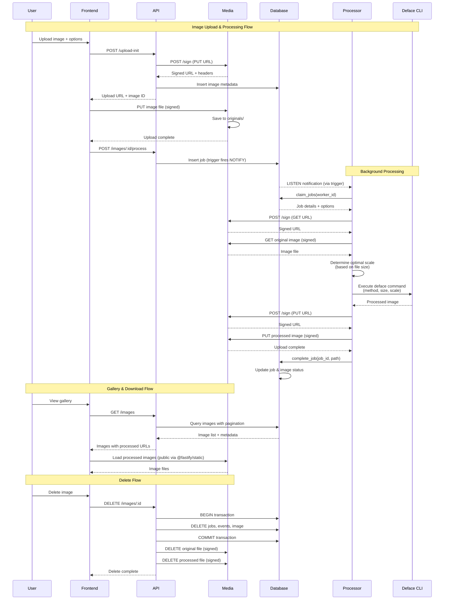
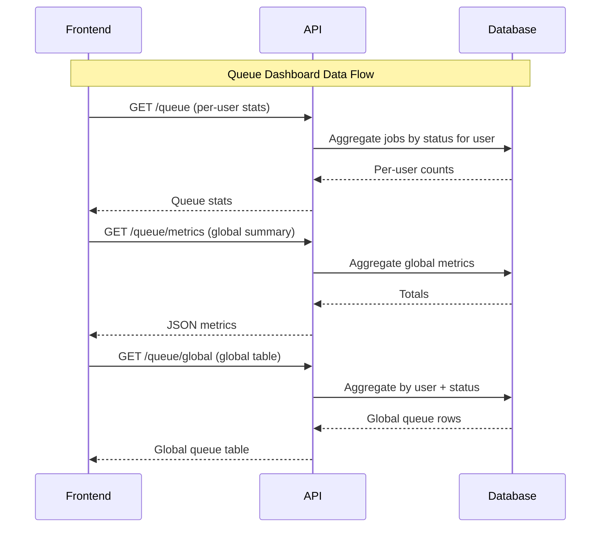
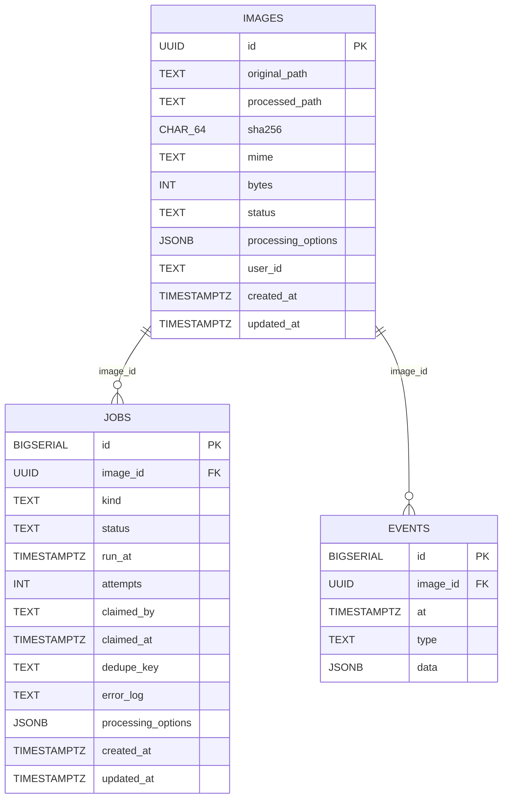

# Face Anonymization Application - Technical Specification

- [Architecture Overview](#architecture-overview)
- [System Architecture Diagram](#system-architecture-diagram)
- [Data Flow Sequences](#data-flow-sequences)
- [Component Details](#component-details)
  - [1. API Service (Node.js/Fastify)](#1-api-service-nodejsfastify)
  - [2. Media Service (Node.js/Fastify)](#2-media-service-nodejsfastify)
  - [3. Processor Service (Node.js Worker)](#3-processor-service-nodejs-worker)
  - [4. Frontend (Vue 3 + Vite)](#4-frontend-vue-3--vite)
  - [5. PostgreSQL Database](#5-postgresql-database)
- [Queue Implementation (PostgreSQL LISTEN/NOTIFY)](#queue-implementation-postgresql-listennotify)
- [Security Implementation](#security-implementation)
  - [HMAC Signature Generation](#hmac-signature-generation)
- [Docker Compose Configuration](#docker-compose-configuration)
- [Environment Configuration (.env)](#environment-configuration-env)
- [Processing Options](#processing-options)
- [Performance Optimizations](#performance-optimizations)
- [Validation \& Limits](#validation--limits)
- [Observability](#observability)
- [Security Considerations](#security-considerations)
- [Development Workflow](#development-workflow)
- [Key Design Decisions](#key-design-decisions)
- [Notes](#notes)

---

**Platform Requirements**: Single Docker Compose deployment, 12GB laptop (eventual k3d migration)  
**Stack**: Node.js (Fastify), Vue 3, PostgreSQL, Python (deface CLI)

## Architecture Overview

Five containerized services with clear separation of concerns:

1. **API Service** - Application orchestrator
2. **Media Service** - File storage handler  
3. **Processor Service** - Face anonymization worker
4. **Frontend** - Vue 3 SPA
5. **PostgreSQL** - Database and job queue

## System Architecture Diagram



## Data Flow Sequences





## Component Details

### 1. API Service (Node.js/Fastify)

**Responsibilities:**
- REST API endpoints
- Database management (pg connection pool, max 20 connections)
- Job queue orchestration via database trigger-based NOTIFY
- Signed URL generation via Media service's `/sign` endpoint
- User scoping via auth headers (`AUTH_USER_HEADER`, `AUTH_USER_FALLBACK`)

**Key Libraries:**
- `fastify` (v5) - Web framework
- `@fastify/cors` - CORS handling with configurable origins
- `@fastify/sensible` - HTTP error helpers
- `fastify-metrics` - Prometheus `/metrics` endpoint
- `pg` - PostgreSQL client (connection pool)
- `node-fetch` - HTTP client for Media service calls
- `dotenv` - Environment variable loading
- Built-in `crypto` module for SHA256 hashing and UUID generation

**Docker Image:** `node:22-alpine`

**Endpoints:**
```
POST /upload-init          - Initialize upload, return signed PUT URL
POST /images/:id/process   - Enqueue processing job
GET  /images               - List images with filters and pagination
GET  /images/:id           - Get image details with signed URLs
DELETE /images/:id         - Delete image and all associated files
GET  /jobs/:id             - Get job status
GET  /queue                - Per-user queue statistics (last 24h)
GET  /queue/global         - Global queue stats by user (last 24h)
GET  /queue/metrics        - JSON metrics summary for the UI
GET  /health               - Health check endpoint
GET  /metrics              - Prometheus metrics
```

### 2. Media Service (Node.js/Fastify)

**Responsibilities:**
- File system operations (sole owner of /media volume)
- HMAC signed URL generation via `/sign` endpoint (used by API and Processor)
- Signed URL verification for uploads, original downloads, and deletes
- Public static serving of processed images via `@fastify/static`
- Atomic file writes (temp `.tmp` → rename to final)

**Key Libraries:**
- `fastify` (v5) - Web framework
- `@fastify/static` - Static file serving for processed images
- `@fastify/cors` - CORS handling
- `@fastify/sensible` - HTTP error helpers
- `dotenv` - Environment variable loading
- Built-in `crypto` module for HMAC-SHA256 signatures

**Docker Image:** `node:22-alpine` with `su-exec` for privilege dropping  
**Entrypoint:** `entrypoint.sh` creates `/media/originals` directory and sets ownership before dropping to `nodejs` user

**Security:**
- HMAC-SHA256 signature verification via `preHandler` hook
- PUT/DELETE operations require valid signatures
- GET for originals: requires valid signature
- GET for processed: public access via `@fastify/static` (prefix `/processed/`)

**Internal Endpoints:**
```
POST /sign                 - Generate signed URL (used by API and Processor)
PUT  /originals/*          - Upload original (signed)
PUT  /processed/*          - Upload processed result (signed)
GET  /originals/*          - Download original (signed)
GET  /processed/*          - Public static serving
DELETE /originals/*        - Delete original (signed)
DELETE /processed/*        - Delete processed (signed)
GET  /health               - Health check
```

**Storage Structure:**
```
/media/
  originals/YYYY/MM/{uuid}.{ext}
  processed/YYYY/MM/{uuid}.{ext}
```

### 3. Processor Service (Node.js Worker)

**Responsibilities:**
- Queue consumption via PostgreSQL LISTEN/NOTIFY
- deface CLI integration via Python virtual environment
- Job retry logic with exponential backoff (via `fail_job()` database function)
- Direct communication with Media service for file operations

**Architecture (modular classes):**
- `FileService` - Handles signed URL requests and file download/upload with the Media service
- `ImageProcessor` - Wraps deface CLI execution with automatic scale selection
- `JobProcessor` - Orchestrates the full job lifecycle (download → process → upload → complete/fail)

**Key Libraries:**
- `pg` - PostgreSQL client (LISTEN/NOTIFY + queries)
- `node-fetch` - HTTP client for Media service
- `dotenv` - Environment variable loading
- Built-in `child_process.spawn` for deface CLI execution

**Docker Image:** `node:22-bookworm` (Debian-based, required for Python)

**deface Integration:**
- Installation: Python venv at `/opt/deface-env` with `pip install deface`
- Executable: `/opt/deface-env/bin/deface`
- Command variations: 
  - Mosaic: `deface INPUT --replacewith mosaic --mosaicsize SIZE --scale WxH -o OUTPUT`
  - Blur: `deface INPUT --replacewith blur --scale WxH -o OUTPUT`
  - Solid: `deface INPUT --replacewith solid --scale WxH -o OUTPUT`
  - None: `deface INPUT --replacewith none --scale WxH -o OUTPUT`
- Automatic scaling based on file size for optimal performance
- Supported formats: jpg, jpeg, png, webp

**Processing Flow:**

1. LISTEN on `jobs_channel`
2. Claim jobs with atomic `claim_jobs()` function using SELECT FOR UPDATE SKIP LOCKED
3. Download original via signed URL (FileService → Media service directly)
4. Determine optimal scale based on file size (1920x1080, 1600x900, or 1280x720)
5. Execute deface command with processing options (method, mosaic_size)
6. Upload processed image via signed URL (FileService → Media service directly)
7. Update job status using `complete_job()` or `fail_job()` database functions
8. Cleanup temporary files
9. Periodic polling every 10 seconds as fallback alongside LISTEN/NOTIFY

**Graceful Shutdown:** Handles SIGTERM — stops listening, waits for active jobs to complete, releases connections.

### 4. Frontend (Vue 3 + Vite)

**Pages:**
- **Upload** (`/upload`): Drag-drop interface, progress tracking, batch mode (up to 50 images)
- **Queue** (`/queue`): Per-user queue counters plus global queue summary table
- **Gallery** (`/gallery`): Grid view of processed images with pagination
- **Detail**: Full image view with processing timeline (modal overlay from Gallery)

**Key Libraries:**
- `vue` (v3) - UI framework (Composition API with `<script setup>`)
- `vue-router` (v4) - Client-side routing with `createWebHistory`
- `axios` - HTTP client for API calls

**Routing & API:**
- Vue Router drives navigation (`/upload`, `/gallery`, `/queue`); `/` redirects to `/upload`
- API client modules under `frontend/src/api/`:
  - `client.js` — Axios instance with `VITE_API_BASE_URL` (defaults to `/api`)
  - `images.js` — Image CRUD and upload operations
  - `queue.js` — Queue stats, metrics, and global queue data
- Utility module `frontend/src/utils/format.js` — byte formatting helper

**Proxying:**
- **Development (Vite):** `/api` → `http://localhost:8080` (with path rewrite), `/media` → `http://localhost:8081` (with path rewrite)
- **Production (nginx):** `/api/` → `http://api:8080/`, `/media/` → `http://media:8081/`, SPA fallback via `try_files`

**Build Process:**
- Development: `vite` dev server on port 3000
- Production: Multi-stage Docker build — `node:22-alpine` builds static assets, `nginx:alpine` serves them

**Testing:** Vitest with jsdom environment; component tests under `src/components/__tests__/`

### 5. PostgreSQL Database

**Docker Image:** `postgres:16-alpine`  
**Initialization:** `db/init.sh` runs all `.sql` files in order via `psql` on first startup.

**Schema:**

```sql
-- Images table
CREATE TABLE images (
  id UUID PRIMARY KEY DEFAULT uuid_generate_v4(),
  original_path TEXT NOT NULL,
  processed_path TEXT,
  sha256 CHAR(64) NOT NULL,
  mime TEXT NOT NULL CHECK (mime IN ('image/jpeg', 'image/png', 'image/webp')),
  bytes INTEGER NOT NULL CHECK (bytes > 0),
  status TEXT NOT NULL DEFAULT 'uploaded' CHECK (status IN ('uploaded', 'queued', 'processing', 'done', 'failed')),
  processing_options JSONB DEFAULT '{"method": "mosaic", "scale_720p": false, "mosaic_size": 20}',
  user_id TEXT NOT NULL DEFAULT 'shared',
  created_at TIMESTAMPTZ DEFAULT NOW(),
  updated_at TIMESTAMPTZ DEFAULT NOW()
);

-- Jobs queue table  
CREATE TABLE jobs (
  id BIGSERIAL PRIMARY KEY,
  image_id UUID NOT NULL REFERENCES images(id) ON DELETE CASCADE,
  kind TEXT NOT NULL DEFAULT 'deface_boxes',
  status TEXT NOT NULL DEFAULT 'queued' CHECK (status IN ('queued', 'processing', 'done', 'failed')),
  run_at TIMESTAMPTZ DEFAULT NOW(),
  attempts INTEGER DEFAULT 0,
  claimed_by TEXT,
  claimed_at TIMESTAMPTZ,
  dedupe_key TEXT UNIQUE,
  error_log TEXT,
  processing_options JSONB DEFAULT '{}',
  created_at TIMESTAMPTZ DEFAULT NOW(),
  updated_at TIMESTAMPTZ DEFAULT NOW()
);

-- Events audit table
CREATE TABLE events (
  id BIGSERIAL PRIMARY KEY,
  image_id UUID NOT NULL REFERENCES images(id) ON DELETE CASCADE,
  at TIMESTAMPTZ DEFAULT NOW(),
  type TEXT NOT NULL,
  data JSONB DEFAULT '{}'
);

-- Indexes
CREATE INDEX idx_jobs_queue ON jobs(status, run_at) WHERE status = 'queued';
CREATE INDEX idx_jobs_processing ON jobs(status, claimed_at) WHERE status = 'processing';
CREATE INDEX idx_images_status ON images(status);
CREATE INDEX idx_images_sha256 ON images(sha256);
CREATE INDEX idx_images_user_id ON images(user_id);
CREATE INDEX idx_images_user_status_created ON images(user_id, status, created_at DESC);
CREATE INDEX idx_events_image_id ON events(image_id);
CREATE INDEX idx_events_at ON events(at DESC);
```

**Triggers:**
- `images_updated_at` / `jobs_updated_at` — Automatically sets `updated_at = NOW()` on row update
- `jobs_notify_queued` — Fires `pg_notify('jobs_channel', ...)` on INSERT when `status = 'queued'`, eliminating the need for manual NOTIFY in application code

**Database Functions (002_functions.sql):**

```sql
-- Atomically claim queued jobs using SKIP LOCKED; also sets images to 'processing'
CREATE OR REPLACE FUNCTION claim_jobs(worker_id TEXT, batch_size INTEGER DEFAULT 1)
RETURNS TABLE (id BIGINT, image_id UUID, kind TEXT, attempts INTEGER);

-- Mark job as done, update image processed_path and status, log event
CREATE OR REPLACE FUNCTION complete_job(job_id BIGINT, p_processed_path TEXT DEFAULT NULL)
RETURNS BOOLEAN;

-- Fail a job: retry with exponential backoff (attempts * 10s) if under max_attempts (default 3),
-- otherwise mark as permanently failed. Returns 'retry' or 'failed'.
CREATE OR REPLACE FUNCTION fail_job(job_id BIGINT, error_message TEXT, max_attempts INTEGER DEFAULT 3)
RETURNS TEXT;

-- Aggregate queue stats for the last 24 hours
CREATE OR REPLACE FUNCTION get_queue_stats()
RETURNS TABLE (status TEXT, count BIGINT);
```



## Queue Implementation (PostgreSQL LISTEN/NOTIFY)

**Enqueue Process:**

Job insertion in the API service automatically triggers notification via the `jobs_notify_queued` database trigger — no manual `NOTIFY` call needed:

```javascript
// API service - process endpoint enqueues the job
await client.query(`
  INSERT INTO jobs (image_id, kind, processing_options, dedupe_key, status)
  VALUES ($1, $2, $3, $4, 'queued')
`, [imageId, 'deface_boxes', processingOptions, dedupeKey]);
// The jobs_notify_queued trigger automatically fires pg_notify('jobs_channel', ...)
```

**Worker Process:**

```javascript
// Processor service - uses atomic claim_jobs function
await client.query('LISTEN jobs_channel');
client.on('notification', async () => {
  const result = await client.query('SELECT * FROM claim_jobs($1, $2)', [workerId, 1]);
  if (result.rows.length > 0) {
    const job = result.rows[0];
    // Process job with automatic scaling and processing options...
  }
});
// Periodic fallback poll every 10 seconds
setInterval(() => processNext(), 10000);
```

PostgreSQL LISTEN/NOTIFY provides a lightweight pub/sub mechanism entirely in memory, perfect for our resource-constrained environment. The database trigger ensures notifications are always sent when jobs are inserted, regardless of which service creates the job.

## Security Implementation

### HMAC Signature Generation

Using Node.js built-in crypto module (implemented in Media service, consumed by API and Processor):

```javascript
import { createHmac } from 'crypto';

// Media service /sign endpoint generates signatures
function generateSignature(method, path, expires, secret) {
  return createHmac('sha256', secret)
    .update(`${method}:${path}:${expires}`)
    .digest('hex');
}

// Media service preHandler hook verifies on protected routes
function verifySignature(signature, method, path, expires, secret) {
  const expected = generateSignature(method, path, expires, secret);
  return signature === expected;
}
```

**Signature Parameters:**
- TTL: 300 seconds default
- Payload: `METHOD:PATH:EXPIRES`
- Algorithm: HMAC-SHA256
- Headers: `X-Signature` (hex digest), `X-Expires` (epoch ms)

**Shared Secret:** `MEDIA_SIGNING_SECRET` is shared between API, Media, and Processor services so that both the API and Processor can request signed URLs from the Media service's `/sign` endpoint.

## Docker Compose Configuration

See `compose.yml` for the authoritative Docker Compose setup. Key details:

- **postgres** — `postgres:16-alpine`, health check via `pg_isready`, named volume `postgres_data`
- **media** — Port 8081, named volume `media-data` mounted at `/media`, custom `entrypoint.sh` for directory setup
- **api** — Port 8080, depends on postgres (healthy) and media (started)
- **processor** — No exposed port, depends on postgres (healthy), media (started), and api (started); resource limits: 2GB RAM, 1 CPU; single replica by default
- **frontend** — Port 3000 (nginx), depends on api and media

All services share the `pxlcensor` bridge network.

## Environment Configuration (.env)

```bash
# Database
POSTGRES_PASSWORD=change-me-production

# Security
MEDIA_SIGNING_SECRET=64-char-hex-string-change-in-production
CORS_ALLOWED_ORIGINS=http://localhost:3000,http://localhost:8080
MEDIA_EXTERNAL_URL=http://localhost:8081

# Limits
MAX_UPLOAD_MB=25
PROCESSOR_CONCURRENCY=1
TEMP_DIR=/tmp/pxlcensor

# Auth/user scoping
AUTH_USER_HEADER=x-auth-request-email
AUTH_USER_FALLBACK=shared

# Frontend
VITE_API_BASE_URL=/api

# Development
NODE_ENV=development
LOG_LEVEL=info
```

## Processing Options

**Supported Methods:**
- `mosaic`: Pixelated blocks with configurable size (1-120 pixels)
- `blur`: Gaussian blur filter
- `solid`: Solid black rectangles
- `none`: No replacement (detection only)

**Automatic Scaling:**
- Small files (<2MB): 1920x1080 inference resolution
- Medium files (2-10MB): 1600x900 inference resolution  
- Large files (>10MB): 1280x720 inference resolution

Processing options are stored as JSONB in both images and jobs tables, allowing flexible configuration without schema changes.

**Deduplication:** `{user_id}:{sha256}:{pipeline}` — scoped per user, per content hash, per pipeline type. Image uploads also deduplicate on `sha256 + user_id`.

## Performance Optimizations

1. **Resource Management:**
   - Single processor worker by default (PROCESSOR_CONCURRENCY=1)
   - Memory limits in Docker Compose (2GB per processor)
   - Automatic scaling based on file size

2. **Database Optimizations:**
   - SKIP LOCKED for concurrent job processing
   - Partial indexes on queue status columns
   - Connection pooling in API (max 20) and Processor (concurrency + 2)
   - Trigger-based NOTIFY avoids extra round-trip

3. **File Handling:**
   - Atomic writes (temp `.tmp` → rename)
   - Date-based directory partitioning (YYYY/MM/)
   - SHA256 deduplication per user

4. **Frontend:**
   - nginx with `try_files` for SPA routing
   - Reverse proxy eliminates CORS for production
   - Static serving of processed images via `@fastify/static`

## Validation & Limits

- **File Types**: jpg, jpeg, png, webp only (MIME validation + filename inference fallback)
- **Max Upload Size**: 25MB configurable (`MAX_UPLOAD_MB`), Media service body limit 26MB
- **Processing Methods**: mosaic, blur, solid, none
- **Mosaic Size**: Integer 1-120
- **Deduplication**: Via `{user_id}:{sha256}:{pipeline}` dedupe key

## Observability

- Structured JSON logging in Processor service with timestamps
- `/health` endpoints on API and Media services
- `/metrics` endpoint on API for Prometheus (via `fastify-metrics`)
- `/queue/metrics` JSON summary for the queue dashboard
- Queue depth via `/queue/metrics` (`queued_jobs` count)
- Docker health check on PostgreSQL via `pg_isready`

## Security Considerations

1. **Container Security:**
   - Non-root user (`nodejs`, UID 1001) in all service containers
   - Media service uses `su-exec` to drop privileges after directory setup
   - Network isolation via Docker bridge network (`pxlcensor`)

2. **Application Security:**
   - HMAC-signed URLs (no public upload or original access)
   - Input validation on all endpoints (MIME, file size, processing options)
   - CORS restricted to configured origins (permissive in dev, strict in production)
   - nginx reverse proxy in production hides backend services
   - No authentication required (user scoping via header, fallback to 'shared')

## Development Workflow

1. **Initial Setup:**
   ```bash
   git clone <repository>
   cd RP2526
   cp .env.example .env
   # Edit .env with secure values
   ```

2. **Build and Run:**
   ```bash
   # Build all services
   docker compose build

   # Start all services
   docker compose up
   ```

   Database initialization scripts in `db/` run automatically on first startup via `init.sh`.

3. **Development Mode:**
   ```bash
   # Frontend with Vite dev server (hot-reload, API/media proxy)
   cd frontend && npm run dev

   # Backend services via Docker
   docker compose up postgres media api processor
   ```

4. **Testing:**
   ```bash
   # API tests (unit + integration)
   cd api && npm test

   # Media service tests
   cd media && npm test

   # Processor tests
   cd processor && npm test

   # Frontend component tests (Vitest)
   cd frontend && npm test

   # Coverage reports
   cd api && npm run test:coverage
   ```

5. **Scaling Processors:**
   ```bash
   docker compose up --scale processor=2
   ```

## Key Design Decisions

1. **PostgreSQL as Queue**: Avoids additional infrastructure (Redis/RabbitMQ), uses SKIP LOCKED for reliable exactly-once processing, trigger-based NOTIFY for zero-latency job dispatch

2. **Separate Media Service**: Isolates file system access, provides a single signing authority used by both API and Processor

3. **Processor → Media Direct Communication**: Processor requests signed URLs from Media service directly (not through API), reducing latency and removing API as a bottleneck during processing

4. **HMAC Signatures**: Simple, effective security without user authentication; shared secret between API, Media, and Processor

5. **deface CLI**: Proven, maintained tool with CenterFace neural network for reliable face detection; isolated in Python venv

6. **Fastify Framework**: High performance with low overhead; used by both API and Media services with plugin architecture (`@fastify/cors`, `@fastify/static`, `@fastify/sensible`)

7. **nginx Reverse Proxy**: Production frontend proxies `/api/` and `/media/` requests, eliminating CORS complexity and hiding backend topology

8. **Modular Processor Architecture**: `FileService`, `ImageProcessor`, and `JobProcessor` classes enable unit testing with dependency injection

## Notes

- This design balances production-readiness with development simplicity
- All technical choices are optimized for 12GB RAM constraint
- Architecture supports future scaling and k3d migration
- Security implemented without requiring user accounts
- All services use Node.js 22 (Alpine for lightweight containers, Bookworm for Processor due to Python dependency)
