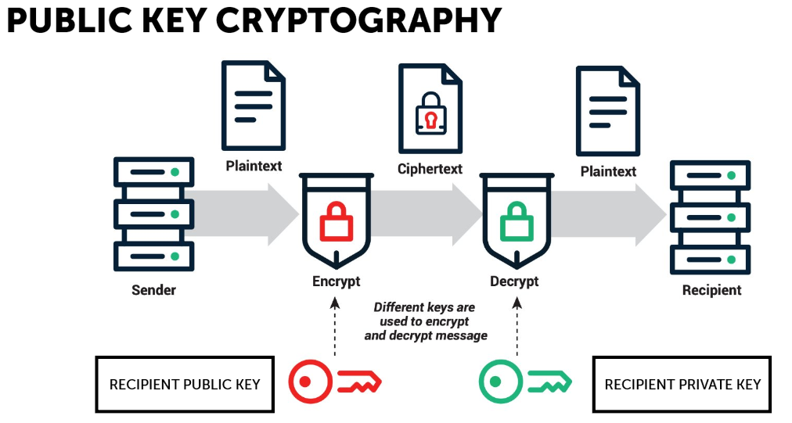
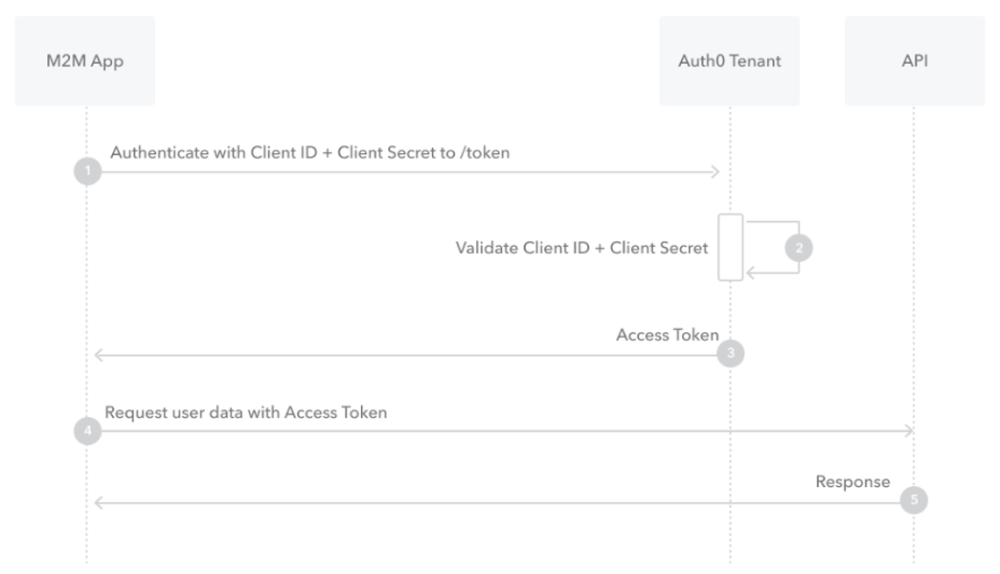
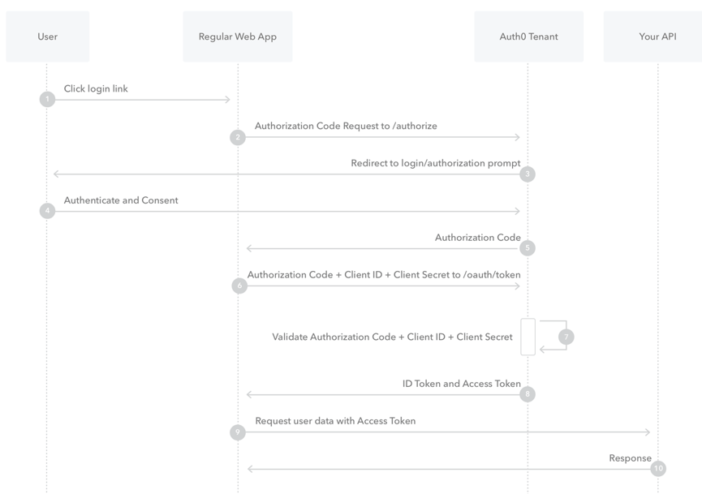
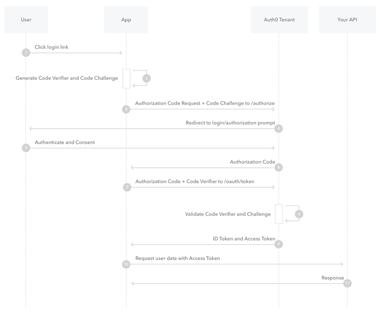

Security Advanced
=================

---

## 0. Recap
### 0.1 Encryption, Hashing and encoding

**Encoding**: Data transformation from one form to another

- Insecure
- Can be used to reduce size
- Base64, ASCII, JPG, UNICODE

**Encryption**: Encoding data in such a way that only authorized personnel can access the message or information, the encoding is gibberish and can only be made readable using one or more keys that (ideally) are only in the hands of authorized personnel.

- Symmetric vs asymmetric
- Problem: how do we exchange keys?
- AES, RSA, DES, Blowfish

**Hashing**: A one-way transformation of data to data of a *fixed size* which is non-reversible. This means that a small change in the source data often completely changes the hash.

- Used for integrity checks
- Password verification
- MD5, SHA256

### 0.2 HTTPS & TLS

Goal: encrypt http traffic to a web server, done using TLS (formerly SSL) encryption (asymmetric).

- Used to prevent man-in-the-middle attacks
- based on certificates (public key + identity): chain of trust!

### 0.3 Vulnerabilities

**SQL injection**: one of the most common web hacking techniques which can have a huge impact, occurs when asked for user input (username/password) and that input is used directly in a query.

**XSS (cross site scripting)**: When a http request allows you to send data that is reflected in an unsafe way.

For example: 
A blogpost that contains Javascript code which will be executed when it is shown in a browser, what will happen when a user is tricked in visiting the website containing that blogpost? -> The Javascript code will execute on the victim's browser

- Forces a user to make a http request containing a payload so the immediate response contains unsafe data
- Reflected/stored

**SUID privilege escalation**: SUID (special file permission bit in linux that gives a user permission to run the file as root), can be used for privilege escalation when misconfigured

- GTFOBINS, LOLBAS

---

## 1. Threat Modelling

### 1.1 What is Threat Modelling?

Threat modelling is the process of identifying, analyzing and prioritizing threats from an attacker's perspective.

Purpose:

- Identify high-value assets
- Identify vulnerabilities
- Identify relevant threats
- Identify attack vectors

### 1.2 Why use Threat Modelling?

- Find security bugs early
- Understand security requirements
- Engineer better products
- Find issues other techniques may miss

### 1.3 Threat Modelling Questions

- Where are the high-value assets?
- Where am I most vulnerable to attack?
- What are the most relevant threats?
- Is there an attack vector that might go unnoticed?

### 1.4 4-Step Threat Modelling Framework

#### 1. What are you building?

Document and understand the system.

Examples:

- Data Flow Diagram (DFD)
- System Context Diagram
- High-Level Architecture Diagram

#### 2. What can go wrong?

Identify threats using techniques such as:

- STRIDE
- Attack Trees

#### 3. What should you do about it?

Determine how identified risks should be handled.

#### 4. Did you do a decent job?

Review and validate the threat model.

### 1.5 Data Flow Diagrams (DFD)

Used to visualize:

- Processes
- Data Flows
- Data Stores
- External Entities

Purpose:

- Understand how data moves through the system
- Identify potential threats

### 1.6 Trust Boundaries

Trust boundaries show where control changes between different entities.

Examples:

- User accounts
- Network interfaces
- Physical computers
- Virtual machines
- Organizational boundaries

Important:

- Show who controls what
- Threats crossing trust boundaries are often important threats

### 1.7 STRIDE

### Security Goals

| Threat | Security Goal | Description |
|----------|----------|----------|
| Spoofing | Authenticity | Pretending to be another user or system |
| Tampering | Integrity | Unauthorized modification of data |
| Repudiation | Non-Repudiation | Denying performed actions |
| Information Disclosure | Confidentiality | Unauthorized access to information |
| Denial of Service | Availability | Making a service unavailable |
| Elevation of Privilege | Authorization | Gaining permissions beyond intended rights |

### 1.8 Attack Trees

Attack trees model attacks in a tree structure.

Structure:

- Root node = attack goal
- Branches = attack paths
- Leaf nodes = attack actions

### 1.9 Risk Treatment

- Mitigate → Reduce the risk
- Eliminate → Remove the source of the risk
- Transfer → Shift the risk to another party
- Accept → Accept the risk

### 1.10 Reflection and Validation

Reflection consists of reviewing the diagram, reviewing identified threats, and validating mitigations/tests.

---

## 2. Security Management
### 2.1 Cyber Incident Response Team (CIRT)

A team responsible for responding to security incidents.

Responsibilities:

- Respond to security breaches
- Respond to malware incidents
- Coordinate incident response
- Communicate during incidents

Works together with:

- IT
- Security teams
- Public Relations
- Disaster Recovery teams

### 2.2 Security Operations Center (SOC)

A team responsible for continuously monitoring an organization's security.

Responsibilities:

- Monitor systems and networks
- Detect security incidents
- Analyze threats
- Respond to incidents

Common roles:

- Security Analysts
- Security Engineers

### 2.3 Security Policy

A written set of security rules, principles and practices within an organization.

Purpose:

- Define security requirements
- Define responsibilities
- Guide employee behavior
- Support incident response

### 2.4 Security Awareness

Security awareness is the process of educating employees about cybersecurity.

Includes:

- Security training programs
- Individual responsibility
- Security audits and assessments

Importance:

- Reduces human error
- Improves security culture
- Helps prevent attacks such as phishing

### 2.5 ISO 27001

ISO 27001 is an international standard for Information Security Management Systems (ISMS).

Purpose:

- Manage information security
- Protect organizational information
- Manage security risks

Important:

- Security is not only an IT responsibility
- Also involves:
  - Physical security
  - Human resources
  - Legal requirements
  - Organizational processes

### 2.6 ISO 27001 Control Categories

| Control | Focus |
|----------|--------|
| A.5 | Information Security Policies |
| A.6 | Organization of Information Security |
| A.7 | Human Resource Security |
| A.8 | Asset Management |
| A.9 | Access Control |
| A.10 | Cryptography |
| A.11 | Physical & Environmental Security |
| A.12 | Operational Security |
| A.13 | Communications Security |
| A.14 | System Acquisition, Development & Maintenance |
| A.15 | Supplier Relationships |
| A.16 | Information Security Incident Management |
| A.17 | Business Continuity Management |
| A.18 | Compliance |

### 2.7 CIS Controls

CIS = Center for Internet Security

Characteristics:

- 20 prioritized security controls
- Designed to prevent common attacks
- Mapped to compliance frameworks

### 2.8 CIS Control Categories

#### Basic Controls

Foundation of cybersecurity.

Focus:

- Asset visibility
- Asset management

#### Foundational Controls

Technical security controls.

Focus:

- Monitoring
- Detection
- Vulnerability management

#### Organizational Controls

People and process focused controls.

Focus:

- Policies
- Governance
- Training
- Incident response

### 2.9 Important CIS Controls

#### Implement a Security Awareness and Training Program

- Educate employees
- Improve security awareness
- Reduce human-related incidents

#### Penetration Tests and Red Team Exercises

- Simulate attacks
- Identify weaknesses
- Evaluate security effectiveness

#### Inventory and Control of Hardware Assets

- Track organizational devices
- Detect unauthorized devices

#### Inventory and Control of Software Assets

- Track installed software
- Detect unauthorized software

#### Data Recovery Capabilities

- Restore data after incidents
- Support backups and recovery

#### Controlled Access Based on the Need to Know

Least Privilege Principle:

- Users only receive permissions required for their job

Benefits:

- Limits damage after compromise
- Reduces unnecessary access

---

## 3. Incident Response

### 3.1 What is an Incident?

An incident is a compromise or violation of an organization's security.

### 3.2 Incident Response Workflow

1. Preparation
2. Identification
3. Containment
4. Eradication
5. Recovery
6. Lessons Learned

### 3.3 Preparation

Most important phase of Incident Response.

#### Team

CIRT should include multiple disciplines:

- IT
- Security
- HR
- Legal
- Public Relations

#### Policy

Defines:

- Rules
- Responsibilities
- Monitoring practices

#### Response Plan

Based on threat modelling.

Prioritize based on:

- Financial impact
- Operational impact
- Reputational impact

#### Documentation

May become evidence.

Should answer:

- Who
- What
- Where
- When
- Why
- How

#### Communication

- Know who to contact
- Define escalation procedures
- Determine when to involve law enforcement

#### Access Control

- Grant required privileges to CIRT
- Remove privileges after the incident

#### Tools

Examples:

- Anti-malware tools
- Packet sniffers
- Forensic tools
- Recovery media

#### Training

- Incident response drills
- Tool familiarity
- Procedure awareness

#### Preparation Checklist

- Security policies known?
- Contact information available?
- Tools available?
- Incident drills performed?

### 3.4 Identification

Determine whether an event is a security incident.

Information sources:

- Log files
- Error messages
- IDS
- IPS
- Firewalls

### 3.5 IDS and IPS

#### IDS (Intrusion Detection System)

- Detects suspicious activity
- Generates alerts
- Does not block attacks

#### IPS (Intrusion Prevention System)

- Detects suspicious activity
- Actively blocks attacks

### 3.6 Detection Methods

#### Signature-Based Detection

- Matches known attack signatures
- Effective against known threats

#### Statistical Anomaly Detection

- Creates a baseline of normal activity
- Detects abnormal behavior

#### Stateful Protocol Analysis

- Analyzes protocol behavior
- Detects deviations from expected protocol states

### 3.7 NIDS vs HIDS

#### NIDS (Network IDS)

- Monitors network traffic
- Protects multiple systems

Examples:

- Snort
- Suricata

#### HIDS (Host IDS)

- Monitors a single host
- Monitors disk, memory and processes

Examples:

- OSSEC
- Wazuh

### 3.8 IDS / IPS Limitations

- False positives
- Alert fatigue
- Delay in signature updates
- Cannot fix weak authentication
- Cannot fix insecure protocols
- Encrypted traffic is difficult to inspect

### 3.9 SIEM (Security information and event management)

Purpose:

- Capture events
- Index logs
- Correlate events in real time

Examples:

- Splunk
- Security Onion
- Wazuh

### 3.10 Identification Checklist

- Where did the incident occur?
- Who discovered it?
- How was it discovered?
- What is the scope?
- What is the business impact?
- Has the source been identified?

### 3.11 Containment

Goal:

- Limit damage
- Prevent further spread

#### Short-Term Containment

- Isolate affected systems
- Disconnect network segments
- Stop immediate damage

#### System Backup

Before making changes:

- Create forensic copies
- Document actions
- Store evidence securely

#### Long-Term Containment

- Remove malicious accounts
- Remove backdoors
- Apply security patches
- Prevent further escalation

### 3.12 Eradication

Steps:

1. Remove malicious content
2. Reimage affected systems if necessary
3. Install security patches
4. Rescan systems

### 3.13 Recovery

Restore normal operations.

Activities:

- Restore systems
- Test systems
- Monitor systems
- Validate systems

Important Decisions:

- When to restore operations
- How to test systems
- Monitoring duration
- Monitoring tools

### 3.14 Lessons Learned

Conducted after recovery.

Review:

- Detection timeline
- Incident scope
- Containment actions
- Eradication actions
- Recovery actions
- Areas of improvement
- Future training needs

### 3.15 Root Cause Analysis (RCA)

Purpose:

- Determine why the incident occurred

Steps:

1. Identify the problem
2. Create a timeline
3. Identify causal factors
4. Identify the root cause
5. Create a cause-and-effect diagram

#### Root Cause vs Causal Factors

- Root Cause → Fundamental reason for the incident
- Causal Factors → Contributing events or conditions

---

## 4. Digital Forensics

### 4.1 What is Digital Forensics?

Digital Forensics is the process of collecting, analyzing and presenting digital evidence.

Sources of evidence:

- Computers
- Mobile devices
- Network devices
- Cloud environments
- IoT devices

### 4.2 Digital Forensics Workflow

1. Acquire
2. Examine
3. Timeline
4. Document
5. Present

### 4.3 Digital Artifacts

#### DAD (Disk Artifact Data)

Artifacts stored on disks.

Examples:

- Files
- Deleted files
- Registry data

#### PAD (Program Artifact Data)

Artifacts created by applications.

Examples:

- Browser history
- Application logs

#### NAD (Network Artifact Data)

Artifacts generated by network activity.

Examples:

- Packet captures
- Firewall logs
- DNS records

### 4.4 Types of Forensics

#### Computer Forensics

- Investigates computers and operating systems

#### Storage Forensics

- Investigates disks and file systems

#### Network Forensics

- Investigates network traffic and communications

#### Mobile Forensics

- Investigates smartphones and tablets

### 4.5 File System Acquisition

Process of acquiring data from a storage device.

#### Disk-to-Image

- Creates a forensic image
- Most common method

#### Disk-to-Disk

- Copies one disk directly to another

#### Logical Acquisition

- Collects only selected files

#### Sparse Acquisition

- Collects deleted or unallocated data

### 4.6 Network Forensics

Purpose:

- Analyze network traffic
- Investigate incidents
- Identify suspicious activity

Information obtained:

- Source and destination addresses
- Connections
- Protocol usage
- Indicators of compromise

Tools:

- Wireshark
- TcpDump
- Snort
- Security Onion

### 4.7 Log Analysis

Analysis of log files to identify events and incidents.

Purpose:

- Log aggregation
- Event correlation
- Enterprise-scale searching

Example:

- Security Onion

### 4.8 Cloud Forensics

Investigation of evidence stored in cloud environments.

Challenges:

- Lack of accountability
- Limited forensic tools
- Limited access to infrastructure

### 4.9 Email Forensics

Investigation of email-related evidence.

Used for:

- Phishing
- Spear phishing
- Whaling
- Vishing

Techniques:

- Email header analysis
- Email investigation frameworks
- Email forensic toolkits

### 4.10 Malware Analysis

Purpose:

- Understand malware behavior
- Identify malware capabilities

#### Static Analysis

- Analyze malware without executing it

#### Dynamic Analysis

- Execute malware in a sandbox

#### Behavioral Analysis

- Observe malware behavior during execution

#### Reverse Engineering

- Analyze code to understand how malware works

Reverse Engineering Tools:

- Ghidra
- IDA Pro

### 4.11 File System Forensics

Focus:

- Recover deleted files
- Analyze file systems

Important:

- Deleted does not mean gone
- Data is often only deallocated

#### Deallocation

- File reference removed
- Data remains until overwritten

#### File Carving

- Recover files from raw disk data

Tools:

- Autopsy
- The Sleuth Kit (TSK)
- Foremost

### 4.12 Memory Forensics

Analysis of RAM through memory dumps.

Why?

- Malware often exists only in memory

Memory Dump Formats:

- RAW
- Crash Dump

Information Obtained:

- Running processes
- Network connections
- Registry hives
- User activity
- Passwords
- Malware artifacts
- Indicators of compromise

Tools:

- Volatility
- Mimikatz

### 4.13 Mobile Forensics

Unique Information:

- Contacts
- Call logs
- SMS messages
- Wi-Fi data
- IP addresses
- MAC addresses
- GPS locations
- Bluetooth data

Challenges:

- Specialized tools
- Device restrictions
- Encryption

### 4.14 Important Skills

Development skills help automate and build tools. Soft skills help communication, reporting and teamwork.

### 4.15 Technical Challenges

#### Encryption

- Makes evidence difficult to access

#### Data Size

- Large amounts of data to analyze

#### Data Wiping

- Intentional destruction of evidence

#### Data Hiding

Examples:

- Steganography
- Volatile RAM

#### Anti-Forensic Tools

Examples:

- Code obfuscation

#### Technology Advancements

- New storage media
- New communication methods
- New file formats

#### Reliance on Cloud Storage

- Limited access to evidence

### 4.16 Attacker Analysis

Purpose:

- Gather intelligence about attackers
- Identify relationships between people and organizations

Uses:

- OSINT
- Relationship analysis

### 4.17 TSK Tool Layers

#### File System Layer

- fsstat

#### File Name Layer

- fls
- ffind

#### Metadata Layer

- istat
- ils
- icat

---

## 5. Penetration Testing
### 5.1 Vulnerability Assessment vs Penetration Testing vs Red Teaming

#### Vulnerability Assessment

- Identifies vulnerabilities
- Does not exploit vulnerabilities

#### Penetration Testing

- Identifies and exploits vulnerabilities
- Demonstrates impact

#### Red Teaming

- Simulates a real attacker
- Focuses on achieving objectives while avoiding detection

### 5.2 Penetration Testing Workflow

1. Project Initiation
2. Reconnaissance
3. Compromise Target
4. Security Improvements

### 5.3 Project Initiation

Purpose:

- Define scope
- Define objectives
- Define constraints
- Plan the engagement

Important:

- Threat Modelling
- Trophies (objectives)
- Schedule
- Attack playbook

#### Scope

Examples:

- Networks
- Web Applications
- Wi-Fi
- Physical Security
- Social Engineering

#### Rules of Engagement (RoE)

Defines:

- Allowed activities
- Restrictions
- Emergency contacts
- Start and end dates

#### White Box vs Black Box

White Box:

- Tester has internal knowledge

Black Box:

- Tester has little or no prior knowledge

### 5.4 Reconnaissance (Recon)

Goals:

- Gather information
- Identify targets
- Identify vulnerabilities
- Identify protection mechanisms

Activities:

- OSINT
- HUMINT
- Social Engineering
- Footprinting

### 5.5 OSINT

OSINT (Open Source Intelligence) is information gathered from publicly available sources.

#### Passive OSINT

- No direct interaction with the target

#### Semi-Passive OSINT

- Appears as normal internet traffic
- Attempts to avoid detection

#### Active OSINT

- Direct interaction with the target
- Likely detectable

### 5.6 Google Dorking

Using advanced Google search operators to find sensitive information.

Examples:

- `filetype:pdf`
- `site:pxl.be`
- `intitle:"Login"`
- `inurl:admin`

### 5.7 HUMINT and Social Engineering

#### HUMINT

Information gathered from people.

#### Social Engineering

Manipulating people to obtain information or access.

### 5.8 Footprinting

Purpose:

- Build a target list
- Identify systems and services
- Gather technical information

#### Passive Footprinting

Examples:

- Whois Lookups
- BGP Looking Glass

#### Active Footprinting

Examples:

- Port Scanning
- Banner Grabbing
- DNS Enumeration
- Zone Transfers

### 5.9 Protection Mechanisms

#### Network-Based

- Firewalls
- IDS
- IPS

#### Host-Based

- Antivirus
- EDR
- Host IDS

#### Application-Level

- Input Validation
- WAF

#### Storage

- Encryption
- Backups

#### User

- MFA
- Security Awareness Training

### 5.10 Vulnerability Analysis

Purpose:

- Identify vulnerabilities
- Determine exploitability
- Prioritize targets

### 5.11 Red Team Operation Lifecycle

1. Reconnaissance
2. Initial Access
3. Foothold
4. Privilege Escalation
5. Lateral Movement
6. Persistence
7. Objectives

### 5.12 Exploitation

Purpose:

- Gain access to systems

Common Techniques:

- RCE (Remote Code Execution)
- RFI (Remote File Inclusion)
- Reverse Shell

### 5.13 Persistence

Maintaining access after compromise.

Examples:

- Web Shells
- Backdoors
- Startup Services
- Alternate User Accounts

### 5.14 Privilege Escalation

Gaining higher privileges than initially obtained.

Common Causes:

- Misconfigurations
- Vulnerabilities
- Weak permissions

### 5.15 Post-Exploitation

Examples:

- Credential Harvesting
- Lateral Movement
- Data Exfiltration
- Persistence

### 5.16 Reporting

#### Executive Summary

Contains:

- Objectives
- High-level findings
- Business impact

#### Technical Report

Contains:

- Technical details
- Attack paths
- Vulnerabilities
- Remediation recommendations

---

## 6. Introduction to Mobile Security

### 6.1 Mobile Applications

Types of mobile applications:

- Native Apps
- Web Apps
- Hybrid Apps
- Progressive Web Apps (PWA)

#### Native App vs Web App

Native App:

- Built for a specific mobile OS
- Uses platform-specific languages
- Direct access to device features

Web App:

- Runs in a browser
- Built using web technologies
- Limited device access

### 6.2 MASTG and MASVS

#### MASVS

OWASP Mobile Application Security Verification Standard.

Purpose:

- Security requirements for mobile apps
- Secure coding guidelines
- Security testing requirements

#### MASTG

OWASP Mobile Application Security Testing Guide.

Purpose:

- Mobile security testing guide
- Testing methodologies
- Technical testing techniques

### 6.3 How Mobile Security Differs

#### Mobile Security is About Data Protection

Focus:

- Protect sensitive user data

#### Different Attack Surface

Traditional vulnerabilities are not always relevant.

Examples:

- CSRF
- Buffer Overflows
- Signature-based antivirus detection

#### Automated Scanners

- Often generate many false positives

#### Sandboxing

- Each app runs in its own isolated environment

#### Hardware Security

Examples:

- Hardware-backed security
- Secure APIs

#### Distribution Platforms

- Apps are distributed through controlled app stores
- Sideloading increases risk

### 6.4 Mobile Security Testing

Similar process to traditional penetration testing.

Activities:

- Static Analysis
- Dynamic Analysis
- Manual Code Review
- Penetration Testing
- Sensitive Data Identification
- Application Mapping

### 6.5 Reverse Engineering

Important skill in mobile security.

Why?

- Analyze application behavior
- Bypass security controls
- Identify hardcoded secrets
- Assess app resilience

Important Principle:

- "The reverse engineer always wins"

### 6.6 Tampering

Tampering is modifying an application or its environment to change behavior.

Examples:

- Bypass root detection
- Modify application logic
- Disable security controls

Techniques:

- Binary Patching
- Code Injection
- Runtime Permission Manipulation

### 6.7 Obfuscation

Purpose:

- Make reverse engineering harder

Techniques:

#### Name Obfuscation

- Replace meaningful names with random names

#### Control Flow Flattening

- Makes program flow difficult to follow

#### Dead Code Injection

- Adds unnecessary code

#### String Encryption

- Encrypts strings inside the application

#### Packing

- Changes executable structure/signature

### 6.8 Android Architecture

Android is based on the Linux kernel.

Main Components:

- Linux Kernel
- Hardware Abstraction Layer (HAL)
- Android Runtime (ART)
- Applications

### 6.9 Android Sandboxing

Each Android application:

- Runs in its own sandbox
- Has its own memory space
- Has its own storage
- Cannot directly access other apps

Purpose:

- Isolation
- Damage limitation

### 6.10 Android Security Measures

Examples:

- File-Based Encryption (FBE)
- Verified Boot
- Users and Groups
- TLS / DNS over TLS
- SELinux

### 6.11 Android Manifest

The Android Manifest describes the application.

Contains:

- Permissions
- Activities
- Services
- Broadcast Receivers
- Content Providers

#### Activities

- Visible screens of an application

#### Content Provider

- Provides access to application data

#### Intent

- Mechanism used for communication between components

#### Broadcast Receiver

- Receives system or application events

### 6.12 App Signing

Purpose:

- Verify application integrity
- Verify application origin
- Validate updates

Forensics Impact:

- Modified APKs must be re-signed
- Original app often must be removed before installing a modified version
- Tampered apps cannot receive legitimate updates

### 6.13 Rooted Devices

Benefits:

- Full system access
- Advanced testing capabilities
- Easier reverse engineering

Commonly used in:

- Mobile security testing
- Mobile forensics

### 6.14 Android Reverse Engineering Workflow

1. Get APK
2. Decompile APK
3. Tamper with APK
4. Repack APK
5. Re-sign APK
6. Run APK

### 6.15 Important Android Terms

#### ART (Android Runtime)

- Runtime environment for Android applications

#### DEX Files

- Executable files used by Android applications

#### APK

- Android application package

### 6.16 Frida Hooking

Frida is a runtime instrumentation tool.

Purpose:

- Function hooking
- Runtime analysis
- Tampering
- Reverse engineering

### 6.17 Binary Patching

Modifying compiled application code to change behavior.

Examples:

- Remove security checks
- Bypass restrictions
- Change application logic

---

## 7. OAuth

### 7.1 Authentication vs Authorization

#### Authentication

- Verifies who you are

#### Authorization

- Determines what you are allowed to do

Important:

- Authentication happens before authorization

### 7.2 The Problem OAuth Solves

Without OAuth:

- Users share credentials with third-party applications
- Third parties must store passwords
- Access is difficult to limit
- Access is difficult to revoke
- Compromise of a third party may expose user credentials

OAuth solves this by using access tokens instead of credentials.

### 7.3 OAuth Terminology

#### Resource

- The thing we want access to

#### Client

- The application requesting access

#### Resource Owner

- The owner of the resource

#### Resource Provider

- Stores or provides the resource

#### Authorization Server

- Issues access tokens

#### Access Token

- Proof that access has been granted

#### Authorization Grant

- Temporary credential used to obtain an access token

### 7.4 OAuth Flow

1. Client requests access
2. Resource owner grants permission
3. Authorization server issues access token
4. Client presents token to resource provider
5. Resource provider returns the resource

Important:

- Authentication is outside the scope of OAuth

### 7.5 Access Tokens

Characteristics:

- Used for authorization
- Do not prove identity
- Must be protected
- Usually bearer tokens
- Require HTTPS

Important:

- OAuth is an authorization framework

#### Access token vs ID token

| Access Token                | ID Token               |
| --------------------------- | ---------------------- |
| Authorization               | Authentication         |
| Used by APIs                | Used by client         |
| Contains permissions/scopes | Contains user identity |

### 7.6 JWT (JSON Web Token)

A common format for access tokens.

Structure:

#### Header

Contains:

- Token type
- Signing algorithm

#### Payload

Contains:

- Token lifetime
- Issuer
- Audience
- Scope
- Roles/permissions

#### Signature

Purpose:

- Verify integrity
- Detect tampering

### 7.7 Token Lifetime

#### Refresh Token

Used to obtain a new access token without re-authenticating the user.

#### Authorization Server

Responsibilities:

- Issues tokens
- Tracks valid tokens
- Supports token revocation

#### Resource Provider

Responsibilities:

- Validates tokens
- Checks token status with the authorization server

### 7.8 OAuth Flows

#### Client Credentials Flow

Used for:

- Machine-to-machine communication

Characteristics:

- No resource owner involved
- Uses Client ID and Client Secret
- Client must securely store a secret

#### Authorization Code Flow

Most common OAuth flow.

Characteristics:

- Uses Client ID
- Uses Client Secret
- Uses Authorization Code
- Authorization Code is short-lived and one-time use

Used for:

- Server-side applications

#### Authorization Code Flow with PKCE (Proof Key for Code Exchange)

Used when storing a secret is not possible.

Examples:

- Mobile applications
- Single Page Applications (SPA)

Characteristics:

- No Client Secret
- Uses a Code Challenge
- More secure than regular Authorization Code Flow

### 7.9 OpenID Connect (OIDC)

OpenID Connect is an authentication layer built on top of OAuth.

Purpose:

- Authentication
- Single Sign-On (SSO)

Examples:

- Login with Google
- Login with Microsoft
- Login with Facebook

Important:

- OAuth → Authorization
- OpenID Connect → Authentication

---

## 8. Secure Coding

### 8.1 Secure Development Lifecycle (SDL)

Security must be integrated into every phase of software development.

Important:

- Security should be considered from the start
- Fixing issues later is more expensive
- Secure development requires management support
- Secure development requires security expertise

### 8.2 Secure Coding Principles

- Input sanitization
- Don't trust the client
- Keep software updated

### 8.3 OWASP Proactive Controls

| Control           | Purpose                 |
| ----------------- | ----------------------- |
| Access Control    | Restrict access         |
| Cryptography      | Protect data            |
| Input Validation  | Prevent malicious input |
| Secure Components | Secure dependencies     |
| Secure Identity   | Authentication          |
| Browser Security  | Secure browser behavior |
| SSRF Prevention   | Prevent server abuse    |

### 8.4 Secure Coding Takeaways

- Input sanitization
- Don't trust the client
- Update your software and dependencies
- Use proven security libraries
- Integrate security throughout the SDLC