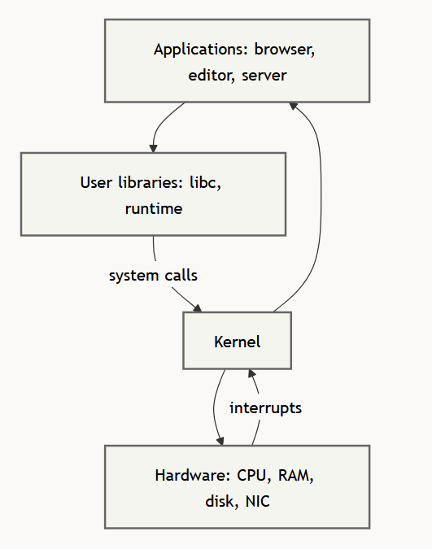
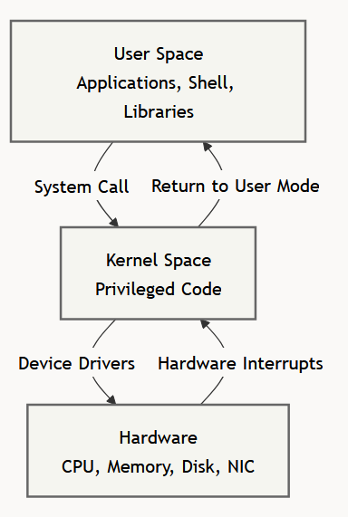
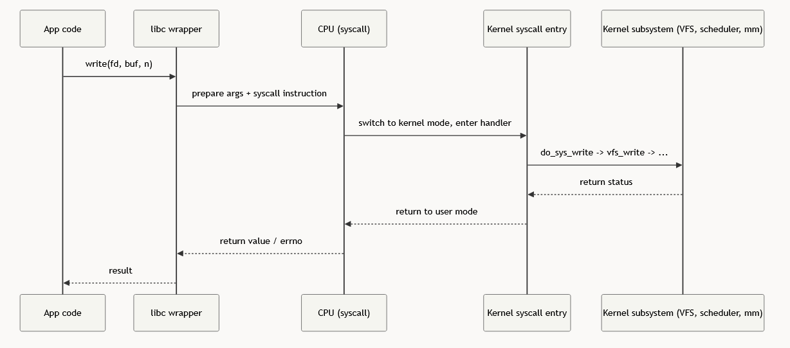
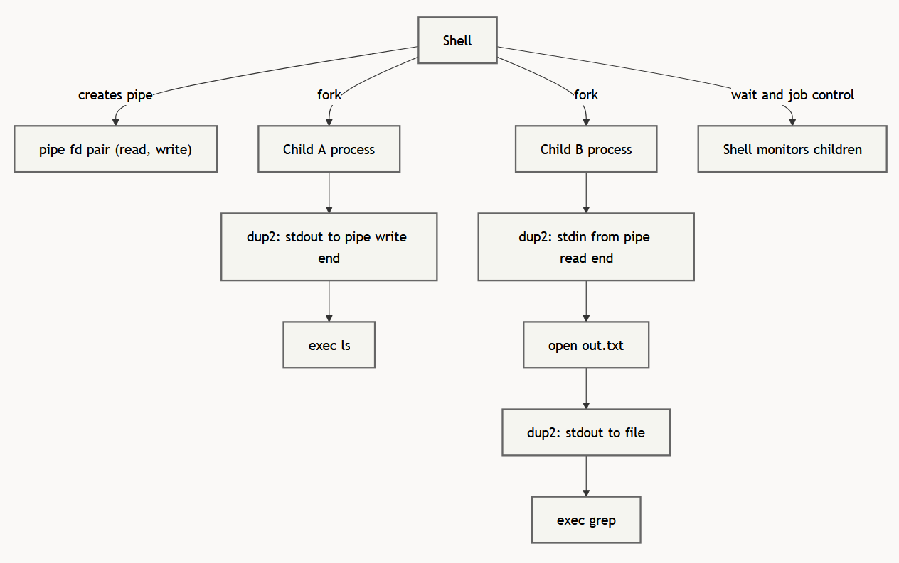
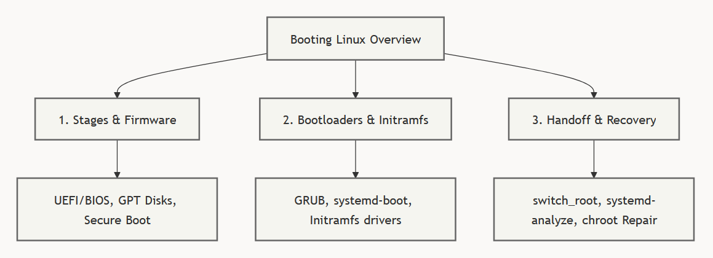
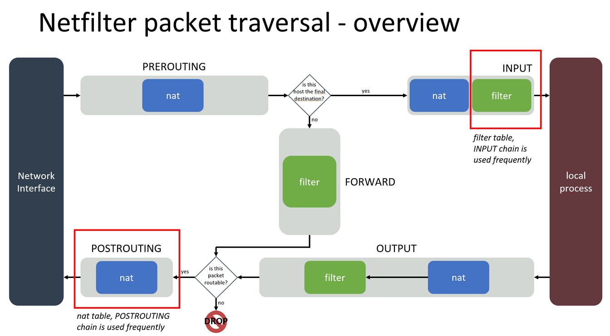

Systems Advanced 2
==================

# Table of Contents

## 1. [Microprocessors](#1-microprocessors)
- [1.1 Logic gates](#11-logic-gates)
- [1.2 CPU architectures](#12-cpu-architectures)
- [1.3 Hardware interupts](#13-hardware-interupts)
- [1.4 PROTECTED flag](#14-protected-flag)
- [1.5 Recap from a linux perspective](#15-recap-from-a-linux-perspective)

## 2. [Licensing and Open Source](#2-licensing-and-open-source)
- [2.1 Why licenses exist, copyright and permission](#21-why-licenses-exist-copyright-and-permission)
  - [2.1.1 Open source vs source-available](#211-open-source-vs-source-available)
- [2.3 License families](#23-license-families)
  - [2.3.1 Permissive licenses](#231-permissive-licenses)
  - [2.3.2 Copyleft licenses](#232-copyleft-licenses)
  - [2.3.3 Network copyleft](#233-network-copyleft)
  - [2.3.4 GPL, LGPL and AGPL](#234-gpl-lgpl-and-agpl)
  - [2.3.5 Comparison](#235-comparison)
- [2.4 Distribution, SaaS and containers](#24-distribution-saas-and-containers)
  - [2.4.1 Compliance](#241-compliance)
- [2.5 Code, docs, assets and contributions](#25-code-docs-assets-and-contributions)
- [2.6 GNU, Linux and distro licenses](#26-gnu-linux-and-distro-licenses)

## 3. [Kernelarchitectuur, privilege en syscalls](#3-kernelarchitectuur-privilege-en-syscalls)
- [3.1 Linux kernel](#31-linux-kernel)
  - [3.1.1 Privilege levels](#311-privilege-levels)
  - [3.1.2 System calls](#312-system-calls)
- [3.2 Processes, threads and scheduling](#32-processes-threads-and-scheduling)
  - [3.2.1 Fork and exec](#321-fork-and-exec)
  - [3.2.2 Process states and lifecycle](#322-process-states-and-lifecycle)
  - [3.2.3 Shell command execution and pipelines](#323-shell-command-execution-and-pipelines)
  - [3.2.4 Signals: asynchronous notifications](#324-signals-asynchronous-notifications)
  - [3.2.5 CPU scheduling](#325-cpu-scheduling)

## 4. [Virtual Memory and the Virtual File System (VFS)](#4-virtual-memory-and-the-virtual-file-system-vfs)
- [4.1 Virtual memory abstraction](#41-virtual-memory-abstraction)
  - [4.1.1 The virtual file system (VFS): the greate abstaction](#411-the-virtual-file-system-vfs-the-greate-abstaction)
  - [4.1.2 Pseudo-filesystems: `/proc` and `/sys`](#412-pseudo-filesystems-proc-and-sys)

## 5. [Interrupts, exceptions en cgroups als kernelmechanismen](#5-interrupts-exceptions-en-cgroups-als-kernelmechanismen)
- [5.1 Hardware, Modules, and Extensions](#51-hardware-modules-and-extensions)
- [5.2 Cgroups](#52-cgroups)

## 6. [Bootproces, bootloader, ESP, initramfs en handoff naar PID 1](#6-bootproces-bootloader-esp-initramfs-en-handoff-naar-pid-1)
- [6.1 Booting Linux](#61-booting-linux)
- [6.2 Booting Stages and Firmware](#62-booting-stages-and-firmware)
- [6.3 Bootloaders and the Initramfs](#63-bootloaders-and-the-initramfs)
  - [6.3.1 EFI system partition](#631-efi-system-partition)
  - [6.3.2 Role of the linux kernel](#632-role-of-the-linux-kernel)
  - [6.3.3 Initramfs](#633-initramfs)
  - [6.3.4 /init](#634-init)
  - [6.3.5 Complete handoff sequence](#635-complete-handoff-sequence)

## 7. [Filesystems: inode, directories, links, mounten, VFS en superblock](#7-filesystems-inode-directories-links-mounten-vfs-en-superblock)
- [7.1 Inode, Directory Entry and Filename](#71-inode-directory-entry-and-filename)
- [7.2 hard links](#72-hard-links)
- [7.3 Symbolic links (symlinks)](#73-symbolic-links-symlinks)
- [7.4 Hard link vs symbolic link](#74-hard-link-vs-symbolic-link)
- [7.5 Link counts](#75-link-counts)
- [7.6 Mounting](#76-mounting)
- [7.7 Ext4 metadata and superblock](#77-ext4-metadata-and-superblock)

## 8. [Networking: Sockets as Kernel Interface](#8-networking-sockets-as-kernel-interface)
- [8.1 Sockets](#81-sockets)
  - [8.1.1 Sockets vs routes](#811-sockets-vs-routes)
- [8.2 Basic socket calls](#82-basic-socket-calls)
  - [8.2.1 flow](#821-flow)
- [8.3 Socket as file descriptor](#83-socket-as-file-descriptor)
- [8.4 How the kernel matches packets to sockets](#84-how-the-kernel-matches-packets-to-sockets)

## 9. [Firewalls: Netfilter, iptables, Conntrack, Hooks and NAT](#9-firewalls-netfilter-iptables-conntrack-hooks-and-nat)
- [9.1 Netfilter vs iptables](#91-netfilter-vs-iptables)
- [9.2 What a firewall does](#92-what-a-firewall-does)
- [9.3 Netfilter hooks](#93-netfilter-hooks)
- [9.4 Iptables tables, chains and rules](#94-iptables-tables-chains-and-rules)
- [9.5 Built-in chain policy](#95-built-in-chain-policy)
- [9.6 Terminating verdicts](#96-terminating-verdicts)
- [9.7 Stateful filtering and conntrack](#97-stateful-filtering-and-conntrack)

## 10. [NFS: root_squash, UID/GID and Identity](#10-nfs-root_squash-uidgid-and-identity)
- [10.1 What is NFS](#101-what-is-nfs)
- [10.2 Exports and mounts](#102-exports-and-mounts)
- [10.3 Traditional NFS security: UID/GID mapping](#103-traditional-nfs-security-uidgid-mapping)
- [10.4 root_squash](#104-root_squash)
  - [10.4.1 Degradation of remote root](#1041-degradation-of-remote-root)

## 11. [systemd: PID 1, Units, Targets, Dependencies and Start Behavior](#11-systemd-pid-1-units-targets-dependencies-and-start-behavior)
- [11.1 Systemd as PID 1](#111-systemd-as-pid-1)
- [11.2 Unit, target, job](#112-unit-target-job)
- [11.3 Start vs enable](#113-start-vs-enable)
- [11.4 Dependencies](#114-dependencies)
- [11.5 How systemd follows processes](#115-how-systemd-follows-processes)

## 12. [eBPF: Verifier, Maps, Hooks and Use Cases](#12-ebpf-verifier-maps-hooks-and-use-cases)
- [12.1 What is eBPF?](#121-what-is-ebpf)
- [12.2 eBPF is event-driven](#122-ebpf-is-event-driven)
  - [12.2.1 Hooks](#1221-hooks)
- [12.3 Why eBPF programs pass through a verifier](#123-why-ebpf-programs-pass-through-a-verifier)
- [12.4 BPF maps](#124-bpf-maps)
- [12.5 eBPF use cases](#125-ebpf-use-cases)

---

## 1. Microprocessors
### 1.1 Logic gates

Transistors/switches can be connected in series/parrallel to create logic gates. With logic gates it is possible to build a system that is **Turing complete**:

- Can write/access to memory storage
- Can do conditional branching
- Can perform any computation given enough time/storage

### 1.2 CPU architectures

The **instruction set architecture (ISA)** specifies the set of instructions that a processor can execute.

- **Complex instruction set computing (CISC)**: a large set of instructions, some of which can execute complex tasks in a single instruction
- **Reduced instruction set computing (RISC)**: smaller set of simple instructions, designed for efficient execution (usually more power efficient)

### 1.3 Hardware interupts

- External devices send an electrical signal on a dedicated interupt line to the CPU
- The interupt controller prioritizes and forwards the highest priority interupt
- Handling
    - The CPU acknowledges the request and retrieves the interupt handler address
    - Execution state is temporarily saved and the control jumps to the interupt handler address
    - After handling, the CPU restores the previous state and resumes execution

### 1.4 PROTECTED flag

A special bit in the CPU's control register enforces privilege levels, when set, the CPU operates in protected mode, restricting direct hardware access. This prevents user-mode programs from modifying system memory or executing privileged instructions.

Used in architectures like x86 to seperate kernel mode (ring 0) from user mode (ring 3)

### 1.5 Recap from a linux perspective

- Complex logical circuits can be built from electrical switches (transistors)
- Extreme miniaturization allows for the design of complex microprocessors with advanced features that are used by modern operating systems: 
    - hardware interupts (linux interupts and signals)
    - protected mode (linux kernel mode)
    - Virtualization (linux hypervisors)

---

## 2. Licensing and Open Source
### 2.1 Why licenses exist, copyright and permission

Copyright applies automatically when code is created.

This means by default:

- The author owns the code
- Copying is restricted
- Modifying is restricted
- Redistributing is restricted

A software license gives permission and defines the conditions.

Important distinction:

- **Visible source code**: you can read the code
- **Public repository**: you can clone the repo
- **Open source**: a license gives reuse rights

A public GitHub repository without a license is **not automatically open source**.

#### 2.1.1 Open source vs source-available

Open source does not mean "no rules".

Examples:

- **MIT**: keep copyright and license notice
- **Apache-2.0** adds:
    - Patent grant: contributors grant patent rights on contributed code
    - Patent retaliation: patent rights terminate if you sue over patent infringement related to the software
- **GPL**: source-code obligations when distributing derivative work
- **AGPL**: also triggers source sharing for modified network services

Source-available means the code can be viewed, but may still restrict:

- Commercial use
- Modification
- Redistribution
- SaaS usage

### 2.3 License families

#### 2.3.1 Permissive licenses

Simple, widely understood and friendly to reuse.

- MIT
- BSD
- Apache-2.0

Usually allow:

- Use
- Modification
- Redistribution
- Proprietary reuse

Main obligation:

- Keep required notices

#### 2.3.2 Copyleft licenses

- GPLv2
- GPLv3

Allow use and modification, but if you distribute derivative work:

- Source code must be provided
- Same freedoms must remain available

#### 2.3.3 Network copyleft

- AGPLv3

Like GPLv3, but also applies when users interact with a modified version over a network (e.g. SaaS).

#### 2.3.4 GPL, LGPL and AGPL

- **GPL**: strong copyleft, distribution triggers source sharing
- **LGPL**: weak copyleft, mainly applies to the library itself
- **AGPL**: GPL + network-service trigger

Version numbers matter, family names are not precise enough!

- GPL-2.0-only
- GPL-2.0-or-later
- GPL-3.0-only
- AGPL-3.0-only

#### 2.3.5 Comparison

| License family | Proprietary reuse possible | Source release triggered by distribution | Extra network trigger | Patent focus |
|---------------|----------------------------|------------------------------------------|----------------------|--------------|
| MIT / BSD | Yes | No | No | Low |
| Apache-2.0 | Yes | No | No | Stronger |
| LGPL / MPL | Sometimes, with conditions | Partial or scoped | No | Varies |
| GPL | Usually no for combined distributed derivative work | Yes | No | Varies by version |
| AGPL | Usually no for combined derivative work | Yes | Yes, for remote interaction with a modified version | Varies by version |

### 2.4 Distribution, SaaS and containers

Licensing obligations become important when software is distributed.

Examples:

- Shipping binaries
- Publishing source code
- Publishing Docker/OCI images
- Bundling dependencies
- Selling devices containing software

Containers do **not** avoid license obligations.

With normal GPL, SaaS use may not trigger source-sharing obligations.

AGPL was designed to cover this case.

#### 2.4.1 Compliance

Compliance is mostly inventory work.

Typical tasks:

- Identify direct dependencies
- Identify transitive dependencies
- Record licenses used
- Keep required notices
- Uphold source-sharing obligations

Important concepts:

- **SPDX**: standardized license identifiers
- **SBOM**: Software Bill of Materials

Useful tools:

- Syft
- ScanCode
- FOSSology
- OSS Review Toolkit (ORT)

### 2.5 Code, docs, assets and contributions

Repositories may contain:

- Source code
- Documentation
- Images
- Fonts
- Logos
- Datasets

These may all have different licenses.

Important:

- Creative Commons is usually for documentation and media
- Software licenses are used for code
- Trademarks are separate from copyright

Contributions:

- **CLA** (Contributor License Agreement): The contributor grants rights through a separate agreement
- **DCO** (Developer Certificate of Origin): The contributor certifies that they have the right to submit the work under the project's license

A CLA usually gives the project stronger legal control, including rights that may matter for relicensing. A DCO is lighter and often easier for community contributions, but it is mainly an attestation about origin and right to contribute, not a general relicensing tool

### 2.6 GNU, Linux and distro licenses

GNU started before Linux and aimed to build a free Unix-like operating system.

Important GNU tools:

- GCC
- GDB
- Bash
- glibc
- Coreutils
- Emacs

Linux provided the kernel.

Modern Linux systems are usually:

- Linux kernel
- GNU userland tools and libraries
- Distribution tooling

Linux kernel license:

- GPL-2.0-only

A Linux distribution does not have a single license.

Examples:

- Debian (DFSG)
- Ubuntu (main, restricted, universe, multiverse)

A distribution consists of many packages, each potentially using different licenses.

---

## 3. Kernelarchitectuur, privilege en syscalls
### 3.1 Linux kernel

The kernel is the privileged core program of an operating system that runs with special hardware permissions and has direct control over the system's physical resources. It is notthe entire operating system, it is the fundamental engine that makes everything possible.

The kernel acts as a mediator between software and hardware.

For example:


#### 3.1.1 Privilege levels

To maintain stability and security, modern CPUs enfore hardware privilege boundaries. On x86 architectures, these are represented by privilege rings:

- Ring 3 (user mode): restricted mode for normal applications. instructions that could compromise the system are blocked by the hardware
- Ring 0 (kernel mode): privileged mode for the kernel. The CPU allows absolute access to all physical memory, device configurations, page tables and CPU registers



There are nuances to this: traditionally Unix systems used an all-or-nothing model but to improve security Linux uses **capabilities** which split root power into small granular permissions (such as those that allow modifying of the system clock, or allow modyfing the ownership of files, ...)

The kernel has 4 core responsibilities:

- **Isolation**: programs cannot access or corrupt the memory of another program
- **Multiplexing**: making sure finite hardware is shared fairly and efficiently
- **Abstractions**: hiding complex, inconsistent hardware details behind simple and standardized interfaces
- **Control**: Enforcing system policies, access permissions, resource limits, keeping track of CPU/memory usage stats

#### 3.1.2 System calls

A **system call** is a controlled entry point into the kernel, allowing user-space applications to request privileged operations.

For example:


### 3.2 Processes, threads and scheduling

A **process** is a running instance of a program, a **thread** is a unit of execution inside a process. A process can contain multiple threads.

Threads of the same process share: 

- Virtual address space (heap, global variables, code)
- Open file descriptors
- System resources

They maintain their own:

- Stack
- CPU registers

#### 3.2.1 Fork and exec

Processes in Linux are created using a split two-step model;

- ``fork()``: The kernel creates a new child process by duplicating the calling parent process. The child gets a new PID but its address space, memory pages and open file descriptors are initially identical to the parent.
    - **Copy-on-write**: For optimization, the kernel does not immediatly copy physical memory pages during ``fork()``. Both processes share the same physical pages until either process attempts to write to a page, the CPU then triggers a page fault and the kernel duplicates that page on the fly
- ``execve()`` or ``exec`` wrappers: replaces the entire address space of the current process with a new program binary loaded from the disk. The PID remains the same but the stack, heap and code segments are overwritten

#### 3.2.2 Process states and lifecycle

A process at any given moment is in one of these states:

- **Running or runnable (R)**: currently executing or is waiting for its turn to execute
- **Interuptable sleep (S)**: waiting for an event but can be woken up by a signal
- **Uninteruptable sleep (D)**: waiting for low-level hardware I/O and cannot be interupted by signals until the operation finishes
- **Stopped (T)**: execution suspended, typically by a job control signal (``ctrl-z`` or ``SIGSTOP``)
- **Zombie (Z)**: execution has finished (``exit``), but its entry remains in the process table so its parent can read itss exit status, once seen by the parent's ``wait()`` call, it disappears

Memory trick:
R = Running
S = Sleeping
D = Disk wait
T = Stopped
Z = Zombie

#### 3.2.3 Shell command execution and pipelines

The shell uses the ``fork`` + ``exec`` sequence to run commands and connect them via pipes

When you execute a pipeline like: ``ls -l | grep conf > out.txt`` the shell:

- Calls the ``pipe()`` system call to create a pair of connected file descriptors.
- Calls ``fork()`` twice to spawn child processes for both ``ls`` and ``grep``.
- In the first child, it uses ``dup2()`` to redirect standard output (``stdout``) to the write end of the pipe, then calls ``exec(ls)``.
- In the second child, it uses ``dup2()`` to redirect standard input (``stdin``) from the read end of the pipe and redirect ``stdout`` to the ``out.txt`` file descriptor, then calls ``exec(grep)``.
- The parent shell monitors the execution of these children using ``waitpid()``



A simpler example would be: ``ls -l``, the shell performs: ``fork()``, ``exec()``, ``waitpid()``

#### 3.2.4 Signals: asynchronous notifications

A **signal** is a software interupt delivered to a process by the kernel to notify it of an asynchronous event.

They can be triggered by:

- Hardware/kernel (divide-by-zero for example)
- User actions at the terminal driver (``ctrl-c`` for example)
- Another process invoking the ``kill()`` system call

When a signal is sent to a process it can be:

- **ignored** (process discards the signal)
- **caught**, by executing a custom **signal handler** function registered by the application
- trigger the **default action** defined by the kernel (terminating the process, generating a core dump, stopping it)

Some special signals:

- ``SIGKILL(9)``
- ``SIGSTOP``

They **CANNOT** be caught, blocked or ignored. The kernel handles them immediatly at the boundary.

#### 3.2.5 CPU scheduling

The kernel uses a multi-class scheduling engine to decide which runnable task runs next on the CPU cores, the default scheduler for normal processes is the **Completely fair scheduler (CFS)**

CFS attempts to allocate CPU time fairly among all runnable tasks:

- Each task tracks its **virtual runtime** (``vruntime``), which measures the amount of CPU time the task has consumed
- The scheduler runs in a loop, choosing the task with the **smallest** ``vruntime`` next
- As a task runs on the CPU, its ``vruntime`` increases and it eventually yields or is preemted so another task with a smaller ``vruntime`` can execute

Users can adjust a prcoess's scheduling priority by modifying itss 'nice' value (ranging from -20 to +19):

- A default process has a niceness of 0
- A negative value gives the task a **higher** priority, making its ``vruntime`` accumulate slower so it receives more CPU cycles
- A positive value gives the task a **lower** priority, making its ``vruntime`` accumalte quicker so it receives less CPU cycles

---

## 4. Virtual Memory and the Virtual File System (VFS)
### 4.1 Virtual memory abstraction

Virtual memory gives every process the illusion that it owns:

- its own memory
- a large address space
- memory starting at address 0

Even though physical RAM is limited, is shared by many processes and memory is fragmented, the kernel hides this complexity

This exists because of:

- **Isolation**: Processes cannot access each other's memory
- **Abstraction**: Programs always work with virtual addresses. They never directly access physical RAM
- **Efficient memory management**

#### 4.1.1 The virtual file system (VFS): the great abstraction

Because "everything is a file" in Linux it is possible to access all disks, hardware devices, network sockets, ... through the standard file API: ``open()``, ``read()``, ``write()`` and ``close()``
The **virtual file system (VFS)** is the kernel subsystem that translates this uniform file interface into drivers for specific resources (like ext4, nfs, procfs or device drivers)

This ensures **consistency** and **transparency**

#### 4.1.2 Pseudo-filesystems: ``/proc`` and ``/sys``

The VFS allows the kernel to expose its own active memory structures as if they were a standard directory tree, these are called **pseudo-filesystems**:

- ``/proc``: exposes process-specific and system-wide kernel configuration data
- ``/sys``: exposes hardware devices, drivers and kernel subsystems in a highly structured tree format

Because ``/proc`` and ``/sys`` are managed by the VFS, standard CLI tools like ``cat``, ``grep`` and ``ls`` can read and write directly to kernel parameters in real time without needing specific specialized system APIs

---

## 5. Interrupts, exceptions en cgroups als kernelmechanismen
### 5.1 Hardware, Modules, and Extensions

The CPU cannot constantly poll hardware devices to check if they have data, instead the hardware notifies the kernel asynchronously using **interupts**.

When an event occurs (a key being pressed, a network packet arriving, ...)

- The hardware asserts an **interupt request (IRQ)** line
- CPU immediatly halts its current work, saves it, switches to ring 0 (kernel mode) and executes the appropriate **interupt service routine (ISR)** registered by the device driver
- To keep the system responsive, the kernel splits interupt processing into 2:
    - **Top half (ISR)**: performs the absolute minimum work required (copy data into a buffer) and quickly returns control to the system
    - **Bottom half (SoftIRQs, Workqueues)**: executes the heavier processing asynchronously after normal execution resumes

An **exception** is a CPU-detected condition caused by a currently executing instruction. Unlike interrupts, exceptions are not external hardware events. They come from the CPU noticing something during execution (for example: page fault, divide by zero, ...)

### 5.2 Cgroups

A **Cgroup** is a Linux kernel mechanism that groups processes so the kernel can measure, limit and control their resource usage.

They group:
- Processes
- Threads/tasks
- Services
- Containers
- login sessions

They measure:
- CPU time
- Memory usage
- Number of processes

They limit:
- CPU
- memory
- PIDs
- ...

Systemd uses cgroups to manages services reliably, it lets systemd:
- track all processes of a service
- measure resource usage
- apply limits
- kill the whole process cleanly

Container runtimes such as Docker, Podman and containerd use cgroups to enforce resource limits, without cgroups, a container could consume unlimited host resources

---

## 6. Bootproces, bootloader, ESP, initramfs en handoff naar PID 1
### 6.1 Booting Linux

The process of starting a Linux operating system is a carefully orchestrated sequence of staged handoffs. Each stage is a self-contained execution environment that initializes system components, performs key verifications and hands control to the next layer in the boot chain.



### 6.2 Booting Stages and Firmware

The Linux boot chain:
```
1. Power On
        ↓
2. Firmware (BIOS/UEFI)
        ↓
3. Bootloader
        ↓
4. Linux Kernel
        ↓
5. Early Userspace (Initramfs)
        ↓
6. Real Init System (systemd)
        ↓
7. Normal Userspace
```

Firmware is the first code executed after power-on: BIOS (old), UEFI (modern), it handles:

- Initializing hardware
- Perform POST (power-on self-test)
- Finding a boot entry
- Loading the bootloader

### 6.3 Bootloaders and the Initramfs

The bootloader is the bridge between firmware and Linux (GRUB, systemd-boot), its main tasks are:

- Present a boot menu
- Load the Linux kernel (into RAM)
- Load initramfs (into RAM)
- Pass kernel parameters

#### 6.3.1 EFI system partition

The EFI system partition is a small FAT32 partition used by UEFI firmware because it cannot necessarily read ext4, xfs, btrfs, ... so it needs a simple partition that stores EFI boot programs used during startup.

#### 6.3.2 Role of the linux kernel

After the bootloader loads the kernel, it starts and:

- Initializes memory management
- Initializes scheduling
- Initializes drivers
- Unpacks initramfs
- Executes ``/init`` inside initramfs

#### 6.3.3 Initramfs

Initramfs (initial RAM filesystem) is a temporary filesytem loaded into ram by the bootloader. But there is a problem:
To mount the real root filesystem, the kernel needs storage drivers and thosen often live in ``/lib/modules`` on the root filesystem which means:
- Need drivers to access disk
- Need disk to access drivers

Initramfs solves this by containing:
- basic tools
- critical storage drivers
- an ``/init`` script

which the kernel can use before the real disk is mounted

#### 6.3.4 /init

When the kernel unpacks initramfs and executes ``/init``, it becomes PID 1 temporarily, it then:
- loads storage drivers
- unlocks encrypted disks
- activates LVM/RAID
- locates root filesystem
- mounts the real root filesystem

Once the real root filesystem is available ``/init`` runs ``switch_root`` which removes the temporary RAM-based root, makes the real root filesystem become the root filesystem and starts the real init system and hands it off the systemd which then becomes PID 1.

Systemd does the following:
- Reads unit files
- Mounts filesystems from ``/etc/fstab``
- Starts services
- Starts networking
- Starts login managers
- Starts graphical environment

#### 6.3.5 Complete handoff sequence

This is the complete startup flow for Linux:
```
1. Bootloader
      ↓
2. Kernel
      ↓
3.Unpack initramfs
      ↓
4. Run /init (PID 1)
      ↓
5. Load storage drivers
      ↓
6. Mount real root filesystem
      ↓
7. switch_root
      ↓
8. Execute systemd
      ↓
9. systemd becomes PID 1
      ↓
10. Normal userspace
```

---

## 7. Filesystems: inode, directories, links, mounten, VFS en superblock
### 7.1 Inode, Directory Entry and Filename

- **Filename**: human readable name that contains almost no information
- **Directory entry**: contains mappings (filename → inode), it connects a name to an inode
- **Inode**: stores a file's metadata:
    - Owner
    - Permissions
    - Timestamps
    - Size
    - File type
    - Link count
    It does NOT store the filename

### 7.2 hard links

A hard link is another directory entry that points to the same inode. for example:

```bash
echo hello > original.txt
ln original.txt second.txt
```
which results in:
```
original.txt
        ↘
         inode 123
        ↗
second.txt
```

A hard link is:
- same inode
- same file object
- same data
- same metadata
BUT it is NOT:
- seperate copy of the file
- seperate inode
- pathname

A consequence of this is that changes to one of the files will also make those changes to the other because both names reference the same inode. But if you delete one file, it will not delete the other because the inode itself still exists, it is only deleted when 'link count = 0' and no process has it open.

A limitation of hard links is that they cannot cross filesystem boundaries because inodes only exist inside one filesystem

### 7.3 Symbolic links (symlinks)

A symbolic link is a seperate filesystem object that stores a pathname. For example:

```bash
ln -s /var/log/syslog latest_log
```
which results in:
```
latest_log
      ↓
stores "/var/log/syslog"
```

A symlink is:
- a seperate inode
- stores a path string
- can cross filesystems
BUT it is NOT:
- same inode
- same file object

When a target disappears, the symlink will remain but point to nowhere, this is called a broken symlink.

### 7.4 Hard link vs symbolic link

| Hard Link                | Symbolic Link         |
| ------------------------ | --------------------- |
| Same inode               | Different inode       |
| Same file                | Separate object       |
| Direct inode reference   | Stores pathname       |
| Cannot cross filesystems | Can cross filesystems |
| Cannot become broken     | Can become broken     |

### 7.5 Link counts

for example:
```bash
touch a.txt # link count: 1

# Create hard link:

ln a.txt b.txt # link count: 2

# Delete one:

rm a.txt # link count: 1

# Delete second:

rm b.txt # link count: 0
```

This is different for directories, because every directory contains '.' and '..', for example:

```
parent/
└── child/
```
/parent contains: '.', '..' and 'child'

This means that the link count is: 2 + number of subdirectories = 3, same goes for 'child', it contains '.' and '..' so its link count is 2

### 7.6 Mounting

Attaching a filesystem to a directory in the existing filesystem tree. Linux represents / as one unified tree even though some of its subdirectories may be different filesystems (/proc is procfs, /home is XFS, ...). As users we do not see different trees, we see one filesystem hierarchy. Mounting attaches a filesystem to a mount point within the single linux directory tree.

### 7.7 Ext4 metadata and superblock

Ext4 is the common Linux filesystem, it has some important structures: superblock, inode tables, bitmapds, data blocks, journal

Superblock contains global filesystem information and stores:
- filesystem size
- block size
- number of inodes
- free blocks
- filesystem state
- feature flags

The kernel reads the superblock when mounting the filesystem, without a valid superblock a filesystem may not be mountable

Ext4 metadata is used to track:
- files using inodes
- free blocks using block bitmaps
- free inodes using inode bitmaps
- consistency using journal

---

## 8. Networking: Sockets as Kernel Interface
### 8.1 Sockets

A socket is a kernel object used for communication, it can be used for networking between machines and inter-process communication (IPC). A simple definition of a socket is: a kernel interface that allows processes to send and receive data

#### 8.1.1 Sockets vs routes

Routes answer the question: where should packets go? (``ip route show``)
Sockets answer the question: which process is accepting traffic? (``ss -tulpen``)

### 8.2 Basic socket calls

- ``socket()``: creates a socket object in the kernel
- ``bind()``: attaches a socket to a local address and port
- ``listen()``: marks the socket as a passive listening socket (used by servers)
- ``accept()``: accepts an incoming client connection (returns a new socket, the original socket keeps listening)
- ``connect()``: connects a socket to a remote address and port (used by clients)
- ``send()``: sends data through the socket
- ``recv()``: receives data from the socket

#### 8.2.1 flow:

Server side:
```
socket()
   ↓
bind()
   ↓
listen()
   ↓
accept()
   ↓
send()/recv()
```
client side:
```
socket()
   ↓
connect()
   ↓
send()/recv()
```

### 8.3 Socket as file descriptor

After a socket is setup it is usually accessed through a file descriptor, this means that a process can use socket handles similarly to files (using ``read()``, ``write()``, ``close()``, ... or socket-specific calls like ``send()``, ``recv()``)

> A socket is not a regular file, but Linux exposes it through file descriptor semantics

### 8.4 How the kernel matches packets to sockets

When a packet arrives, the kernel checks information such as:
- protocol
- source IP/port
- destination IP/port
- interface/namespace

For example:
```
Incoming packet:
TCP packet
Destination: 192.168.10.38:8080
---
Kernel checks:
Is there a socket listening on 192.168.10.38:8080?
Is there a socket listening on 0.0.0.0:8080?
---
If yes:
Packet is delivered to that socket
---
If no:
Connection fails
```

---

## 9. Firewalls: Netfilter, iptables, Conntrack, Hooks and NAT
### 9.1 Netfilter vs iptables

Netfilter is the firewall framework inside the Linux kernel, it provides:
- packet-processing hooks
- filtering decisions
- connection tracking
- NAT
It is the kernel packet-filtering framework

Iptables is a userspace CLI tool used to configure Netfilter rules

| Netfilter                        | iptables                 |
| -------------------------------- | ------------------------ |
| Kernel framework                 | Userspace tool           |
| Processes packets                | Configures rules         |
| Implements hooks, conntrack, NAT | Adds/lists/deletes rules |
| Always in kernel path            | Admin interface          |

### 9.2 What a firewall does

A firewall evaluates packets and applies decision, it has some common actions:
- ACCEPT
- DROP
- REJECT
- LOG
- NAT rewrite

each rule has: 'match condition' → 'action' (for example: ``TCP destination port 22 → ACCEPT``)

### 9.3 Netfilter hooks

Netfilter places checkpoints in the packet path:

- PREROUTING: first hook for incoming packets, used before routing decision
- INPUT: packets destined for the local machine
- FORWARD: packets routed through the machine
- OUTPUT: packets created by local processes
- POSTROUTING: packets just before leaving the machine, used after routing decision

The classic packet path:


### 9.4 Iptables tables, chains and rules

- A table groups chains by purpose (tables like 'filter' and 'nat')
- A chain is an ordered list of rules
- A rule says what to match and what to do

for example:
```bash
iptables -A INPUT -p tcp --dport 22 -j ACCEPT
```
Means:
```
append to INPUT
match TCP destination port 22
accept packet
```

### 9.5 Built-in chain policy

Built-in chains can have a default policy which is applied when no rule in the chain matches

### 9.6 Terminating verdicts

A terminating verdict stops rule evaluation for that packet (ACCEPT, DROP, REJECT, LOG)

### 9.7 Stateful filtering and conntrack

**Stateless** filtering looks at packets individually, this makes it so that replies and related traffic are harder to reason about, **stateful** filtering uses connection tracking (the kernel remembers flows), this is called conntrack.

Common conntrack states:
- NEW: start of a new connection
- ESTABLISHED: part of an already known connection
- RELATED: not part of the original flow but related to it
- INVALID: packet does not make sense for any known connection and is usually dropped

---

## 10. NFS: root_squash, UID/GID and Identity
### 10.1 What is NFS

NFS stands for network file system, it allows one machine to use files stored on another machine. To applications it looks like a normal filesystem. Behind the scenes, the kernel sends filesystem operations over the network

### 10.2 Exports and mounts

Server side: export
The server decides what is shared

Client side: mount
The client attaches the export into its own directory tree

Mounting does not copy the files! It attaches a remote filesystem view

### 10.3 Traditional NFS security: UID/GID mapping

Classic NFS security uses UID, GID and supplementary groups. This is called sec=sys or AUTH_SYS.
With traditional NFS, the server checks permissions based on numeric IDs, this means:
```
The server sees:
UID 1001
GID 1001

not necessarily:
alice
```

> This has the risk of UID/GID mismatches

For example:
```
Client:
alice = UID 1001

Server:
bob = UID 1001

If Alice accesses the NFS share, the request carries:
UID 1001

The server interprets that as:
bob
```

A UID/GUID mismatch occurs when the same numeric user or group ID refers to different users or groups on client and server, causing incorrect permission decisions.

### 10.4 root_squash

Root_squash maps client-side root (UID 0) to an anonymous, unprivileged identity on the server. Because without this protection, root on client means root on server files, which is very dangerous

#### 10.4.1 Degradation of remote root

With root squash:
```
Client root UID 0
        ↓
NFS server maps it to anonymous user
        ↓
Usually nobody / nfsnobody
```

So remote root is no longer treated as server root, it becomes an unprivileged/anonymous user (usually with UID/GID 65534)

---

## 11. systemd: PID 1, Units, Targets, Dependencies and Start Behavior
### 11.1 Systemd as PID 1

Systemd is the system and service manager on most Linux systems, during boot, the kernel starts the first userspace process, on most systems that is systemd with PID 1

Systemd manages:
- services
- sockets
- timers
- mounts
- devices
- targets
- logs through journald
- user sessions
- process supervision
- ...

### 11.2 Unit, target, job

- **Unit**: an object systemd can manage (many different types)
    - examples: ssh.service; cups.socket; home.mount; multi-user.target, ...
- **Job**: an action systemd performs on a unit
    - examples: start, stop, restart, reload, isolate
    - if a unit has dependencies, systemd may create extra jobs
- **Target**: a grouping or synchronization point (not a program!)
    - represents a system state
    - unit that groups other units

### 11.3 Start vs enable

```bash
systemctl start nginx.service # start it now

systemctl enable nginx.service # start it automatically during future boots

systemctl enable --now nginx.service # enable for future boots + start immediatly
```

### 11.4 Dependencies

Systemd uses a dependency graph, it does not run scripts one by one

- ``Wants=``: weak dependency
- ``Requires=``: Strong dependency
- ``After=``: ordering only
- ``Before=``: opposite of after

For example:

```ini
Wants=postgresql.service # try to start postgresql too, if it fails this unit still continues

Requires=postgresql.service # if postgresql fails, this unit fails too

After=network.target # start this after network.target, if both are started (does NOT start the other unit)

Before=backup.service # start this before backup.service, if both are started (does NOT start the other unit)
```

### 11.5 How systemd follows processes

Systemd uses cgroups, this groups all processes belonging to a service together. Systemd can use this to:
- track all service processes
- measure resource usage
- apply limits
- stop or kill the whole service cleanly

---

## 12. eBPF: Verifier, Maps, Hooks and Use Cases
### 12.1 What is eBPF?

eBPF allows small, sandboxed programs to run inside the Linux kernel, they can run without modifying kernel source code or loading risky kernel modules. It is a safe way to run event-driven programs inside the kernel

Before eBPF, extending kernel behaviour usually meant 'user space', this is safe but slower and less direct. Instead we can make use of kernel modules, this is fast and powerfuln but dangerous because a bug in a kernel module can crash the whole system.

eBPF is the middle ground: User space safety + Kernel-level visibility and speed

### 12.2 eBPF is event-driven

eBPF programs do not continuously poll, they attach to hooks (kernel event or execution point), when the event happens, the eBPF program runs.

Some examples of hooks are:
- system call entry
- system call exit
- packet arrival
- scheduler event
- kernel function call
- user space function call

#### 12.2.1 Hooks

Hook families:
- **Tracepoints**: predefined, stable hooks compiled into the kernel code
- **Kprobes and Kretprobes**: dynamic hooks that attach to the entry (``kprobe``) or exit (``kretprobe``) of any kernel function, powerful but fragile due to kernel version changes
- **Uprobes and Uretprobes**: similar to kprobes/kretprobes, hooks on user-space applications and shared libraries (like ``libc``), allows tracing application functions in real time
- **USDT (User statically-defined tracing)**: named trace points explicitly compiled into user-space applications for structured diagnostics 
- **XDP**: hooks in network card driver space
- **tc**: hooks inside the kernel traffic control layer on interface ingress and egress paths

### 12.3 Why eBPF programs pass through a verifier

Because eBPF programs run in kernel space (ring 0), just running them without doing any checks is dangerous. Before loading, the kernel verifier check the program.

The verifier checks:
- **Termination**: the program must eventually finish (no infinte loops)
- **Memory safety**: the program cannot read or write invalid memory, has no out-of-bounds stack access or has no random kernel memory access
- **Allowed helpers only**: the program may only call allowed kernel helper functions
- **Safe pointer usage**: the program cannot freely dereference arbitrary kernel pointers

If verification fails: the program is rejected and is not allowed to run. If verification succeeds, the program can be loaded and attached to a hook.

### 12.4 BPF maps

eBPF programs are restricted, they cannot freely allocate memory or write global kernel memory so they use BPF maps, kernel memory data structurs used for:
- shared state
- counters
- configuration
- communication with user space
- event streaming

BPF maps are highly efficient key-value stores allocated inside kernel memory, both the eBPF program and user-space controller can read and write maps.

Some common map types are:

``BPF_MAP_TYPE_HASH``: Standard hash table mapping custom keys to values (e.g., keeping track of PID connection counts).
``BPF_MAP_TYPE_ARRAY``: Fast indexed array stores.
``BPF_MAP_TYPE_RINGBUF``: A high-performance, lockless ring buffer used to stream structured event records to user space in real time.

### 12.5 eBPF use cases

- **Observability**: trace syscalls, measure latency, trace file opens, ...
- **Security**: detect suspicious syscalls, audit file access, enforce runtime policy, ...
- **Networking**: packet filtering, load balancing, DDOS mitigation, container netwokring, fast packet forwarding (XDP and tc)
- **Performance analysis**: CPU profiling, scheduler tracing, latency histograms, bottleneck detection